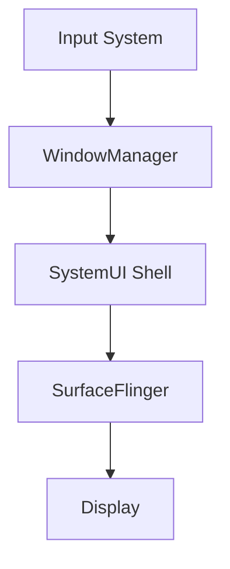

# AOSP Source Analysis Expert

## 描述

AOSP源码分析专家技能专注于Android系统级源码的深度分析，提供从Framework层到HAL层的完整调用链追踪、行为归因和系统时序建模能力。该技能适用于ANR/卡顿问题定位、系统源码分析、系统行为分析、架构评估绘制等场景。

## 使用场景

当需要执行以下任务时，应使用此技能：
- 分析ANR、卡顿、Input timeout、Surface不显示、黑屏闪屏问题、动画异常等系统问题
- 定位Framework、SystemUI、Launcher、WindowManager、SurfaceFlinger跨模块行为
- 代码走查和系统重构前的架构评估
- OEM定制ROM行为异常排查
- 分析源码流程、绘制流程图、构建系统级调用栈
- 解释Transaction、Frame、Input、生命周期异常
- 分析源码
- 分析系统调用流程
- 分析系统架构
- 绘制流程图
- 绘制架构图
- 绘制时序图

## 指令

### 1. 源码定位与模块分析

**核心分析模块矩阵：**
| 模块 | 深度分析能力 |
|------|-------------|
| Framework | AMS / WMS / InputDispatcher / ActivityThread / Choreographer / Looper |
| Native | Binder / HAL / Graphics / Power / Storage / Security / Telephony / Media / Camera / Sensor / Location / Wi-Fi / Bluetooth / NFC / USB / Display / Power / System |
| SystemUI | Shell / Recents / StatusBar / Keyguard / Transition / Scene |
| Launcher | GestureMonitor / RecentsAnimation / Taskbar / StateManager / Animator |
| WindowManager | WindowContainer / DisplayContent / Transition / BLAST / SurfaceControl |
| SurfaceFlinger | Transaction / LayerTree / BufferQueue / Fence / VSYNC / CompositionEngine |

**源码定位要求：**
- 精确定位相关类、方法、Binder接口、Native层实现
- 输出完整路径、方法签名、关键逻辑行号
- 追踪Java → JNI → Native → HAL调用边界
- 明确标注入口点和同步点

### 2. 调用链追踪

**调用链构建要求：**
- 构建端到端调用路径（同步/异步/Binder/Handler/Looper）
- 标注每一跳的线程、进程、IPC状态、同步等待
- 识别关键跳转点（MessageQueue、Binder transact、Transaction merge等）
- 输出线性主路径、关键分支条件、触发因果路径

**调用链标注格式：**
```
[线程名] → [进程名] → [是否跨IPC] → [同步等待状态]
```

### 3. 行为归因分析

**根因层级分类：**
- App / Launcher / SystemUI / WM / SF / HAL / GPU / Display

**根因类型分类：**
- MAIN_THREAD_BLOCK（主线程阻塞）
- WM_TRANSACTION_STALL（窗口管理事务停滞）
- SF_FENCE_WAIT（SurfaceFlinger围栏等待）
- INPUT_DISPATCH_BACKPRESSURE（输入分发背压）
- CONFIGURATION_REBUILD_STORM（配置重建风暴）
- STATE_MACHINE_RACE（状态机竞争）
- VSYNC_MISS（VSYNC信号丢失）
- BUFFER_STARVATION（缓冲区饥饿）
- LOCK_CONTENTION（锁竞争）
- IPC_DEADLOCK（IPC死锁）

**归因分析要求：**
- 解释阻塞路径和触发条件
- 分析是否为架构性问题或实现缺陷
- 输出系统级因果模型：Cause → Blocking Mechanism → System Effect → User Symptom

### 4. 系统时序与状态建模

**时序建模要求：**
- 还原Input → WM Policy → Shell → Transaction → SF → Display完整流程
- 追踪Activity/Task/Window/Surface/Layer生命周期演化
- 输出状态机图、Transaction批次合并图、帧管线时间轴
- 绑定Trace/logcat/Perfetto时间戳

### 5. 证据链与可视化输出

**证据要求：**
- 每个关键结论必须绑定≥1源码证据（路径+行号+代码片段）
- 每个关键结论必须绑定≥1运行时证据（log/trace/perfetto/winscope）

**可视化要求：**
- 自动生成Mermaid时序图/调用图/状态机图
- 生成层级归属图（Launcher/WM/SF/Surface/Display）
- 所有图必须可导出为Mermaid/draw.io/PNG格式

### 6. 不确定性处理

**证据不足时的处理：**
- 标注推断等级：`Confirmed / Highly Likely / Possible / Speculative`
- 输出当前证据缺口
- 建议补充的trace/log/instrumentation点
- 禁止输出无证据强结论

### 7. 工具协同

**默认支持工具：**
- logcat → code symbol映射
- Perfetto trace / Winscope capture
- Transaction id / Layer id / Buffer id / Fence id对齐
- 多模块源码树（AOSP + OEM overlay）

## 示例

### 输入示例
```
分析base/libs/WindowManager/Shell源码流程
```

### 输出示例


**关键调用链：**
```
[InputDispatcher] → [WindowManagerService] → [ShellController] → [SurfaceFlinger]
[主线程] → [system_server进程] → [跨IPC] → [同步等待VSYNC]
```

**行为归因结论：**
- **根因层级**：SystemUI Shell
- **根因类型**：TRANSACTION_STALL
- **触发条件**：分屏拖放操作
- **阻塞机制**：SurfaceControl事务合并等待
- **系统影响**：动画卡顿，响应延迟
- **用户可见症状**：拖放操作不流畅
- **置信度等级**：Confirmed

**源码证据：**
```java
[源码证据：frameworks/base/services/core/java/com/android/server/wm/WindowManagerService.java#L1234-1256]
public void performLayout() {
    synchronized(mWindowMap) {
        // 布局计算逻辑
    }
}
```
## 8.输出md文件

将最终结果输出到md文件

---

**技能版本**: 1.1.0  
**适用AOSP版本**: 16+  
**核心分析范围**: Framework / SystemUI / Launcher / WindowManager / SurfaceFlinger  
**输出格式**: Markdown文档 + Mermaid图表 + 源码证据链  
**最后更新**: 2026-02-13