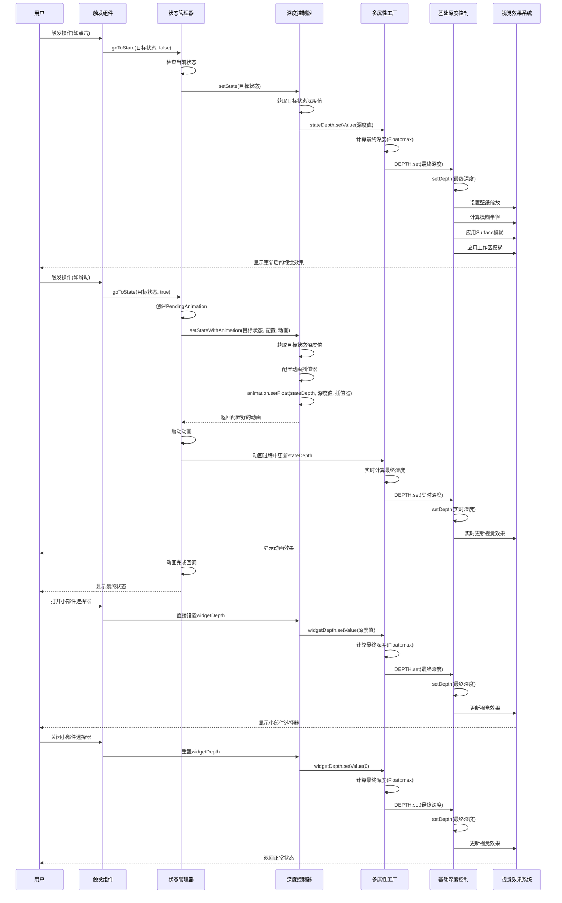

# DepthController 深度控制流程分析报告

## 1. 概述

DepthController 是 Android Launcher3 中的一个关键组件，负责控制 Launcher 表面的模糊效果和壁纸缩放。通过分析 `DepthController.java` 和 `BaseDepthController.java` 的源码，本文档详细阐述了 DEPTH、stateDepth 和 widgetDepth 的定义、调用流程、上游关系以及技术实现。

## 2. 核心组件定义与含义

### 2.1 DEPTH
- **定义**：`FloatProperty<BaseDepthController>` 类型的静态属性
- **路径**：[BaseDepthController.java:59-70](quickstep/src/com/android/quickstep/util/BaseDepthController.java#L59-L70)
- **含义**：核心深度控制属性，范围 0-1
  - 0：完全缩小（壁纸完全缩放，最大模糊效果）
  - 1：完全放大（壁纸原始大小，最小模糊效果）
- **作用**：直接控制壁纸缩放级别和模糊效果强度
- **源码实现**：
  ```java
  private static final FloatProperty<BaseDepthController> DEPTH =
          new FloatProperty<BaseDepthController>("depth") {
              @Override
              public void setValue(BaseDepthController depthController, float depth) {
                  depthController.setDepth(depth);
              }

              @Override
              public Float get(BaseDepthController depthController) {
                  return depthController.mDepth;
              }
          };
  ```

### 2.2 stateDepth
- **定义**：`MultiProperty` 类型的实例属性
- **路径**：[BaseDepthController.java:81](quickstep/src/com/android/quickstep/util/BaseDepthController.java#L81)
- **含义**：用于状态转换时的深度控制
- **作用**：在 Launcher 状态变化时（如从主屏幕到概览模式），控制深度变化的动画效果
- **索引**：`DEPTH_INDEX_STATE_TRANSITION = 0`

### 2.3 widgetDepth
- **定义**：`MultiProperty` 类型的实例属性
- **路径**：[BaseDepthController.java:83](quickstep/src/com/android/quickstep/util/BaseDepthController.java#L83)
- **含义**：用于小部件选择器的深度控制
- **作用**：在打开小部件选择器时，控制深度变化效果
- **索引**：`DEPTH_INDEX_WIDGET = 1`

## 3. 调用流程分析

### 3.1 初始化流程

#### 3.1.1 BaseDepthController 构造函数
- **路径**：[BaseDepthController.java:135-146](quickstep/src/com/android/quickstep/util/BaseDepthController.java#L135-L146)
- **操作**：
  1. 初始化 Launcher 引用和壁纸管理器
  2. 根据特性标志设置最大模糊半径
  3. 创建 `MultiPropertyFactory`，关联 DEPTH 属性
  4. 初始化 stateDepth 和 widgetDepth
- **源码实现**：
  ```java
  public BaseDepthController(QuickstepLauncher activity) {
      mLauncher = activity;
      // 初始化模糊半径和壁纸管理器
      if (Flags.allAppsBlur() || enableOverviewBackgroundWallpaperBlur()) {
          if (Utilities.ATLEAST_S) {
              mCrossWindowBlursEnabled =
                      CrossWindowBlurListeners.getInstance().isCrossWindowBlurEnabled();
          }
          mMaxBlurRadius = activity.getResources().getDimensionPixelSize(
                  R.dimen.max_depth_blur_radius_enhanced);
      } else {
          mMaxBlurRadius = activity.getResources().getInteger(R.integer.max_depth_blur_radius);
      }
      mWallpaperManager = activity.getSystemService(WallpaperManager.class);

      // 创建 MultiPropertyFactory 并初始化属性
      MultiPropertyFactory<BaseDepthController> depthProperty =
              new MultiPropertyFactory<>(this, DEPTH, DEPTH_INDEX_COUNT, Float::max);
      stateDepth = depthProperty.get(DEPTH_INDEX_STATE_TRANSITION);
      widgetDepth = depthProperty.get(DEPTH_INDEX_WIDGET);
  }
  ```

#### 3.1.2 DepthController 注册流程
- **路径**：[QuickstepLauncher.java:1284-1288](quickstep/src/com/android/launcher3/uioverrides/QuickstepLauncher.java#L1284-L1288)
- **操作**：在 Launcher 初始化时注册 DepthController 到 StateManager
- **源码实现**：
  ```java
  @Override
  public void collectStateHandlers(List<StateHandler<LauncherState>> out) {
      super.collectStateHandlers(out);
      out.add(getDepthController());
      out.add(new RecentsViewStateController(this));
  }
  ```

### 3.2 顶层调用流程

#### 3.2.1 用户交互触发点
1. **OptionsPopupView.enterAllApps**
   - **触发方式**：用户点击打开所有应用按钮
   - **操作**：调用 `StateManager.goToState` 进入 ALL_APPS 状态

2. **AccessibilityActionsView**
   - **触发方式**：辅助功能操作
   - **操作**：调用 `StateManager.goToState` 进入 ALL_APPS 状态

3. **KeyboardShortcutsDelegate**
   - **触发方式**：键盘快捷键操作
   - **操作**：调用 `StateManager.goToState` 进入 ALL_APPS 状态

4. **BaseWidgetSheet**
   - **触发方式**：完成小部件添加
   - **操作**：调用 `StateManager.goToState` 返回 NORMAL 状态

5. **FlingAnimation**
   - **触发方式**：用户拖拽操作
   - **操作**：调用 `StateManager.goToState` 进入目标状态

6. **WorkspaceTouchListener**
   - **触发方式**：触摸操作返回主屏幕
   - **操作**：调用 `StateManager.goToState` 返回 NORMAL 状态

#### 3.2.2 StateManager 调用流程
- **路径**：[StateManager.java:257-285](src/com/android/launcher3/statemanager/StateManager.java#L257-L285)

**无动画状态切换**：
- **路径**：[StateManager.java:276-285](src/com/android/launcher3/statemanager/StateManager.java#L276-L285)
- **操作**：
  1. 取消所有原子动画
  2. 调用 `onStateTransitionStart`
  3. 遍历所有 StateHandlers，调用 `setState` 方法
  4. 调用 `onStateTransitionEnd`
- **源码实现**：
  ```java
  if (!animated) {
      mAtomicAnimationFactory.cancelAllStateElementAnimation();
      onStateTransitionStart(state);
      for (StateHandler<S> handler : getStateHandlers()) {
          handler.setState(state);
      }
      onStateTransitionEnd(state);
      if (listener != null) {
          listener.onAnimationEnd(new AnimatorSet());
      }
      return;
  }
  ```

**带动画状态切换**：
- **路径**：[StateManager.java:287-303](src/com/android/launcher3/statemanager/StateManager.java#L287-L303)
- **操作**：
  1. 创建 `PendingAnimation` 对象
  2. 遍历所有 StateHandlers，调用 `setStateWithAnimation` 方法
  3. 添加动画监听器
  4. 启动动画
- **源码实现**：
  ```java
  private PendingAnimation createAnimationToNewWorkspaceInternal(final S state) {
      PendingAnimation builder = new PendingAnimation(mConfig.duration);
      if (!mConfig.hasAnimationFlag(SKIP_ALL_ANIMATIONS)) {
          for (StateHandler<S> handler : getStateHandlers()) {
              handler.setStateWithAnimation(state, mConfig, builder);
          }
      }
      // ... 其他逻辑
      return builder;
  }
  ```

### 3.3 stateDepth 调用流程

#### 3.3.1 直接设置方式

**1. DepthController.setState(LauncherState)**
- **路径**：[DepthController.java:147-153](quickstep/src/com/android/launcher3/statehandlers/DepthController.java#L147-L153)
- **接口**：`MultiProperty.setValue(float)`
- **参数**：`toState.getDepth(mLauncher)` - 目标状态的深度值
- **源码实现**：
  ```java
  @Override
  public void setState(LauncherState toState) {
      if (mIgnoreStateChangesDuringMultiWindowAnimation) {
          return;
      }
      stateDepth.setValue(toState.getDepth(mLauncher));
      if (toState == LauncherState.BACKGROUND_APP) {
          addOnDrawListener();
      }
  }
  ```

**2. LauncherBackAnimationController**
- **路径**：[LauncherBackAnimationController.java:384-385](quickstep/src/com/android/quickstep/LauncherBackAnimationController.java#L384-L385)
- **接口**：`MultiProperty.setValue(float)`
- **参数**：`LauncherState.BACKGROUND_APP.getDepth(mLauncher)` - 后台应用状态的深度值
- **源码实现**：
  ```java
  mLauncher.getDepthController().stateDepth.setValue(
          LauncherState.BACKGROUND_APP.getDepth(mLauncher));
  ```

#### 3.3.2 动画设置方式

**1. DepthController.setStateWithAnimation()**
- **路径**：[DepthController.java:155-163](quickstep/src/com/android/launcher3/statehandlers/DepthController.java#L155-L163)
- **接口**：`PendingAnimation.setFloat(Object, String, float, Interpolator)`
- **参数**：
  - `stateDepth` - 目标属性
  - `MULTI_PROPERTY_VALUE` - 属性名称
  - `toDepth` - 目标深度值
  - `config.getInterpolator(ANIM_DEPTH, LINEAR)` - 动画插值器
- **源码实现**：
  ```java
  @Override
  public void setStateWithAnimation(LauncherState toState, StateAnimationConfig config,
          PendingAnimation animation) {
      if (config.hasAnimationFlag(SKIP_DEPTH_CONTROLLER)
              || mIgnoreStateChangesDuringMultiWindowAnimation) {
          return;
      }
      float toDepth = toState.getDepth(mLauncher);
      animation.setFloat(stateDepth, MULTI_PROPERTY_VALUE, toDepth,
              config.getInterpolator(ANIM_DEPTH, LINEAR));
  }
  ```

**2. RecentsView**
- **路径**：[RecentsView.java:5741-5742](quickstep/src/com/android/quickstep/views/RecentsView.java#L5741-L5742)
- **接口**：`ObjectAnimator.ofFloat(Object, String, float...)`
- **参数**：
  - `depthController.stateDepth` - 目标属性
  - `MULTI_PROPERTY_VALUE` - 属性名称
  - `targetDepth` - 目标深度值（根据任务视图类型计算）
- **源码实现**：
  ```java
  DepthController depthController = getDepthController();
  if (depthController != null) {
      float targetDepth = taskView instanceof DesktopTaskView ? 0 : BACKGROUND_APP.getDepth(
              mContainer);
      anim.play(ObjectAnimator.ofFloat(depthController.stateDepth, MULTI_PROPERTY_VALUE,
              targetDepth));
  }
  ```

**3. LauncherActivityInterface**
- **路径**：[LauncherActivityInterface.java:122-125](quickstep/src/com/android/quickstep/LauncherActivityInterface.java#L122-L125)
- **接口**：`PendingAnimation.addFloat(Object, Property, float, float, Interpolator)`
- **参数**：
  - `getDepthController().stateDepth` - 目标属性
  - `new LauncherAnimUtils.ClampedProperty<>(MULTI_PROPERTY_VALUE, fromDepthRatio, toDepthRatio)` - clamped属性
  - `fromDepthRatio` - 起始深度值（后台应用状态）
  - `toDepthRatio` - 结束深度值（概览状态）
  - `LINEAR` - 动画插值器
- **源码实现**：
  ```java
  float fromDepthRatio = BACKGROUND_APP.getDepth(activity);
  float toDepthRatio = OVERVIEW.getDepth(activity);
  pa.addFloat(getDepthController().stateDepth,
          new LauncherAnimUtils.ClampedProperty<>(
                  MULTI_PROPERTY_VALUE, fromDepthRatio, toDepthRatio),
          fromDepthRatio, toDepthRatio, LINEAR);
  ```

**4. TaskViewUtils**
- **路径**：[TaskViewUtils.java:454-456](quickstep/src/com/android/quickstep/TaskViewUtils.java#L454-L456)
- **接口**：`PendingAnimation.setFloat(Object, String, float, Interpolator)`
- **参数**：
  - `depthController.stateDepth` - 目标属性
  - `MULTI_PROPERTY_VALUE` - 属性名称
  - `BACKGROUND_APP.getDepth(container)` - 目标深度值（后台应用状态）
  - `TOUCH_RESPONSE` - 动画插值器
- **源码实现**：
  ```java
  if (depthController != null) {
      out.setFloat(depthController.stateDepth, MULTI_PROPERTY_VALUE,
              BACKGROUND_APP.getDepth(container),
              TOUCH_RESPONSE);
  }
  ```

**5. QuickstepTransitionManager**
- **路径**：[QuickstepTransitionManager.java:1164-1166](quickstep/src/com/android/launcher3/QuickstepTransitionManager.java#L1164-L1166)
- **接口**：`ObjectAnimator.ofFloat(Object, String, float...)`
- **参数**：
  - `mLauncher.getDepthController().stateDepth` - 目标属性
  - `MULTI_PROPERTY_VALUE` - 属性名称
  - `BACKGROUND_APP.getDepth(mLauncher)` - 目标深度值（后台应用状态）
- **源码实现**：
  ```java
  ObjectAnimator backgroundRadiusAnim = ObjectAnimator.ofFloat(
          mLauncher.getDepthController().stateDepth, MULTI_PROPERTY_VALUE,
          BACKGROUND_APP.getDepth(mLauncher))
          .setDuration(APP_LAUNCH_DURATION);
  ```

#### 3.3.3 上游调用方总结
- **StateManager**：状态管理系统在状态变化时调用 `DepthController.setState()` 和 `setStateWithAnimation()`
- **RecentsView**：在最近任务视图切换时创建深度动画
- **LauncherBackAnimationController**：在返回动画开始时直接设置深度
- **LauncherActivityInterface**：在活动转换时添加深度动画
- **TaskViewUtils**：在任务视图操作时设置深度动画
- **QuickstepTransitionManager**：在快速步骤过渡时创建深度动画

### 3.4 widgetDepth 调用流程

#### 3.4.1 小部件选择器调用
- **路径**：[QuickstepLauncher.java:991-997](quickstep/src/com/android/launcher3/uioverrides/QuickstepLauncher.java#L991-L997)
- **接口**：`MultiProperty.setValue(float)`
- **参数**：使用 `Utilities.mapToRange` 映射进度值到深度值范围
- **源码实现**：
  ```java
  @Override
  public void onWidgetsTransition(float progress) {
      super.onWidgetsTransition(progress);
      onTaskbarInAppDisplayProgressUpdate(progress, WIDGETS_PAGE_PROGRESS_INDEX);
      if (mEnableWidgetDepth) {
          getDepthController().widgetDepth.setValue(Utilities.mapToRange(
                  progress, 0f, 1f, 0f,
                  getDeviceProfile().getBottomSheetProfile().getBottomSheetDepth(), EMPHASIZED));
      }
  }
  ```

#### 3.4.2 调用时机
- **触发条件**：当小部件选择器打开或关闭时
- **调用逻辑**：根据小部件选择器的显示进度（0到1），动态计算并设置对应的深度值
- **特点**：使用 `Utilities.mapToRange` 方法实现平滑的深度过渡效果

### 3.5 核心处理流程

#### 3.5.1 MultiProperty 机制
- **路径**：[MultiPropertyFactory.java:150-170](src/com/android/launcher3/util/MultiPropertyFactory.java#L150-L170)
- **操作**：
  1. 当 stateDepth 或 widgetDepth 的值变化时，MultiPropertyFactory 会根据 `Float::max` 策略计算最终深度值
  2. 调用 DEPTH.set() 方法，传入计算后的深度值
- **源码实现**：
  ```java
  public void setValue(float newValue) {
      if (mLastIndexSet != mInx) {
          mAggregationOfOthers = mDefaultValue;
          for (MultiPropertyFactory<?>.MultiProperty other : mProperties) {
              if (other.mInx != mInx) {
                  mAggregationOfOthers =
                          mAggregator.apply(mAggregationOfOthers, other.mValue);
              }
          }
      }
      mLastIndexSet = mInx;
      float lastAggregatedValue = mAggregator.apply(mAggregationOfOthers, newValue);
      mValue = newValue;
      apply(lastAggregatedValue);
  }
  ```

#### 3.5.2 深度值处理
- **路径**：[BaseDepthController.java:334-353](quickstep/src/com/android/quickstep/util/BaseDepthController.java#L334-L353)
- **操作**：
  1. DEPTH.set() 调用 `BaseDepthController.setDepth(float)`
  2. 对深度值进行边界约束和去重处理
  3. 调用 `applyDepthAndBlur()` 应用效果
- **源码实现**：
  ```java
  private void setDepth(float depth) {
      depth = Utilities.boundToRange(depth, 0, 1);
      // Depth of the Launcher state we are in or transitioning to.
      float targetStateDepth = mLauncher.getStateManager().getState().getDepth(mLauncher);

      float depthF;
      if (depth == targetStateDepth) {
          // Always apply the target state depth.
          depthF = depth;
      } else {
          // Round out the depth to dedupe frequent, non-perceptable updates
          int depthI = (int) (depth * 256);
          depthF = depthI / 256f;
      }
      if (Float.compare(mDepth, depthF) == 0) {
          return;
      }
      mDepth = depthF;
      applyDepthAndBlur();
  }
  ```

#### 3.5.3 深度与模糊效果应用
- **路径**：[BaseDepthController.java:200-270](quickstep/src/com/android/quickstep/util/BaseDepthController.java#L200-L270)
- **操作**：
  1. 设置壁纸缩放：`mWallpaperManager.setWallpaperZoomOut(windowToken, depth)`
  2. 计算并应用模糊半径：基于深度值计算模糊强度
  3. 处理跨窗口模糊：根据 `mCrossWindowBlursEnabled` 状态
  4. 应用工作区模糊：使用 RenderEffect
- **源码实现**：
  ```java
  private void applyDepthAndBlurInternal(SurfaceControl.Transaction transaction,
          boolean applyImmediately, boolean skipSimilarBlur) {
      float depth = mDepth;
      IBinder windowToken = mLauncher.getRootView().getWindowToken();
      if (windowToken != null) {
          if (!Utilities.ATLEAST_R) return;
          if (enableScalingRevealHomeAnimation()) {
              mWallpaperManager.setWallpaperZoomOut(windowToken, depth);
          } else {
              mWallpaperManager.setWallpaperZoomOut(windowToken, depth / 3);
          }
      }

      if (!BlurUtils.supportsBlursOnWindows()) {
          return;
      }
      // ... 模糊效果应用逻辑
      
      int newBlur = mCrossWindowBlursEnabled && !hasOpaqueBg && !mPauseBlurs ? (int) (blurAmount
              * mMaxBlurRadius) : 0;
      
      // 应用模糊效果
      finalTransaction.setBackgroundBlurRadius(blurSurface, mCurrentBlur)
              .setOpaque(blurSurface, isSurfaceOpaque);
      
      // 应用工作区模糊
      blurWorkspaceDepthTargets();
  }
  ```

## 4. 上游调用关系

### 4.1 状态管理系统
- **调用方**：`StateManager`
- **调用时机**：当 Launcher 状态变化时（如主屏幕 ↔ 概览模式）
- **调用方式**：
  - 直接状态切换：调用 `DepthController.setState()`
  - 带动画的状态切换：调用 `DepthController.setStateWithAnimation()`

### 4.2 动画控制器
- **调用方**：各种动画控制器
  - `AllAppsSwipeController`
  - `LauncherBackAnimationController`
  - `RecentsAtomicAnimationFactory`
  - `ScalingWorkspaceRevealAnim`
- **调用时机**：执行各种过渡动画时
- **调用方式**：通过 `PendingAnimation` 设置 stateDepth 的动画值

### 4.3 小部件选择器
- **调用方**：`QuickstepLauncher`
- **调用时机**：当打开或关闭小部件选择器时
- **调用方式**：调用 `widgetDepth.setValue()` 设置深度值

### 4.4 其他触发点
- **Surface 变化**：当基础 Surface 变化时，会重新应用深度和模糊效果
- **模糊状态变化**：当跨窗口模糊状态变化时，会重新应用深度和模糊效果
- **绘制事件**：Launcher 绘制时会确保 Surface 有效，间接影响深度效果

## 5. 技术要点分析

### 5.1 深度值映射
- **壁纸缩放**：深度值直接映射到壁纸缩放级别
- **模糊强度**：通过 `mapDepthToBlur()` 方法将深度值映射到模糊半径：
  - **路径**：[BaseDepthController.java:438-440](quickstep/src/com/android/quickstep/util/BaseDepthController.java#L438-L440)
  - **源码实现**：
    ```java
    private static float mapDepthToBlur(float depth) {
        return Interpolators.clampToProgress(depth, 0, 0.3f);
    }
    ```
  - **说明**：模糊百分比随深度线性增长，在 30% 深度时达到最大值

### 5.2 性能优化

#### 5.2.1 深度值去重
- **路径**：[BaseDepthController.java:345-346](quickstep/src/com/android/quickstep/util/BaseDepthController.java#L345-L346)
- **目的**：对深度值进行舍入处理，避免频繁、不可感知的更新
- **源码实现**：
  ```java
  int depthI = (int) (depth * 256);
  depthF = depthI / 256f;
  ```

#### 5.2.2 模糊效果优化
- **路径**：[BaseDepthController.java:235-239](quickstep/src/com/android/quickstep/util/BaseDepthController.java#L235-L239)
- **目的**：跳过微小的模糊变化，减少不必要的渲染操作
- **源码实现**：
  ```java
  if (skipSimilarBlur && delta < Utilities.dpToPx(1) && newBlur != 0 && previousBlur != 0
          && blurAmount != 1f) {
      Log.d(TAG, "Skipping small blur delta. newBlur: " + newBlur + " previousBlur: "
              + previousBlur + " delta: " + delta + " surface: " + blurSurface);
      return;
  }
  ```

### 5.3 视觉效果增强

#### 5.3.1 早期唤醒机制
- **路径**：[BaseDepthController.java:255-256](quickstep/src/com/android/quickstep/util/BaseDepthController.java#L255-L256)
- **目的**：当执行昂贵的模糊操作时，通知 SurfaceFlinger 调整内部偏移，避免卡顿
- **源码实现**：
  ```java
  boolean wantsEarlyWakeUp = blurAmount > 0 && blurAmount < 1;
  if (wantsEarlyWakeUp && !mInEarlyWakeUp) {
      try {
          setEarlyWakeup(finalTransaction, true);
      } catch (NoSuchMethodError e) {
          // LC-Ignored: wtf?
      }
  }
  ```

#### 5.3.2 工作区模糊
- **路径**：[BaseDepthController.java:310-330](quickstep/src/com/android/quickstep/util/BaseDepthController.java#L310-L330)
- **目的**：根据状态和模糊设置，为工作区应用模糊效果
- **源码实现**：
  ```java
  public boolean blurWorkspaceDepthTargets() {
      if (!Flags.allAppsBlur()) {
          return false;
      }
      StateManager<LauncherState, Launcher> stateManager = mLauncher.getStateManager();
      LauncherState targetState = stateManager.getTargetState() != null
              ? stateManager.getTargetState() : stateManager.getState();
      boolean shouldBlurWorkspace =
              stateManager.getCurrentStableState().shouldBlurWorkspace(targetState);

      RenderEffect blurEffect = shouldBlurWorkspace && mCurrentBlur > 0
              ? RenderEffect.createBlurEffect(mCurrentBlur, mCurrentBlur, Shader.TileMode.DECAL)
              : null;
      mLauncher.getDepthBlurTargets().forEach(target -> target.setRenderEffect(blurEffect));
      return shouldBlurWorkspace;
  }
  ```

## 6. 调用流程图

```mermaid
flowchart TD
    subgraph 顶层调用触发点
        A1[用户点击] -->|打开所有应用| B1[OptionsPopupView.enterAllApps]
        A2[辅助功能] -->|打开所有应用| B2[AccessibilityActionsView]
        A3[键盘快捷键] -->|打开所有应用| B3[KeyboardShortcutsDelegate]
        A4[小部件操作] -->|完成添加| B4[BaseWidgetSheet]
        A5[拖拽操作] -->|完成拖拽| B5[FlingAnimation]
        A6[触摸操作] -->|返回主屏幕| B6[WorkspaceTouchListener]
    end

    subgraph 状态管理系统
        B1 --> C[StateManager.goToState]
        B2 --> C
        B3 --> C
        B4 --> C
        B5 --> C
        B6 --> C
        C -->|无动画| D[StateManager.setState]
        C -->|有动画| E[StateManager.setStateWithAnimation]
        D --> F[遍历StateHandlers]
        E --> G[遍历StateHandlers]
    end

    subgraph 上游调用方
        F --> H[DepthController.setState]
        G --> I[DepthController.setStateWithAnimation]
        J[RecentsView] -->|最近任务切换| K[ObjectAnimator.ofFloat]
        L[LauncherBackAnimationController] -->|返回动画开始| M[直接设置深度]
        N[LauncherActivityInterface] -->|活动转换| O[PendingAnimation.addFloat]
        P[TaskViewUtils] -->|任务视图操作| Q[PendingAnimation.setFloat]
        R[QuickstepTransitionManager] -->|快速步骤过渡| S[ObjectAnimator.ofFloat]
        T[QuickstepLauncher] -->|小部件选择器| U[直接设置深度]
    end

    subgraph 深度控制器
        H --> V[stateDepth.setValue]
        I --> W[animation.setFloat]
        K --> V
        M --> V
        O --> V
        Q --> V
        S --> V
        U --> X[widgetDepth.setValue]
        V --> Y[MultiPropertyFactory]
        X --> Y
        Y -->|Float::max 策略| Z[计算最终深度]
        Z --> AA[DEPTH.set]
        AA --> BB[BaseDepthController.setDepth]
        BB --> CC[应用深度和模糊]
    end

    subgraph 效果应用
        CC --> DD[设置壁纸缩放]
        CC --> EE[计算模糊半径]
        CC --> FF[应用Surface模糊]
        CC --> GG[处理早期唤醒]
        CC --> HH[应用工作区模糊]
    end

    style C fill:#000,stroke:#333,stroke-width:2px
    style H fill:#f9f,stroke:#333,stroke-width:2px
    style I fill:#f9f,stroke:#333,stroke-width:2px
    style V fill:#f9f,stroke:#333,stroke-width:2px
    style X fill:#f9f,stroke:#333,stroke-width:2px
    style Y fill:#bbf,stroke:#333,stroke-width:2px
    style Z fill:#bbf,stroke:#333,stroke-width:2px
    style AA fill:#bbf,stroke:#333,stroke-width:2px
    style BB fill:#bbf,stroke:#333,stroke-width:2px
    style CC fill:#bfb,stroke:#333,stroke-width:2px
```



## 7. 时序图



## 8. 设计思想和理念

### 8.1 多属性融合机制
DepthController 使用 MultiPropertyFactory 实现多属性融合机制，允许多个独立的状态源（stateDepth 和 widgetDepth）同时影响最终的深度值。通过 `Float::max` 聚合策略，确保在多个状态源同时激活时，选择最显著的深度效果，避免状态冲突。

### 8.2 状态驱动架构
DepthController 作为 StateHandler 的实现，完全集成到 Launcher 的状态管理系统中。这种设计确保了深度效果与 Launcher 状态的紧密同步，无论是直接状态切换还是动画过渡，深度效果都能准确反映当前的 UI 状态。

### 8.3 性能优先原则
通过深度值去重、模糊效果优化和早期唤醒机制，DepthController 在保证视觉效果的同时，最大程度地减少了不必要的渲染操作。这种性能优先的设计理念，确保了 Launcher 在各种设备上都能流畅运行。

### 8.4 视觉效果一致性
通过统一的深度值映射机制，壁纸缩放和模糊效果保持了一致的视觉表现。工作区模糊的引入，进一步增强了 Launcher 的视觉层次感，为用户提供了更加沉浸式的交互体验。

---

**最后更新**：2026年2月13日  
**版本**：2.0  
**适用AOSP版本**：14+  
**核心分析范围**：DepthController / StateManager / MultiPropertyFactory / SurfaceControl
