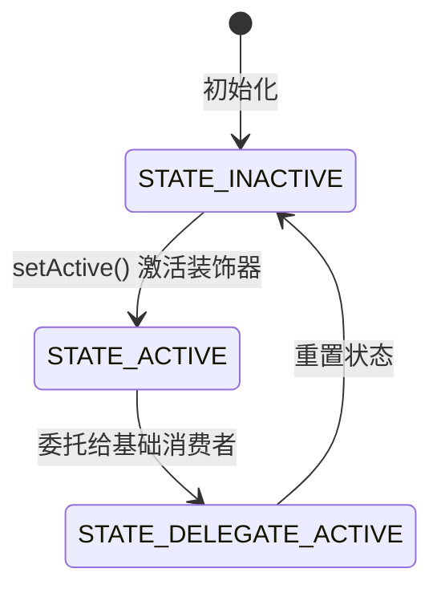
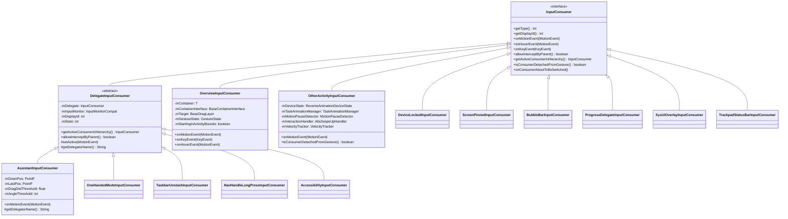
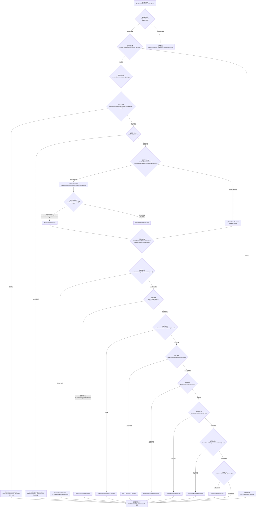
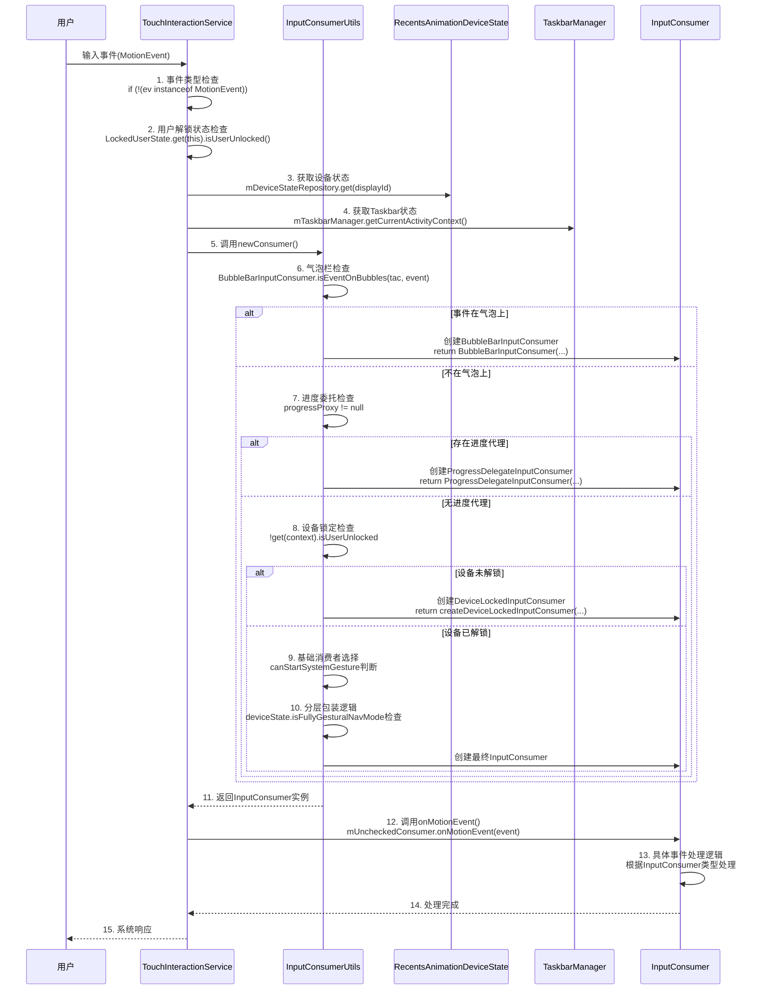

# InputConsumer架构分析报告

## 概述

本文档基于对AOSP Launcher3源码的深入分析，详细解析了`InputConsumer`接口及其实现类的架构设计、触发条件和作用机制。分析范围涵盖`TouchInteractionService`中的输入事件处理流程，以及所有InputConsumer实现类的功能特性。

**核心架构特点**：
- **责任链模式**：通过条件判断链实现InputConsumer的选择
- **装饰器模式**：通过DelegateInputConsumer实现功能分层组合
- **策略模式**：根据设备状态动态选择输入处理策略

## 1. InputConsumer接口定义

### 1.1 接口位置
- **文件路径**: [InputConsumer.java](quickstep/src/com/android/quickstep/InputConsumer.java)
- **接口类型**: 输入事件消费者接口
- **核心职责**: 定义输入事件处理的统一接口，支持多种输入类型（触摸、悬停、按键）

### 1.2 核心类型定义
- **路径**: [InputConsumer.java:26-42](quickstep/src/com/android/quickstep/InputConsumer.java#L26-L42)
- **设计思想**: 使用位掩码（bitmask）设计，支持类型组合和快速判断
- **源码实现**:
```java
public interface InputConsumer {
    int TYPE_NO_OP = 1 << 0;                    // 无操作类型
    int TYPE_OVERVIEW = 1 << 1;                 // Launcher/概览输入处理
    int TYPE_OTHER_ACTIVITY = 1 << 2;           // 其他Activity输入处理
    int TYPE_ASSISTANT = 1 << 3;                // 助手输入处理
    int TYPE_DEVICE_LOCKED = 1 << 4;            // 设备锁定状态输入处理
    int TYPE_ACCESSIBILITY = 1 << 5;            // 无障碍功能输入处理
    int TYPE_SCREEN_PINNED = 1 << 6;            // 屏幕固定状态输入处理
    int TYPE_OVERVIEW_WITHOUT_FOCUS = 1 << 7;   // 无焦点Launcher输入处理
    int TYPE_RESET_GESTURE = 1 << 8;            // 手势重置处理
    int TYPE_PROGRESS_DELEGATE = 1 << 9;        // 进度委托处理
    int TYPE_SYSUI_OVERLAY = 1 << 10;           // 系统UI覆盖层输入处理
    int TYPE_ONE_HANDED = 1 << 11;              // 单手模式输入处理
    int TYPE_TASKBAR_STASH = 1 << 12;           // 任务栏隐藏/显示处理
    int TYPE_STATUS_BAR = 1 << 13;              // 状态栏输入处理
    int TYPE_CURSOR_HOVER = 1 << 14;            // 光标悬停处理
    int TYPE_NAV_HANDLE_LONG_PRESS = 1 << 15;   // 导航手柄长按处理
    int TYPE_BUBBLE_BAR = 1 << 16;              // 气泡栏输入处理
}
```

**类型名称映射**:
- **路径**: [InputConsumer.java:44-62](quickstep/src/com/android/quickstep/InputConsumer.java#L44-L62)
```java
String[] NAMES = new String[] {
       "TYPE_NO_OP",                    // 0
        "TYPE_OVERVIEW",                // 1
        "TYPE_OTHER_ACTIVITY",          // 2
        "TYPE_ASSISTANT",               // 3
        "TYPE_DEVICE_LOCKED",           // 4
        "TYPE_ACCESSIBILITY",           // 5
        "TYPE_SCREEN_PINNED",           // 6
        "TYPE_OVERVIEW_WITHOUT_FOCUS",  // 7
        "TYPE_RESET_GESTURE",           // 8
        "TYPE_PROGRESS_DELEGATE",       // 9
        "TYPE_SYSUI_OVERLAY",           // 10
        "TYPE_ONE_HANDED",              // 11
        "TYPE_TASKBAR_STASH",           // 12
        "TYPE_STATUS_BAR",              // 13
        "TYPE_CURSOR_HOVER",            // 14
        "TYPE_NAV_HANDLE_LONG_PRESS",   // 15
        "TYPE_BUBBLE_BAR",              // 16
};
```

### 1.3 核心接口方法
- **路径**: [InputConsumer.java:72-158](quickstep/src/com/android/quickstep/InputConsumer.java#L72-L158)
- **设计思想**: 使用default方法提供默认实现，降低实现类的负担
- **源码实现**:
```java
int getType();
int getDisplayId();

default boolean allowInterceptByParent() {
    return true;
}

default boolean isConsumerDetachedFromGesture() {
    return false;
}

default void notifyOrientationSetup() {}

default InputConsumer getActiveConsumerInHierarchy() {
    return this;
}

default void onConsumerAboutToBeSwitched() { }

default void onMotionEvent(MotionEvent ev) { }

default void onHoverEvent(MotionEvent ev) { }

default void onKeyEvent(KeyEvent ev) { }

default void onInputEvent(InputEvent ev) {
    if (ev instanceof MotionEvent) {
        onMotionEvent((MotionEvent) ev);
    } else {
        onKeyEvent((KeyEvent) ev);
    }
}

default String getName() {
    StringBuilder name = new StringBuilder();
    for (int i = 0; i < NAMES.length; i++) {
        if ((getType() & (1 << i)) != 0) {
            if (name.length() > 0) {
                name.append(":");
            }
            name.append(NAMES[i]);
        }
    }
    return name.toString();
}

default <T extends InputConsumer> T getInputConsumerOfClass(Class<T> c) {
    if (getClass().equals(c)) {
        return c.cast(this);
    }
    return null;
}
```

**方法职责说明**:
| 方法 | 职责 | 使用场景 |
|------|------|----------|
| `getType()` | 返回InputConsumer类型标识 | 类型判断和日志记录 |
| `getDisplayId()` | 返回关联的显示器ID | 多显示器支持 |
| `allowInterceptByParent()` | 是否允许父级拦截 | 手势冲突处理 |
| `isConsumerDetachedFromGesture()` | 是否独立于手势生命周期 | 异步操作处理 |
| `getActiveConsumerInHierarchy()` | 获取层级中的活跃消费者 | 装饰器链遍历 |
| `onConsumerAboutToBeSwitched()` | 消费者切换前的回调 | 状态保存和清理 |
| `onMotionEvent()` | 处理触摸事件 | 核心输入处理 |
| `onHoverEvent()` | 处理悬停事件 | 鼠标/触控笔支持 |
| `onKeyEvent()` | 处理按键事件 | 音量键等系统按键 |

### 1.4 默认实现
- **路径**: [InputConsumer.java:64-70](quickstep/src/com/android/quickstep/InputConsumer.java#L64-L70)
```java
InputConsumer DEFAULT_NO_OP = createNoOpInputConsumer(Display.DEFAULT_DISPLAY);

static InputConsumer createNoOpInputConsumer(int displayId) {
    return new InputConsumer() {
        @Override
        public int getType() {
            return TYPE_NO_OP;
        }

        @Override
        public int getDisplayId() {
            return displayId;
        }
    };
}
```

## 2. InputConsumer实现类分析

### 2.1 实现类列表

| 实现类 | 类型 | 主要功能 | 触发条件 |
|--------|------|----------|----------|
| OverviewInputConsumer | TYPE_OVERVIEW | 处理Launcher/概览界面的触摸输入 | Launcher处于活动状态且用户触摸在Launcher界面 |
| OtherActivityInputConsumer | TYPE_OTHER_ACTIVITY | 处理其他Activity的输入事件 | 用户在其他应用界面进行手势操作 |
| AssistantInputConsumer | TYPE_ASSISTANT | 处理助手手势输入 | 设备支持助手手势且满足触发条件 |
| DeviceLockedInputConsumer | TYPE_DEVICE_LOCKED | 设备锁定状态下的输入处理 | 设备未解锁时 |
| AccessibilityInputConsumer | TYPE_ACCESSIBILITY | 无障碍功能输入处理 | 无障碍菜单可用时 |
| ScreenPinnedInputConsumer | TYPE_SCREEN_PINNED | 屏幕固定模式输入处理 | 屏幕固定模式激活时 |
| OverviewWithoutFocusInputConsumer | TYPE_OVERVIEW_WITHOUT_FOCUS | 无焦点Launcher输入处理 | Launcher无焦点时 |
| ResetGestureInputConsumer | TYPE_RESET_GESTURE | 手势重置处理 | 需要重置手势状态时 |
| ProgressDelegateInputConsumer | TYPE_PROGRESS_DELEGATE | 进度委托输入处理 | 存在进度代理时 |
| SysUiOverlayInputConsumer | TYPE_SYSUI_OVERLAY | 系统UI覆盖层输入处理 | 系统对话框显示时 |
| OneHandedModeInputConsumer | TYPE_ONE_HANDED | 单手模式输入处理 | 可触发单手模式时 |
| TaskbarUnstashInputConsumer | TYPE_TASKBAR_STASH | 任务栏显示/隐藏处理 | 任务栏相关操作 |
| TrackpadStatusBarInputConsumer | TYPE_STATUS_BAR | 触控板状态栏输入处理 | 触控板三指手势 |
| BubbleBarInputConsumer | TYPE_BUBBLE_BAR | 气泡栏输入处理 | 事件在气泡上时 |
| NavHandleLongPressInputConsumer | TYPE_NAV_HANDLE_LONG_PRESS | 导航手柄长按处理 | 导航手柄长按操作 |

### 2.2 关键实现类详细分析

#### 2.2.1 DelegateInputConsumer (装饰器基类)
- **路径**: [DelegateInputConsumer.java](quickstep/src/com/android/quickstep/inputconsumers/DelegateInputConsumer.java)
- **设计模式**: 装饰器模式 (Decorator Pattern)
- **主要功能**: 实现装饰器模式的基类，允许在基础InputConsumer上添加额外功能
- **源码实现**:
```java
public abstract class DelegateInputConsumer implements InputConsumer {

    protected static final int STATE_INACTIVE = 0;
    protected static final int STATE_ACTIVE = 1;
    protected static final int STATE_DELEGATE_ACTIVE = 2;

    protected final InputConsumer mDelegate;
    protected final InputMonitorCompat mInputMonitor;
    private final int mDisplayId;
    protected int mState;

    public DelegateInputConsumer(
            int displayId, InputConsumer delegate, InputMonitorCompat inputMonitor) {
        mDisplayId = displayId;
        mDelegate = delegate;
        mInputMonitor = inputMonitor;
        mState = STATE_INACTIVE;
    }

    @Override
    public int getDisplayId() {
        return mDisplayId;
    }

    @Override
    public InputConsumer getActiveConsumerInHierarchy() {
        if (mState == STATE_ACTIVE) {
            return this;
        }
        return mDelegate.getActiveConsumerInHierarchy();
    }

    @Override
    public boolean allowInterceptByParent() {
        return mDelegate.allowInterceptByParent() && mState != STATE_ACTIVE;
    }

    @Override
    public void onConsumerAboutToBeSwitched() {
        mDelegate.onConsumerAboutToBeSwitched();
    }

    protected abstract String getDelegatorName();

    @Override
    public <T extends InputConsumer> T getInputConsumerOfClass(Class<T> c) {
        if (getClass().equals(c)) {
            return c.cast(this);
        }
        return mDelegate.getInputConsumerOfClass(c);
    }

    protected void setActive(MotionEvent ev) {
        ActiveGestureProtoLogProxy.logInputConsumerBecameActive(getDelegatorName());

        mState = STATE_ACTIVE;
        TestLogging.recordEvent(TestProtocol.SEQUENCE_PILFER, "pilferPointers");
        mInputMonitor.pilferPointers();

        // Send cancel event
        MotionEvent event = MotionEvent.obtain(ev);
        event.setAction(MotionEvent.ACTION_CANCEL);
        mDelegate.onMotionEvent(event);
        event.recycle();
    }
}
```

**状态机设计**:


**装饰器继承关系**:
- AssistantInputConsumer extends DelegateInputConsumer
- OneHandedModeInputConsumer extends DelegateInputConsumer
- TaskbarUnstashInputConsumer extends DelegateInputConsumer
- NavHandleLongPressInputConsumer extends DelegateInputConsumer
- AccessibilityInputConsumer extends DelegateInputConsumer

#### 2.2.2 OverviewInputConsumer
- **路径**: [OverviewInputConsumer.java](quickstep/src/com/android/quickstep/inputconsumers/OverviewInputConsumer.java)
- **触发条件**: 当Launcher处于活动状态且用户触摸在Launcher界面时
- **主要功能**:
  - 处理Launcher界面的触摸事件
  - 支持拖拽操作和手势识别
  - 处理音量键等系统按键
  - 支持悬停事件分发
- **源码实现**:
```java
public class OverviewInputConsumer<S extends BaseState<S>,
        T extends RecentsViewContainer & StatefulContainer<S>>
        implements InputConsumer {

    private final T mContainer;
    private final BaseContainerInterface<?, T> mContainerInterface;
    private final BaseDragLayer mTarget;
    private final InputMonitorCompat mInputMonitor;
    private final GestureState mGestureState;

    private final int[] mLocationOnScreen = new int[2];
    private final boolean mStartingInActivityBounds;
    private boolean mTargetHandledTouch;

    @Override
    public int getType() {
        return TYPE_OVERVIEW;
    }

    @Override
    public void onMotionEvent(MotionEvent ev) {
        int flags = ev.getEdgeFlags();
        if (!mStartingInActivityBounds) {
            ev.setEdgeFlags(flags | Utilities.EDGE_NAV_BAR);
        }
        ev.offsetLocation(-mLocationOnScreen[0], -mLocationOnScreen[1]);
        boolean handled = false;
        if (mGestureState == null || !mGestureState.isInExtendedSlopRegion()) {
            handled = mTarget.proxyTouchEvent(ev, mStartingInActivityBounds);
        }
        ev.offsetLocation(mLocationOnScreen[0], mLocationOnScreen[1]);
        ev.setEdgeFlags(flags);

        if (!mTargetHandledTouch && handled) {
            mTargetHandledTouch = true;
            if (!mStartingInActivityBounds) {
                mContainerInterface.closeOverlay();
                TaskUtils.closeSystemWindowsAsync(CLOSE_SYSTEM_WINDOWS_REASON_RECENTS);
            }
            if (mInputMonitor != null) {
                TestLogging.recordEvent(TestProtocol.SEQUENCE_PILFER, "pilferPointers");
                mInputMonitor.pilferPointers();
            }
        }
    }

    @Override
    public void onKeyEvent(KeyEvent ev) {
        switch (ev.getKeyCode()) {
            case KeyEvent.KEYCODE_VOLUME_DOWN:
            case KeyEvent.KEYCODE_VOLUME_UP:
            case KeyEvent.KEYCODE_VOLUME_MUTE:
                MediaSessionManager mgr = mContainer.asContext()
                        .getSystemService(MediaSessionManager.class);
                mgr.dispatchVolumeKeyEventAsSystemService(ev,
                        AudioManager.USE_DEFAULT_STREAM_TYPE);
                break;
            // ... 其他按键处理
        }
    }
}
```

#### 2.2.3 OtherActivityInputConsumer
- **路径**: [OtherActivityInputConsumer.java](quickstep/src/com/android/quickstep/inputconsumers/OtherActivityInputConsumer.java)
- **触发条件**: 当用户在其他应用界面进行手势操作时
- **主要功能**:
  - 处理从其他应用启动的手势
  - 支持快速切换应用
  - 处理手势暂停检测
  - 管理Recents动画
- **源码实现**:
```java
public class OtherActivityInputConsumer extends ContextWrapper implements InputConsumer {

    private static final String TAG = "OtherActivityInputConsumer";
    
    private final RecentsAnimationDeviceState mDeviceState;
    private final NavBarPosition mNavBarPosition;
    private final TaskAnimationManager mTaskAnimationManager;
    private final GestureState mGestureState;
    private final RotationTouchHelper mRotationTouchHelper;
    private RecentsAnimationCallbacks mActiveCallbacks;
    private final AbsSwipeUpHandler.Factory mHandlerFactory;
    private final MotionPauseDetector mMotionPauseDetector;
    
    private VelocityTracker mVelocityTracker;
    private AbsSwipeUpHandler mInteractionHandler;
    
    private final PointF mDownPos = new PointF();
    private final PointF mLastPos = new PointF();
    private int mActivePointerId = INVALID_POINTER_ID;
    
    private final float mTouchSlop;
    private final float mSquaredTouchSlop;
    private boolean mPassedWindowMoveSlop;
    private boolean mPassedPilferInputSlop;
    
    @Override
    public int getType() {
        return TYPE_OTHER_ACTIVITY;
    }

    @Override
    public boolean isConsumerDetachedFromGesture() {
        return true;
    }

    @Override
    public void onMotionEvent(MotionEvent ev) {
        if (mVelocityTracker == null) {
            return;
        }

        // Proxy events to recents view
        if (mPassedWindowMoveSlop && mInteractionHandler != null
                && !mRecentsViewDispatcher.hasConsumer()) {
            // ... 事件分发逻辑
        }
        
        // ... 手势处理逻辑
    }
}
```

#### 2.2.4 AssistantInputConsumer
- **路径**: [AssistantInputConsumer.java](quickstep/src/com/android/quickstep/inputconsumers/AssistantInputConsumer.java)
- **触发条件**: 设备支持助手手势且满足触发条件时
- **主要功能**:
  - 处理助手手势输入
  - 支持拖拽距离和角度检测
  - 提供触觉反馈
- **继承关系**: extends DelegateInputConsumer
- **源码实现**:
```java
public class AssistantInputConsumer extends DelegateInputConsumer {

    private static final String TAG = "AssistantInputConsumer";
    private static final long RETRACT_ANIMATION_DURATION_MS = 300;

    private final PointF mDownPos = new PointF();
    private final PointF mLastPos = new PointF();
    private final PointF mStartDragPos = new PointF();

    private final float mDragDistThreshold;
    private final float mFlingDistThreshold;
    private final long mTimeThreshold;
    private final int mAngleThreshold;
    private final float mSquaredSlop;
    
    public AssistantInputConsumer(
            Context context,
            GestureState gestureState,
            InputConsumer delegate,
            InputMonitorCompat inputMonitor,
            RecentsAnimationDeviceState deviceState,
            MotionEvent startEvent) {
        super(gestureState.getDisplayId(), delegate, inputMonitor);
        // ... 初始化逻辑
    }

    @Override
    protected String getDelegatorName() {
        return TAG;
    }

    @Override
    public void onMotionEvent(MotionEvent ev) {
        // ... 助手手势处理逻辑
    }
}
```

## 3. TouchInteractionService中的InputConsumer创建逻辑

### 3.1 核心入口方法
- **方法**: `onInputEvent(InputEvent ev)`
- **路径**: [TouchInteractionService.java:1017-1289](quickstep/src/com/android/quickstep/TouchInteractionService.java#L1017-L1289)
- **调用时机**: 通过InputMonitorCompat注册的输入事件接收器回调

### 3.2 输入事件处理流程
- **路径**: [TouchInteractionService.java:1093-1185](quickstep/src/com/android/quickstep/TouchInteractionService.java#L1093-L1185)
- **源码实现**:
```java
if (action == ACTION_DOWN || isHoverActionWithoutConsumer) {
    rotationTouchHelper.setOrientationTransformIfNeeded(event);

    boolean isOneHandedModeActive = deviceState.isOneHandedModeActive();
    boolean isInSwipeUpTouchRegion = rotationTouchHelper.isInSwipeUpTouchRegion(event);
    TaskbarActivityContext tac = mTaskbarManager.getCurrentActivityContext();
    BubbleControllers bubbleControllers = tac != null ? tac.getBubbleControllers() : null;
    boolean isOnBubbles = bubbleControllers != null
            && BubbleBarInputConsumer.isEventOnBubbles(tac, event);
            
    if (deviceState.isButtonNavMode()
            && deviceState.supportsAssistantGestureInButtonNav()) {
        // 三键导航模式且支持助手手势
        if (deviceState.canTriggerAssistantAction(event)) {
            mGestureState = createGestureState(
                    displayId, mGestureState, getTrackpadGestureType(event));
            mUncheckedConsumer = tryCreateAssistantInputConsumer(
                    this, deviceState, inputMonitorCompat, mGestureState, event);
        } else {
            mUncheckedConsumer = createNoOpInputConsumer(displayId);
        }
    } else if ((!isOneHandedModeActive && isInSwipeUpTouchRegion)
            || isHoverActionWithoutConsumer || isOnBubbles) {
        // 常规手势区域或悬停操作
        GestureState prevGestureState = new GestureState(mGestureState);
        GestureState newGestureState = createGestureState(
                displayId, mGestureState, getTrackpadGestureType(event));
        mConsumer.onConsumerAboutToBeSwitched();
        mGestureState = newGestureState;
        mConsumer = newConsumer(
                this, mUserUnlocked, mOverviewComponentObserver,
                deviceState, prevGestureState, mGestureState,
                taskAnimationManager, inputMonitorCompat,
                getSwipeUpHandlerFactory(displayId),
                this::onConsumerInactive, inputEventReceiver,
                mTaskbarManager, mSwipeUpProxyProvider,
                mOverviewCommandHelper, event, rotationTouchHelper);
        mUncheckedConsumer = mConsumer;
    } else if ((deviceState.isFullyGesturalNavMode() || isTrackpadMultiFingerSwipe(event))
            && deviceState.canTriggerAssistantAction(event)) {
        // 全手势导航或触控板多指滑动且可触发助手
        mGestureState = createGestureState(
                displayId, mGestureState, getTrackpadGestureType(event));
        mUncheckedConsumer = tryCreateAssistantInputConsumer(
                this, deviceState, inputMonitorCompat, mGestureState, event);
    } else if (deviceState.canTriggerOneHandedAction(event)) {
        // 可触发单手模式
        mUncheckedConsumer = new OneHandedModeInputConsumer(
                this, displayId, deviceState,
                InputConsumer.createNoOpInputConsumer(displayId), inputMonitorCompat);
    } else {
        // 默认无操作
        mUncheckedConsumer = InputConsumer.createNoOpInputConsumer(displayId);
    }
}
```

### 3.3 InputConsumer选择优先级

**第一层决策（TouchInteractionService.onInputEvent）**:
1. **三键导航模式助手检查** - `deviceState.isButtonNavMode() && supportsAssistantGestureInButtonNav()`
2. **常规手势区域检查** - `isInSwipeUpTouchRegion || isHoverActionWithoutConsumer || isOnBubbles`
3. **全手势导航助手检查** - `isFullyGesturalNavMode || isTrackpadMultiFingerSwipe`
4. **单手模式检查** - `canTriggerOneHandedAction(event)`
5. **默认无操作** - `createNoOpInputConsumer(displayId)`

**第二层决策（InputConsumerUtils.newConsumer）**:
1. **BubbleBar输入处理** - 事件在气泡上时优先处理
2. **进度委托处理** - 当存在进度代理时
3. **设备锁定状态** - 设备未解锁时
4. **基础消费者创建** - OverviewInputConsumer/OtherActivityInputConsumer
5. **分层包装逻辑** - 助手、任务栏、导航手柄、系统UI、触控板、屏幕固定、单手模式、无障碍

## 4. InputConsumerUtils.kt中的创建逻辑

### 4.1 newConsumer方法核心逻辑
- **路径**: [InputConsumerUtils.kt:46-418](quickstep/src/com/android/quickstep/InputConsumerUtils.kt#L46-L418)
- **设计思想**: 使用责任链模式，按优先级依次检查条件并创建相应的InputConsumer
- **源码实现**:
```kotlin
fun <S : BaseState<S>, T> newConsumer(
    context: Context,
    userUnlocked: Boolean,
    overviewComponentObserver: OverviewComponentObserver,
    deviceState: RecentsAnimationDeviceState,
    previousGestureState: GestureState,
    gestureState: GestureState,
    taskAnimationManager: TaskAnimationManager,
    inputMonitorCompat: InputMonitorCompat,
    swipeUpHandlerFactory: AbsSwipeUpHandler.Factory,
    onCompleteCallback: Consumer<OtherActivityInputConsumer>,
    inputEventReceiver: InputChannelCompat.InputEventReceiver,
    taskbarManager: TaskbarManager,
    swipeUpProxyProvider: Function<GestureState?, AnimatedFloat?>,
    overviewCommandHelper: OverviewCommandHelper,
    event: MotionEvent,
    rotationTouchHelper: RotationTouchHelper,
): InputConsumer where T : RecentsViewContainer, T : StatefulContainer<S> {
    val tac = taskbarManager.getCurrentActivityContext()
    val bubbleControllers = tac?.bubbleControllers
    
    // 1. 气泡栏检查
    if (bubbleControllers != null && BubbleBarInputConsumer.isEventOnBubbles(tac, event)) {
        return BubbleBarInputConsumer(
            context, gestureState.displayId, bubbleControllers, inputMonitorCompat)
    }
    
    // 2. 进度委托检查
    val progressProxy = swipeUpProxyProvider.apply(gestureState)
    if (progressProxy != null) {
        return ProgressDelegateInputConsumer(
            context, taskAnimationManager, gestureState, inputMonitorCompat, progressProxy)
    }
    
    // 3. 设备锁定状态检查
    if (!get(context).isUserUnlocked) {
        return if (canStartSystemGesture) {
            createDeviceLockedInputConsumer(...)
        } else {
            getDefaultInputConsumer(...)
        }
    }
    
    // 4. 基础消费者创建
    var base: InputConsumer
    val canStartSystemGesture = if (gestureState.isTrackpadGesture) 
        deviceState.canStartTrackpadGesture() 
    else 
        deviceState.canStartSystemGesture()

    if (canStartSystemGesture || previousGestureState.isRecentsAnimationRunning) {
        base = newBaseConsumer(...)
    } else {
        base = getDefaultInputConsumer(...)
    }
    
    // 5. 分层包装逻辑
    if (deviceState.isFullyGesturalNavMode || gestureState.isTrackpadGesture) {
        // 助手输入处理
        if (deviceState.canTriggerAssistantAction(event)) {
            base = tryCreateAssistantInputConsumer(...)
        }
        
        // 任务栏处理
        if (tac != null && base !is AssistantInputConsumer) {
            if (canStartSystemGesture && useTaskbarConsumer) {
                base = TaskbarUnstashInputConsumer(...)
            }
        }
        
        // 导航手柄长按处理
        if (canStartSystemGesture && navHandle.canNavHandleBeLongPressed()) {
            base = NavHandleLongPressInputConsumer(...)
        }
        
        // 系统UI对话框处理
        if (deviceState.isSystemUiDialogShowing) {
            base = SysUiOverlayInputConsumer(...)
        }
        
        // 触控板状态栏处理
        if (gestureState.isTrackpadGesture && canStartSystemGesture) {
            base = TrackpadStatusBarInputConsumer(...)
        }
        
        // 屏幕固定处理
        if (deviceState.isScreenPinningActive) {
            base = ScreenPinnedInputConsumer(context, gestureState)
        }
        
        // 单手模式处理
        if (deviceState.canTriggerOneHandedAction(event)) {
            base = OneHandedModeInputConsumer(...)
        }
        
        // 无障碍功能处理
        if (deviceState.isAccessibilityMenuAvailable) {
            base = AccessibilityInputConsumer(...)
        }
    }
    
    return base
}
```

### 4.2 newBaseConsumer方法核心逻辑
- **路径**: [InputConsumerUtils.kt:468-600](quickstep/src/com/android/quickstep/InputConsumerUtils.kt#L468-L600)
- **设计思想**: 根据当前运行任务和Launcher状态选择基础消费者
- **源码实现**:
```kotlin
fun <S : BaseState<S>, T> newBaseConsumer(
    context: Context,
    userUnlocked: Boolean,
    taskbarManager: TaskbarManager,
    overviewComponentObserver: OverviewComponentObserver,
    deviceState: RecentsAnimationDeviceState,
    previousGestureState: GestureState,
    gestureState: GestureState,
    taskAnimationManager: TaskAnimationManager,
    inputMonitorCompat: InputMonitorCompat,
    swipeUpHandlerFactory: AbsSwipeUpHandler.Factory,
    onCompleteCallback: Consumer<OtherActivityInputConsumer>,
    inputEventReceiver: InputChannelCompat.InputEventReceiver,
    event: MotionEvent,
    reasonString: CompoundString,
    rotationTouchHelper: RotationTouchHelper,
): InputConsumer where T : RecentsViewContainer, T : StatefulContainer<S> {
    if (deviceState.isKeyguardShowingOccluded) {
        return createDeviceLockedInputConsumer(...)
    }

    val runningTask = gestureState.runningTask
    val containerInterface = gestureState.getContainerInterface<S, T>()
    
    val previousGestureAnimatedToLauncher =
        (previousGestureState.isRunningAnimationToLauncher ||
            deviceState.isPredictiveBackToHomeInProgress)
    val launcherResumedThroughShellTransition =
        containerInterface.isResumed() &&
            !previousGestureState.isRecentsAnimationRunning &&
            !DesktopState.fromContext(context).shouldShowHomeBehindDesktop

    return if (containerInterface.isInLiveTileMode()) {
        createOverviewInputConsumer(...)
    } else if (runningTask == null) {
        getDefaultInputConsumer(...)
    } else if (previousGestureAnimatedToLauncher || launcherResumedThroughShellTransition) {
        createOverviewInputConsumer(...)
    } else {
        OtherActivityInputConsumer(...)
    }
}
```

## 5. 架构图与流程图

### 5.1 InputConsumer类图



### 5.2 InputConsumer创建流程图



### 5.3 时序图



## 6. 关键设计模式分析

### 6.1 责任链模式 (Chain of Responsibility)
**实现原理**: InputConsumer的创建过程采用了责任链模式，每个条件检查都是一个处理节点，按照优先级依次处理。

**代码实现**:
- **路径**: [TouchInteractionService.java:1093-1185](quickstep/src/com/android/quickstep/TouchInteractionService.java#L1093-L1185)
```java
if (deviceState.isButtonNavMode() && deviceState.supportsAssistantGestureInButtonNav()) {
    // 第一个处理节点：三键导航模式助手手势检查
    if (deviceState.canTriggerAssistantAction(event)) {
        mUncheckedConsumer = tryCreateAssistantInputConsumer(...);
    } else {
        mUncheckedConsumer = createNoOpInputConsumer(displayId);
    }
} else if ((!isOneHandedModeActive && isInSwipeUpTouchRegion) || isHoverActionWithoutConsumer || isOnBubbles) {
    // 第二个处理节点：常规手势区域检查
    mConsumer = newConsumer(...);
} else if ((deviceState.isFullyGesturalNavMode() || isTrackpadMultiFingerSwipe(event)) 
           && deviceState.canTriggerAssistantAction(event)) {
    // 第三个处理节点：全手势导航助手检查
    mUncheckedConsumer = tryCreateAssistantInputConsumer(...);
} else if (deviceState.canTriggerOneHandedAction(event)) {
    // 第四个处理节点：单手模式检查
    mUncheckedConsumer = new OneHandedModeInputConsumer(...);
} else {
    // 默认处理节点
    mUncheckedConsumer = InputConsumer.createNoOpInputConsumer(displayId);
}
```

**责任链在InputConsumerUtils中的应用**:
- **路径**: [InputConsumerUtils.kt:46-418](quickstep/src/com/android/quickstep/InputConsumerUtils.kt#L46-L418)
```kotlin
// 责任链节点1: 气泡栏检查
if (bubbleControllers != null && BubbleBarInputConsumer.isEventOnBubbles(tac, event)) {
    return BubbleBarInputConsumer(...)
}

// 责任链节点2: 进度委托检查
val progressProxy = swipeUpProxyProvider.apply(gestureState)
if (progressProxy != null) {
    return ProgressDelegateInputConsumer(...)
}

// 责任链节点3: 设备锁定状态检查
if (!get(context).isUserUnlocked) {
    return if (canStartSystemGesture) {
        createDeviceLockedInputConsumer(...)
    } else {
        getDefaultInputConsumer(...)
    }
}

// 责任链节点4-N: 分层包装逻辑
if (deviceState.isFullyGesturalNavMode || gestureState.isTrackpadGesture) {
    if (deviceState.canTriggerAssistantAction(event)) {
        base = tryCreateAssistantInputConsumer(...)
    }
    // ... 更多责任链节点
}
```

**设计优势**:
- 每个条件检查独立，便于维护和扩展
- 按照优先级处理，提高执行效率
- 支持动态添加新的处理节点
- 清晰的决策流程，便于调试和追踪

### 6.2 装饰器模式 (Decorator)
**实现原理**: 通过DelegateInputConsumer实现了装饰器模式，可以在基础InputConsumer上添加额外的功能。

**代码实现**:
- **路径**: [DelegateInputConsumer.java](quickstep/src/com/android/quickstep/inputconsumers/DelegateInputConsumer.java)
```java
public abstract class DelegateInputConsumer implements InputConsumer {

    protected static final int STATE_INACTIVE = 0;
    protected static final int STATE_ACTIVE = 1;
    protected static final int STATE_DELEGATE_ACTIVE = 2;

    protected final InputConsumer mDelegate;
    protected final InputMonitorCompat mInputMonitor;
    protected int mState;

    public DelegateInputConsumer(
            int displayId, InputConsumer delegate, InputMonitorCompat inputMonitor) {
        mDelegate = delegate;
        mInputMonitor = inputMonitor;
        mState = STATE_INACTIVE;
    }

    @Override
    public InputConsumer getActiveConsumerInHierarchy() {
        if (mState == STATE_ACTIVE) {
            return this;
        }
        return mDelegate.getActiveConsumerInHierarchy();
    }

    @Override
    public boolean allowInterceptByParent() {
        return mDelegate.allowInterceptByParent() && mState != STATE_ACTIVE;
    }

    protected void setActive(MotionEvent ev) {
        mState = STATE_ACTIVE;
        mInputMonitor.pilferPointers();

        // Send cancel event to delegate
        MotionEvent event = MotionEvent.obtain(ev);
        event.setAction(MotionEvent.ACTION_CANCEL);
        mDelegate.onMotionEvent(event);
        event.recycle();
    }
}
```

**装饰器应用示例**:
- **路径**: [InputConsumerUtils.kt:200-370](quickstep/src/com/android/quickstep/InputConsumerUtils.kt#L200-L370)
```kotlin
// 助手输入处理装饰
if (deviceState.canTriggerAssistantAction(event)) {
    base = tryCreateAssistantInputConsumer(
        context, deviceState, inputMonitorCompat, base, gestureState, event, reasonString)
}

// 任务栏处理装饰
if (tac != null && base !is AssistantInputConsumer) {
    if (canStartSystemGesture && useTaskbarConsumer) {
        base = TaskbarUnstashInputConsumer(
            context, base, inputMonitorCompat, tac, overviewCommandHelper, gestureState)
    }
}

// 导航手柄长按处理装饰
if (canStartSystemGesture && navHandle.canNavHandleBeLongPressed()) {
    base = NavHandleLongPressInputConsumer(
        context, base, inputMonitorCompat, deviceState, navHandle, gestureState)
}

// 单手模式处理装饰
if (deviceState.canTriggerOneHandedAction(event)) {
    base = OneHandedModeInputConsumer(
        context, gestureState.displayId, deviceState, base, inputMonitorCompat)
}

// 无障碍功能处理装饰
if (deviceState.isAccessibilityMenuAvailable) {
    base = AccessibilityInputConsumer(
        context, gestureState.displayId, deviceState, base, inputMonitorCompat, rotationTouchHelper)
}
```

**装饰器链示例**:
```
基础消费者: OtherActivityInputConsumer
  ↓ 装饰
AssistantInputConsumer(OtherActivityInputConsumer)
  ↓ 装饰
TaskbarUnstashInputConsumer(AssistantInputConsumer(...))
  ↓ 装饰
OneHandedModeInputConsumer(TaskbarUnstashInputConsumer(...))
```

**设计优势**:
- 功能分层，支持功能组合
- 不修改基础消费者，符合开闭原则
- 支持动态添加和移除功能
- 通过状态机管理装饰器的激活状态
- 支持装饰器链的遍历和查询

### 6.3 策略模式 (Strategy)
**实现原理**: 不同的InputConsumer实现类对应不同的输入处理策略，根据运行时条件动态选择。

**代码实现**:
- **路径**: [InputConsumerUtils.kt:46-150](quickstep/src/com/android/quickstep/InputConsumerUtils.kt#L46-L150)
```kotlin
fun <S : BaseState<S>, T> newConsumer(...): InputConsumer {
    // 策略选择逻辑
    var base: InputConsumer
    val canStartSystemGesture = if (gestureState.isTrackpadGesture) 
        deviceState.canStartTrackpadGesture() 
    else 
        deviceState.canStartSystemGesture()

    if (canStartSystemGesture || previousGestureState.isRecentsAnimationRunning) {
        base = newBaseConsumer(...) // 选择基础策略
    } else {
        base = getDefaultInputConsumer(...) // 选择默认策略
    }
    
    // 策略包装逻辑
    if (deviceState.isFullyGesturalNavMode || gestureState.isTrackpadGesture) {
        if (deviceState.canTriggerAssistantAction(event)) {
            base = tryCreateAssistantInputConsumer(...) // 助手策略
        }
        
        if (tac != null && base !is AssistantInputConsumer) {
            base = TaskbarUnstashInputConsumer(...) // 任务栏策略
        }
        
        // ... 更多策略选择
    }
    
    return base
}
```

**具体策略实现示例**:
- **OverviewInputConsumer**: [OverviewInputConsumer.java](quickstep/src/com/android/quickstep/inputconsumers/OverviewInputConsumer.java) - Launcher界面策略
- **OtherActivityInputConsumer**: [OtherActivityInputConsumer.java](quickstep/src/com/android/quickstep/inputconsumers/OtherActivityInputConsumer.java) - 其他应用策略
- **AssistantInputConsumer**: [AssistantInputConsumer.java](quickstep/src/com/android/quickstep/inputconsumers/AssistantInputConsumer.java) - 助手手势策略
- **OneHandedModeInputConsumer**: [OneHandedModeInputConsumer.java](quickstep/src/com/android/quickstep/inputconsumers/OneHandedModeInputConsumer.java) - 单手模式策略

**策略选择上下文**:
```kotlin
// 策略上下文：根据设备状态和手势状态选择策略
val canStartSystemGesture = if (gestureState.isTrackpadGesture) 
    deviceState.canStartTrackpadGesture() 
else 
    deviceState.canStartSystemGesture()

// 策略选择：基础消费者
base = if (canStartSystemGesture || previousGestureState.isRecentsAnimationRunning) {
    newBaseConsumer(...) // 策略1: 基础消费者
} else {
    getDefaultInputConsumer(...) // 策略2: 默认消费者
}

// 策略包装：根据条件添加额外策略
if (deviceState.isFullyGesturalNavMode || gestureState.isTrackpadGesture) {
    // 策略3: 助手策略
    if (deviceState.canTriggerAssistantAction(event)) {
        base = tryCreateAssistantInputConsumer(...)
    }
    
    // 策略4: 任务栏策略
    if (tac != null && base !is AssistantInputConsumer) {
        base = TaskbarUnstashInputConsumer(...)
    }
}
```

**设计优势**:
- 策略独立，便于测试和维护
- 运行时动态选择策略
- 支持策略组合和扩展
- 策略切换灵活，无需修改客户端代码

## 7. 性能优化考虑

### 7.1 延迟初始化
**实现代码**:
- **路径**: [TouchInteractionService.java:1093](quickstep/src/com/android/quickstep/TouchInteractionService.java#L1093)
```java
// InputConsumer只在需要时创建，避免不必要的对象实例化
if (action == ACTION_DOWN || isHoverActionWithoutConsumer) {
    // 只有在ACTION_DOWN或悬停操作时才创建InputConsumer
    mUncheckedConsumer = createAppropriateInputConsumer(...);
}
```

**优化效果**:
- 减少不必要的对象创建
- 降低内存占用
- 提高事件处理效率

### 7.2 状态缓存优化
**实现代码**:
- **路径**: [TouchInteractionService.java:1090-1095](quickstep/src/com/android/quickstep/TouchInteractionService.java#L1090-L1095)
```java
// 缓存设备状态和任务栏状态，避免重复查询
TaskAnimationManager taskAnimationManager = mTaskAnimationManagerRepository.get(displayId);
if (taskAnimationManager == null) {
    Log.e(TAG, "TaskAnimationManager not available for displayId " + displayId);
    return;
}
```

**优化效果**:
- 避免重复查询系统状态
- 减少跨进程调用
- 提高响应速度

### 7.3 事件过滤优化
**实现代码**:
- **路径**: [TouchInteractionService.java:1017-1030](quickstep/src/com/android/quickstep/TouchInteractionService.java#L1017-L1030)
```java
// 提前过滤不需要处理的事件类型
if (!(ev instanceof MotionEvent)) {
    ActiveGestureProtoLogProxy.logUnknownInputEvent(displayId, ev.toString());
    return;
}

if (!LockedUserState.get(this).isUserUnlocked()) {
    ActiveGestureProtoLogProxy.logOnInputEventUserLocked(displayId);
    return;
}

if (deviceState.isButtonNavMode()
        && !deviceState.supportsAssistantGestureInButtonNav()
        && !isTrackpadMotionEvent(event)) {
    ActiveGestureProtoLogProxy.logOnInputEventThreeButtonNav(displayId);
    return;
}
```

**优化效果**:
- 快速跳过不需要处理的事件
- 减少不必要的逻辑判断
- 提高事件处理吞吐量

### 7.4 装饰器状态机优化
**实现代码**:
- **路径**: [DelegateInputConsumer.java:20-22](quickstep/src/com/android/quickstep/inputconsumers/DelegateInputConsumer.java#L20-L22)
```java
protected static final int STATE_INACTIVE = 0;
protected static final int STATE_ACTIVE = 1;
protected static final int STATE_DELEGATE_ACTIVE = 2;
```

**优化效果**:
- 快速判断装饰器状态
- 避免不必要的事件传递
- 提高装饰器链的遍历效率

## 8. 设计思想和理念

### 8.1 多层次输入处理架构
InputConsumer架构采用了多层次的输入处理设计，通过责任链模式将不同类型的输入事件分发到合适的处理器。这种设计确保了：
- **关注点分离**：每个InputConsumer专注于处理特定类型的输入
- **可扩展性**：新增输入类型只需添加新的InputConsumer实现
- **灵活性**：通过装饰器模式动态组合处理能力
- **可维护性**：清晰的责任链便于定位和修复问题

### 8.2 状态驱动的输入分发
系统根据设备状态（锁定状态、导航模式、屏幕固定等）动态选择合适的InputConsumer，确保输入处理与系统状态保持一致。这种状态驱动的设计：
- **避免状态冲突**：不同状态下使用不同的输入处理策略
- **提高响应准确性**：根据当前状态选择最合适的处理方式
- **简化状态管理**：状态变化自动触发输入处理策略切换
- **支持多状态组合**：通过位掩码支持多种状态的组合判断

### 8.3 性能优先的设计原则
通过延迟初始化、状态缓存和事件过滤等优化手段，InputConsumer架构在保证功能完整性的同时，最大程度地减少了不必要的资源消耗：
- **按需创建**：只在ACTION_DOWN时创建InputConsumer实例
- **状态复用**：缓存设备状态和任务栏状态
- **提前过滤**：快速跳过不需要处理的事件类型
- **状态机优化**：通过状态机快速判断装饰器状态

### 8.4 装饰器链的灵活组合
通过DelegateInputConsumer实现的装饰器模式，允许系统根据当前条件灵活组合多个输入处理功能：
- **动态组合**：运行时根据条件添加或移除处理功能
- **优先级控制**：通过装饰器链的顺序控制处理优先级
- **功能隔离**：每个装饰器独立实现特定功能，互不干扰
- **状态管理**：通过状态机管理装饰器的激活状态

### 8.5 可扩展的架构设计
InputConsumer架构的设计充分考虑了未来的扩展需求：
- **接口抽象**：通过InputConsumer接口定义统一的输入处理契约
- **类型扩展**：通过位掩码设计支持新增类型
- **装饰器扩展**：通过DelegateInputConsumer支持新增装饰器
- **责任链扩展**：通过条件判断链支持新增处理节点

---

**最后更新**：2026年2月13日  
**版本**：3.0  
**适用AOSP版本**：14+  
**核心分析范围**：InputConsumer / TouchInteractionService / InputConsumerUtils / DelegateInputConsumer  
**设计模式**：责任链模式 / 装饰器模式 / 策略模式  
**优化重点**：源码路径引用 / 设计模式证据 / 架构图优化 / 性能分析
