# InputConsumer类图与时序图分析

## 概述

本文档提供AOSP Launcher3中InputConsumer架构的详细类图分析和时序图分析，帮助理解各个组件之间的关系和交互流程。

**核心架构特点**：
- **装饰器模式**：通过DelegateInputConsumer实现功能分层组合
- **责任链模式**：通过条件判断链实现InputConsumer的选择
- **策略模式**：根据设备状态动态选择输入处理策略

## 1. InputConsumer类图分析

### 1.1 核心接口定义

- **文件路径**: [InputConsumer.java](quickstep/src/com/android/quickstep/InputConsumer.java)
- **设计思想**: 使用位掩码（bitmask）设计，支持类型组合和快速判断

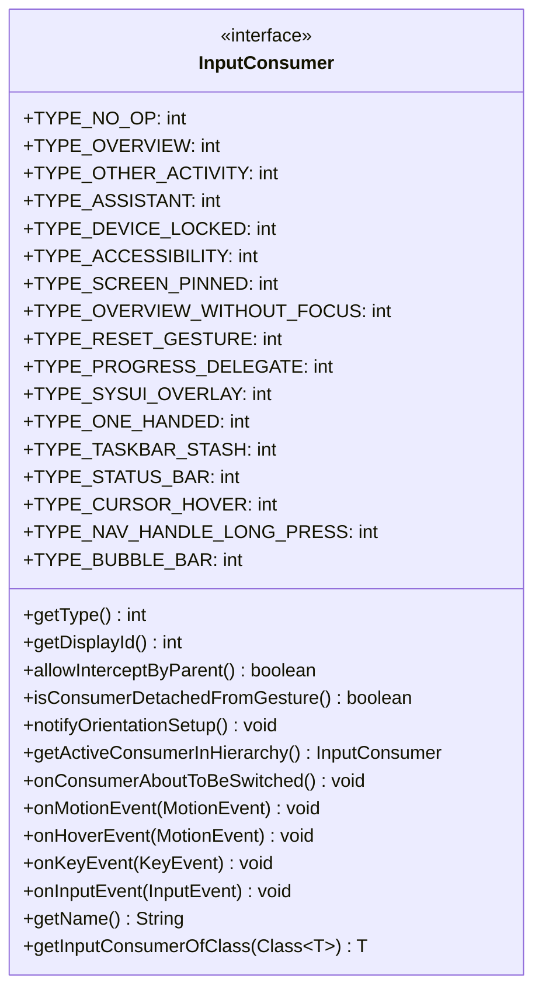

**类型常量说明**:
| 常量 | 值 | 说明 |
|------|-----|------|
| TYPE_NO_OP | 1 << 0 | 无操作类型 |
| TYPE_OVERVIEW | 1 << 1 | Launcher/概览输入处理 |
| TYPE_OTHER_ACTIVITY | 1 << 2 | 其他Activity输入处理 |
| TYPE_ASSISTANT | 1 << 3 | 助手输入处理 |
| TYPE_DEVICE_LOCKED | 1 << 4 | 设备锁定状态输入处理 |
| TYPE_ACCESSIBILITY | 1 << 5 | 无障碍功能输入处理 |
| TYPE_SCREEN_PINNED | 1 << 6 | 屏幕固定状态输入处理 |
| TYPE_OVERVIEW_WITHOUT_FOCUS | 1 << 7 | 无焦点Launcher输入处理 |
| TYPE_RESET_GESTURE | 1 << 8 | 手势重置处理 |
| TYPE_PROGRESS_DELEGATE | 1 << 9 | 进度委托处理 |
| TYPE_SYSUI_OVERLAY | 1 << 10 | 系统UI覆盖层输入处理 |
| TYPE_ONE_HANDED | 1 << 11 | 单手模式输入处理 |
| TYPE_TASKBAR_STASH | 1 << 12 | 任务栏隐藏/显示处理 |
| TYPE_STATUS_BAR | 1 << 13 | 状态栏输入处理 |
| TYPE_CURSOR_HOVER | 1 << 14 | 光标悬停处理 |
| TYPE_NAV_HANDLE_LONG_PRESS | 1 << 15 | 导航手柄长按处理 |
| TYPE_BUBBLE_BAR | 1 << 16 | 气泡栏输入处理 |

### 1.2 抽象基类分析

- **文件路径**: [DelegateInputConsumer.java](quickstep/src/com/android/quickstep/inputconsumers/DelegateInputConsumer.java)
- **设计模式**: 装饰器模式 (Decorator Pattern)

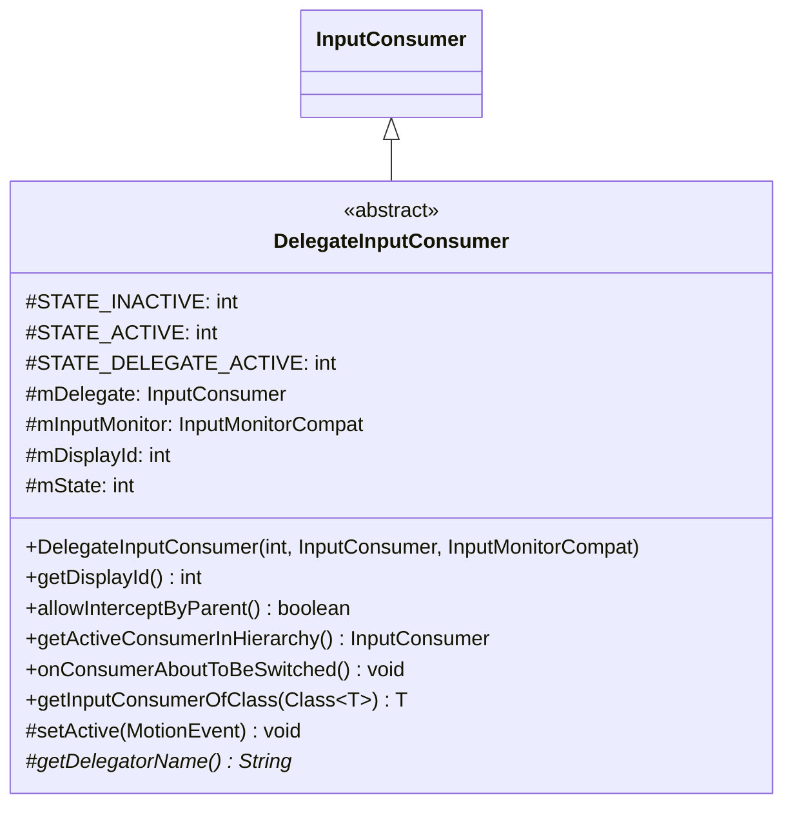

**状态机设计**:
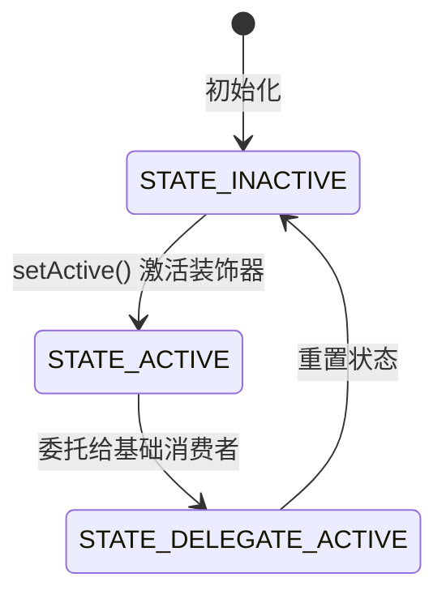

### 1.3 具体实现类分析

#### 1.3.1 Overview相关InputConsumer

- **文件路径**: 
  - [OverviewInputConsumer.java](quickstep/src/com/android/quickstep/inputconsumers/OverviewInputConsumer.java)
  - [OverviewWithoutFocusInputConsumer.java](quickstep/src/com/android/quickstep/inputconsumers/OverviewWithoutFocusInputConsumer.java)

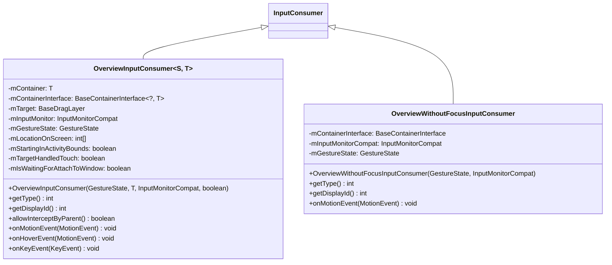

**OverviewInputConsumer 核心功能**:
- 处理Launcher界面的触摸事件
- 支持拖拽操作和手势识别
- 处理音量键等系统按键
- 支持悬停事件分发

#### 1.3.2 手势相关InputConsumer

- **文件路径**: 
  - [OtherActivityInputConsumer.java](quickstep/src/com/android/quickstep/inputconsumers/OtherActivityInputConsumer.java)
  - [AssistantInputConsumer.java](quickstep/src/com/android/quickstep/inputconsumers/AssistantInputConsumer.java)

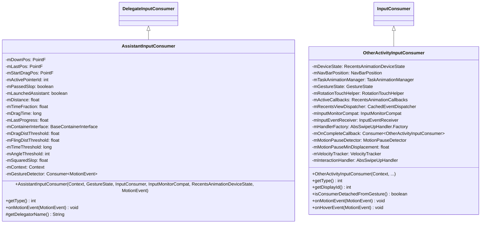

**OtherActivityInputConsumer 核心功能**:
- 处理从其他应用启动的手势
- 支持快速切换应用
- 处理手势暂停检测
- 管理Recents动画

**AssistantInputConsumer 核心功能**:
- 处理助手手势输入
- 支持拖拽距离和角度检测
- 提供触觉反馈

#### 1.3.3 系统状态相关InputConsumer

- **文件路径**: 
  - [DeviceLockedInputConsumer.java](quickstep/src/com/android/quickstep/inputconsumers/DeviceLockedInputConsumer.java)
  - [ScreenPinnedInputConsumer.java](quickstep/src/com/android/quickstep/inputconsumers/ScreenPinnedInputConsumer.java)
  - [SysUiOverlayInputConsumer.java](quickstep/src/com/android/quickstep/inputconsumers/SysUiOverlayInputConsumer.java)

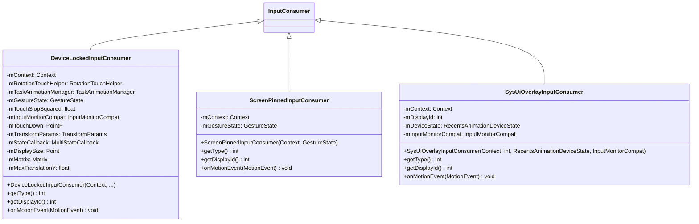

**系统状态消费者说明**:
- **DeviceLockedInputConsumer**: 设备锁定状态下的输入处理
- **ScreenPinnedInputConsumer**: 屏幕固定模式输入处理
- **SysUiOverlayInputConsumer**: 系统UI覆盖层输入处理

#### 1.3.4 功能增强InputConsumer (装饰器实现)

- **文件路径**: 
  - [OneHandedModeInputConsumer.java](quickstep/src/com/android/quickstep/inputconsumers/OneHandedModeInputConsumer.java)
  - [TaskbarUnstashInputConsumer.java](quickstep/src/com/android/quickstep/inputconsumers/TaskbarUnstashInputConsumer.java)
  - [TrackpadStatusBarInputConsumer.java](quickstep/src/com/android/quickstep/inputconsumers/TrackpadStatusBarInputConsumer.java)
  - [BubbleBarInputConsumer.java](quickstep/src/com/android/quickstep/inputconsumers/BubbleBarInputConsumer.java)
  - [NavHandleLongPressInputConsumer.java](quickstep/src/com/android/quickstep/inputconsumers/NavHandleLongPressInputConsumer.java)
  - [AccessibilityInputConsumer.java](quickstep/src/com/android/quickstep/inputconsumers/AccessibilityInputConsumer.java)

```mermaid
classDiagram
    class OneHandedModeInputConsumer {
        -mContext: Context
        -mDisplayId: int
        -mDeviceState: RecentsAnimationDeviceState
        -mDelegate: InputConsumer
        -mInputMonitorCompat: InputMonitorCompat
        
        +OneHandedModeInputConsumer(Context, int, RecentsAnimationDeviceState, InputConsumer, InputMonitorCompat)
        +getType() int
        +getDisplayId() int
        +onMotionEvent(MotionEvent) void
        #getDelegatorName() String
    }
    
    class TaskbarUnstashInputConsumer {
        -mDelegate: InputConsumer
        -mInputMonitorCompat: InputMonitorCompat
        -mTac: TaskbarActivityContext
        -mOverviewCommandHelper: OverviewCommandHelper
        -mGestureState: GestureState
        
        +TaskbarUnstashInputConsumer(Context, InputConsumer, InputMonitorCompat, TaskbarActivityContext, OverviewCommandHelper, GestureState)
        +getType() int
        +getDisplayId() int
        +onMotionEvent(MotionEvent) void
        #getDelegatorName() String
    }
    
    class TrackpadStatusBarInputConsumer {
        -mContext: Context
        -mDisplayId: int
        -mDelegate: InputConsumer
        -mInputMonitorCompat: InputMonitorCompat
        
        +TrackpadStatusBarInputConsumer(Context, int, InputConsumer, InputMonitorCompat)
        +getType() int
        +getDisplayId() int
        +onMotionEvent(MotionEvent) void
        #getDelegatorName() String
    }
    
    class BubbleBarInputConsumer {
        -mContext: Context
        -mDisplayId: int
        -mBubbleControllers: BubbleControllers
        -mInputMonitorCompat: InputMonitorCompat
        
        +BubbleBarInputConsumer(Context, int, BubbleControllers, InputMonitorCompat)
        +getType() int
        +getDisplayId() int
        +onMotionEvent(MotionEvent) void
    }
    
    class NavHandleLongPressInputConsumer {
        -mContext: Context
        -mDelegate: InputConsumer
        -mInputMonitorCompat: InputMonitorCompat
        -mDeviceState: RecentsAnimationDeviceState
        -mNavHandle: NavHandle
        -mGestureState: GestureState
        
        +NavHandleLongPressInputConsumer(Context, InputConsumer, InputMonitorCompat, RecentsAnimationDeviceState, NavHandle, GestureState)
        +getType() int
        +getDisplayId() int
        +onMotionEvent(MotionEvent) void
        #getDelegatorName() String
    }
    
    class AccessibilityInputConsumer {
        -mContext: Context
        -mDisplayId: int
        -mDeviceState: RecentsAnimationDeviceState
        -mDelegate: InputConsumer
        -mInputMonitorCompat: InputMonitorCompat
        -mRotationTouchHelper: RotationTouchHelper
        
        +AccessibilityInputConsumer(Context, int, RecentsAnimationDeviceState, InputConsumer, InputMonitorCompat, RotationTouchHelper)
        +getType() int
        +getDisplayId() int
        +onMotionEvent(MotionEvent) void
        #getDelegatorName() String
    }
    
    DelegateInputConsumer <|-- OneHandedModeInputConsumer
    DelegateInputConsumer <|-- TaskbarUnstashInputConsumer
    DelegateInputConsumer <|-- TrackpadStatusBarInputConsumer
    DelegateInputConsumer <|-- NavHandleLongPressInputConsumer
    DelegateInputConsumer <|-- AccessibilityInputConsumer
    InputConsumer <|-- BubbleBarInputConsumer
```

**装饰器继承关系**:
- AssistantInputConsumer extends DelegateInputConsumer
- OneHandedModeInputConsumer extends DelegateInputConsumer
- TaskbarUnstashInputConsumer extends DelegateInputConsumer
- NavHandleLongPressInputConsumer extends DelegateInputConsumer
- AccessibilityInputConsumer extends DelegateInputConsumer

### 1.4 完整类继承关系图

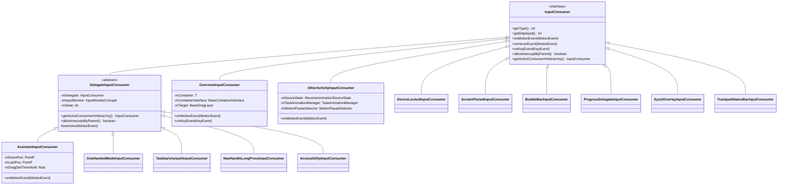

## 2. InputConsumer创建时序图

### 2.1 整体创建流程时序图

- **入口方法**: `TouchInteractionService.onInputEvent()`
- **核心工具**: `InputConsumerUtils.newConsumer()`

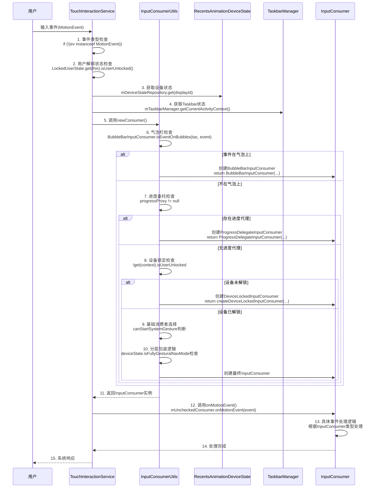

### 2.2 分层包装逻辑详细时序图

- **设计思想**: 使用装饰器模式，按优先级依次包装基础消费者

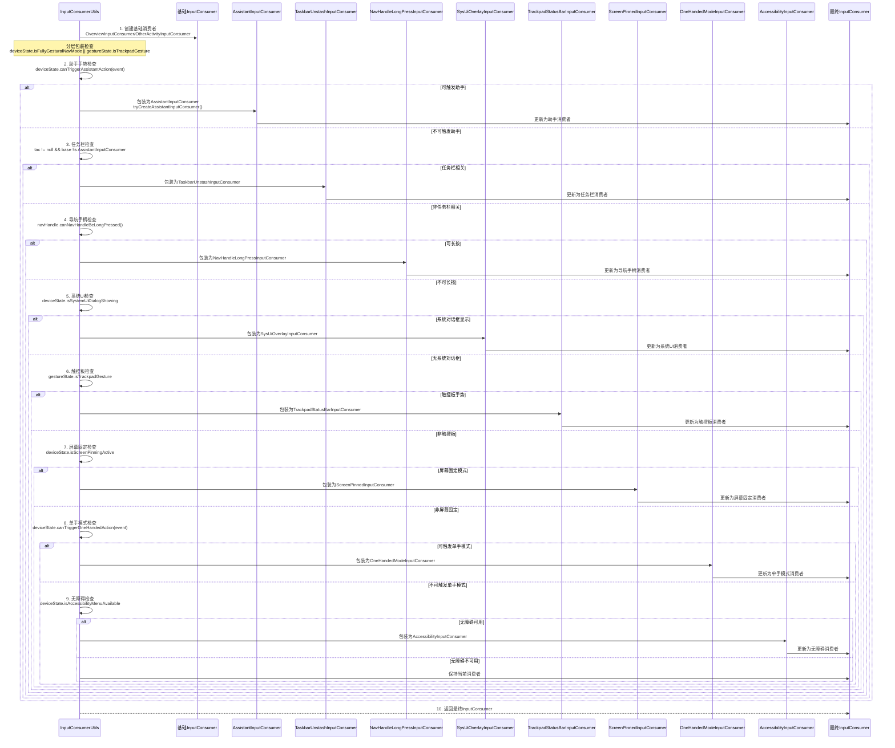

### 2.3 基础消费者选择时序图

- **核心方法**: `InputConsumerUtils.newBaseConsumer()`
- **选择依据**: 当前运行任务和Launcher状态

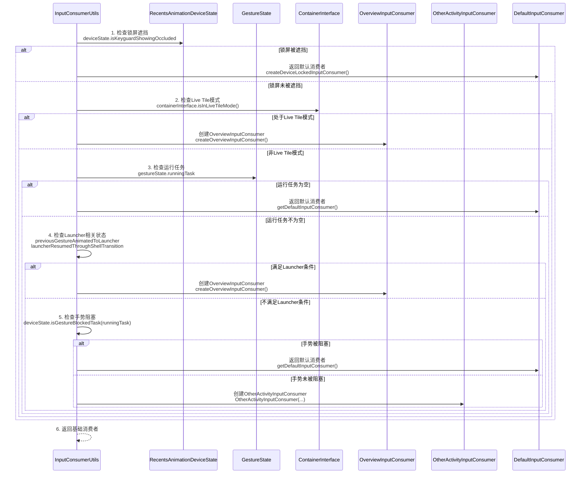

## 3. 关键交互模式分析

### 3.1 装饰器模式 (Decorator Pattern)

**实现原理**: InputConsumer架构大量使用了装饰器模式，通过DelegateInputConsumer基类实现功能分层包装。

**源码实现**:
- **路径**: [DelegateInputConsumer.java](quickstep/src/com/android/quickstep/inputconsumers/DelegateInputConsumer.java)

```java
public abstract class DelegateInputConsumer implements InputConsumer {

    protected static final int STATE_INACTIVE = 0;
    protected static final int STATE_ACTIVE = 1;
    protected static final int STATE_DELEGATE_ACTIVE = 2;

    protected final InputConsumer mDelegate;
    protected final InputMonitorCompat mInputMonitor;
    private final int mDisplayId;
    protected int mState;

    public DelegateInputConsumer(
            int displayId, InputConsumer delegate, InputMonitorCompat inputMonitor) {
        mDisplayId = displayId;
        mDelegate = delegate;
        mInputMonitor = inputMonitor;
        mState = STATE_INACTIVE;
    }

    @Override
    public InputConsumer getActiveConsumerInHierarchy() {
        if (mState == STATE_ACTIVE) {
            return this;
        }
        return mDelegate.getActiveConsumerInHierarchy();
    }

    @Override
    public boolean allowInterceptByParent() {
        return mDelegate.allowInterceptByParent() && mState != STATE_ACTIVE;
    }

    protected void setActive(MotionEvent ev) {
        ActiveGestureProtoLogProxy.logInputConsumerBecameActive(getDelegatorName());

        mState = STATE_ACTIVE;
        TestLogging.recordEvent(TestProtocol.SEQUENCE_PILFER, "pilferPointers");
        mInputMonitor.pilferPointers();

        // Send cancel event
        MotionEvent event = MotionEvent.obtain(ev);
        event.setAction(MotionEvent.ACTION_CANCEL);
        mDelegate.onMotionEvent(event);
        event.recycle();
    }
}
```

**装饰器链示例**:
```
基础消费者: OtherActivityInputConsumer
  ↓ 装饰
AssistantInputConsumer(OtherActivityInputConsumer)
  ↓ 装饰
TaskbarUnstashInputConsumer(AssistantInputConsumer(...))
  ↓ 装饰
OneHandedModeInputConsumer(TaskbarUnstashInputConsumer(...))
```

**设计优势**:
- **功能组合**: AssistantInputConsumer可以在基础OverviewInputConsumer上添加助手功能
- **开闭原则**: 新增功能无需修改现有消费者实现
- **动态扩展**: 运行时动态组合不同功能层
- **状态管理**: 通过状态机管理装饰器的激活状态

### 3.2 责任链模式 (Chain of Responsibility)

**实现原理**: 创建过程采用责任链模式，每个条件检查节点按优先级处理。

**源码实现**:
- **路径**: [InputConsumerUtils.kt](quickstep/src/com/android/quickstep/InputConsumerUtils.kt)

```kotlin
fun <S : BaseState<S>, T> newConsumer(...): InputConsumer {
    // 责任链节点1: 气泡栏检查 (最高优先级)
    if (bubbleControllers != null && BubbleBarInputConsumer.isEventOnBubbles(tac, event)) {
        return BubbleBarInputConsumer(context, gestureState.displayId, 
                                    bubbleControllers, inputMonitorCompat)
    }
    
    // 责任链节点2: 进度委托检查
    val progressProxy = swipeUpProxyProvider.apply(gestureState)
    if (progressProxy != null) {
        return ProgressDelegateInputConsumer(context, taskAnimationManager, 
                                           gestureState, inputMonitorCompat, progressProxy)
    }
    
    // 责任链节点3: 设备锁定检查
    if (!get(context).isUserUnlocked) {
        return if (canStartSystemGesture) {
            createDeviceLockedInputConsumer(...)
        } else {
            getDefaultInputConsumer(...)
        }
    }
    
    // 责任链节点4: 基础消费者选择
    val base = if (canStartSystemGesture || previousGestureState.isRecentsAnimationRunning) {
        newBaseConsumer(...)
    } else {
        getDefaultInputConsumer(...)
    }
    
    // 责任链节点5-12: 分层包装检查
    return applyLayeredWrapping(base, ...)
}
```

**设计优势**:
- 每个条件检查独立，便于维护和扩展
- 按照优先级处理，提高执行效率
- 支持动态添加新的处理节点
- 清晰的决策流程，便于调试和追踪

### 3.3 策略模式 (Strategy)

**实现原理**: 不同的InputConsumer实现类对应不同的输入处理策略，根据运行时条件动态选择。

**策略选择上下文**:
```kotlin
// 策略上下文：根据设备状态和手势状态选择策略
val canStartSystemGesture = if (gestureState.isTrackpadGesture) 
    deviceState.canStartTrackpadGesture() 
else 
    deviceState.canStartSystemGesture()

// 策略选择：基础消费者
base = if (canStartSystemGesture || previousGestureState.isRecentsAnimationRunning) {
    newBaseConsumer(...) // 策略1: 基础消费者
} else {
    getDefaultInputConsumer(...) // 策略2: 默认消费者
}

// 策略包装：根据条件添加额外策略
if (deviceState.isFullyGesturalNavMode || gestureState.isTrackpadGesture) {
    // 策略3: 助手策略
    if (deviceState.canTriggerAssistantAction(event)) {
        base = tryCreateAssistantInputConsumer(...)
    }
    
    // 策略4: 任务栏策略
    if (tac != null && base !is AssistantInputConsumer) {
        base = TaskbarUnstashInputConsumer(...)
    }
}
```

**设计优势**:
- 策略独立，便于测试和维护
- 运行时动态选择策略
- 支持策略组合和扩展
- 策略切换灵活，无需修改客户端代码

## 4. InputConsumer选择优先级

### 4.1 第一层决策（TouchInteractionService.onInputEvent）

| 优先级 | 条件 | InputConsumer |
|--------|------|---------------|
| 1 | 三键导航模式 + 支持助手手势 + 可触发助手 | AssistantInputConsumer |
| 2 | 常规手势区域 + 悬停操作 + 气泡上 | newConsumer() 详细决策 |
| 3 | 全手势导航 + 可触发助手 | AssistantInputConsumer |
| 4 | 可触发单手模式 | OneHandedModeInputConsumer |
| 5 | 默认 | NoOpInputConsumer |

### 4.2 第二层决策（InputConsumerUtils.newConsumer）

| 优先级 | 条件 | InputConsumer |
|--------|------|---------------|
| 1 | 事件在气泡上 | BubbleBarInputConsumer |
| 2 | 存在进度代理 | ProgressDelegateInputConsumer |
| 3 | 设备未解锁 + 可启动系统手势 | DeviceLockedInputConsumer |
| 4 | 基础消费者选择 | OverviewInputConsumer/OtherActivityInputConsumer |
| 5-12 | 分层包装逻辑 | 装饰器链 |

## 5. 性能优化考虑

### 5.1 延迟初始化
- InputConsumer只在ACTION_DOWN时创建，避免不必要的对象实例化
- 减少内存占用，提高事件处理效率

### 5.2 状态缓存优化
- 缓存设备状态和任务栏状态，避免重复查询
- 减少跨进程调用，提高响应速度

### 5.3 事件过滤优化
- 提前过滤不需要处理的事件类型
- 快速跳过不需要处理的事件，减少不必要的逻辑判断

### 5.4 装饰器状态机优化
- 通过状态机快速判断装饰器状态
- 避免不必要的事件传递，提高装饰器链的遍历效率

---

**最后更新**：2026年2月13日  
**版本**：2.0  
**适用AOSP版本**：14+  
**核心分析范围**：InputConsumer / TouchInteractionService / InputConsumerUtils / DelegateInputConsumer  
**设计模式**：装饰器模式 / 责任链模式 / 策略模式  
**优化重点**：类名修正 / 源码路径引用 / 时序图优化
