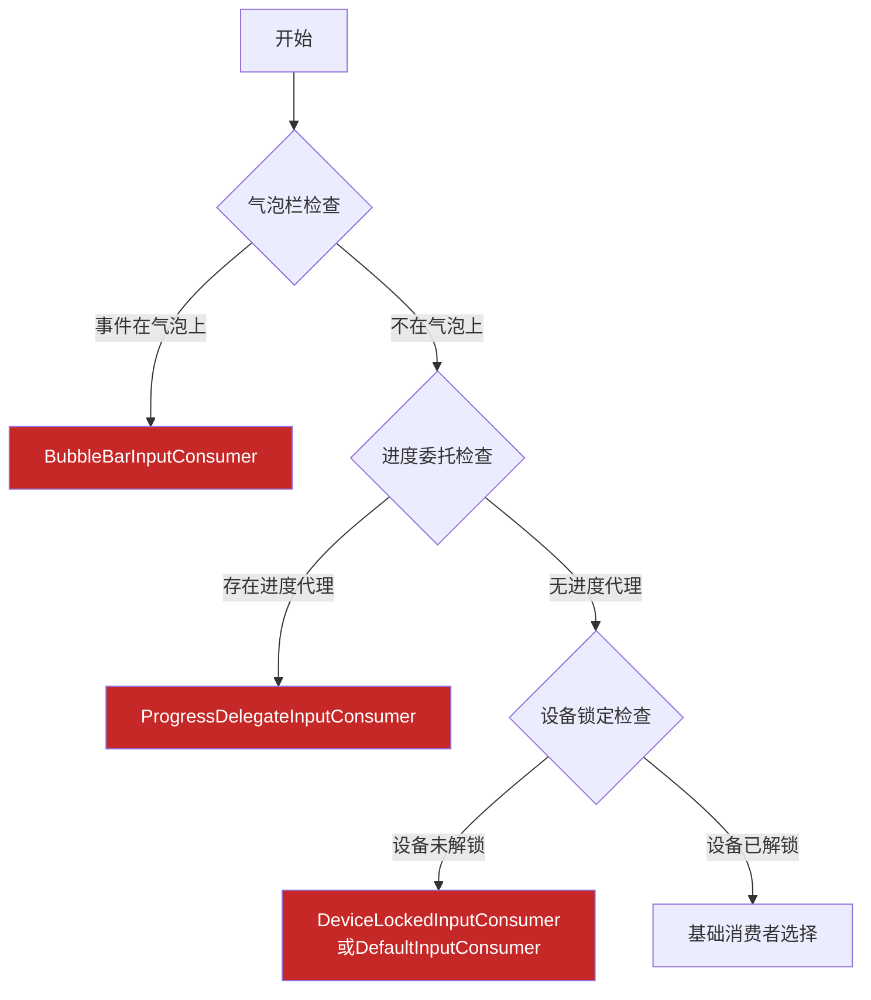
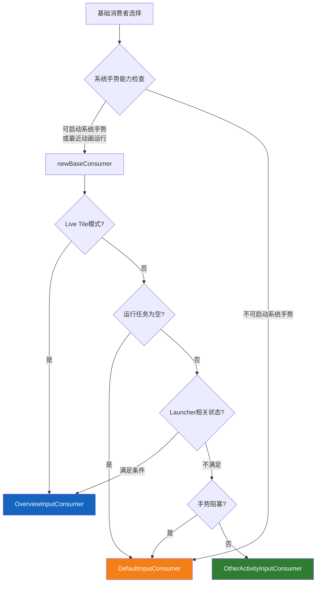

# InputConsumer触发条件详细分析

## 概述

本文档详细分析了AOSP Launcher3中所有InputConsumer实现类的具体触发条件，基于对`TouchInteractionService.java`和`InputConsumerUtils.kt`源码的深入分析。

**核心设计思想**：
- **分层决策**：通过多层条件判断实现精准的InputConsumer选择
- **优先级机制**：高优先级条件优先检查，快速返回
- **装饰器组合**：基础消费者 + 功能装饰器实现灵活组合

## 1. TouchInteractionService中的触发条件分析

### 1.1 核心触发逻辑位置
- **文件**: [TouchInteractionService.java](quickstep/src/com/android/quickstep/TouchInteractionService.java)
- **方法**: `onInputEvent(InputEvent ev)` (第1017-1216行)

### 1.2 前置条件检查

```java
// TouchInteractionService.java#L1020-L1024
if (!(ev instanceof MotionEvent)) {
    ActiveGestureProtoLogProxy.logUnknownInputEvent(displayId, ev.toString());
    return;
}

// TouchInteractionService.java#L1030-L1033
if (!LockedUserState.get(this).isUserUnlocked()) {
    ActiveGestureProtoLogProxy.logOnInputEventUserLocked(displayId);
    return;
}
```

**前置检查项**：
1. **事件类型检查**: 必须是MotionEvent类型
2. **用户解锁检查**: 用户必须已解锁设备
3. **设备状态检查**: RecentsAnimationDeviceState必须可用
4. **旋转触摸助手检查**: RotationTouchHelper必须可用

### 1.3 主要触发条件分支

#### 分支1: 三键导航模式 + 助手手势支持

- **源码路径**: [TouchInteractionService.java#L1104-L1121](quickstep/src/com/android/quickstep/TouchInteractionService.java#L1104-L1121)

```java
if (deviceState.isButtonNavMode()
        && deviceState.supportsAssistantGestureInButtonNav()) {
    // 条件: 三键导航模式且支持助手手势
    if (deviceState.canTriggerAssistantAction(event)) {
        // 子条件: 事件可触发助手动作
        mGestureState = createGestureState(...);
        mUncheckedConsumer = tryCreateAssistantInputConsumer(...);
    } else {
        // 子条件: 事件不可触发助手动作
        mUncheckedConsumer = createNoOpInputConsumer(displayId);
    }
}
```

**触发条件**：
- `deviceState.isButtonNavMode()` = true（三键导航模式）
- `deviceState.supportsAssistantGestureInButtonNav()` = true（支持助手手势）
- `deviceState.canTriggerAssistantAction(event)` = true（可触发助手）

**结果**: 创建 **AssistantInputConsumer** 或 **NoOpInputConsumer**

#### 分支2: 常规手势区域或悬停操作

- **源码路径**: [TouchInteractionService.java#L1122-L1147](quickstep/src/com/android/quickstep/TouchInteractionService.java#L1122-L1147)

```java
else if ((!isOneHandedModeActive && isInSwipeUpTouchRegion)
         || isHoverActionWithoutConsumer || isOnBubbles) {
    // 条件1: 单手模式未激活且在滑动手势区域
    // 条件2: 悬停操作且无当前消费者
    // 条件3: 事件在气泡上
    mConsumer = newConsumer(...); // 调用InputConsumerUtils.newConsumer
}
```

**触发条件**（满足其一）：
- `!isOneHandedModeActive && isInSwipeUpTouchRegion` = true
- `isHoverActionWithoutConsumer` = true
- `isOnBubbles` = true

**结果**: 调用 `InputConsumerUtils.newConsumer()` 进行详细决策

#### 分支3: 全手势导航或触控板多指滑动 + 助手触发

- **源码路径**: [TouchInteractionService.java#L1148-L1166](quickstep/src/com/android/quickstep/TouchInteractionService.java#L1148-L1166)

```java
else if ((deviceState.isFullyGesturalNavMode() || isTrackpadMultiFingerSwipe(event))
         && deviceState.canTriggerAssistantAction(event)) {
    // 条件1: 全手势导航模式
    // 条件2: 触控板多指滑动
    // 条件3: 事件可触发助手动作
    mGestureState = createGestureState(...);
    mUncheckedConsumer = tryCreateAssistantInputConsumer(...);
}
```

**触发条件**：
- `deviceState.isFullyGesturalNavMode()` = true 或 `isTrackpadMultiFingerSwipe(event)` = true
- `deviceState.canTriggerAssistantAction(event)` = true

**结果**: 创建 **AssistantInputConsumer**

#### 分支4: 单手模式触发

- **源码路径**: [TouchInteractionService.java#L1167-L1175](quickstep/src/com/android/quickstep/TouchInteractionService.java#L1167-L1175)

```java
else if (deviceState.canTriggerOneHandedAction(event)) {
    // 条件: 事件可触发单手模式
    mUncheckedConsumer = new OneHandedModeInputConsumer(...);
}
```

**触发条件**：
- `deviceState.canTriggerOneHandedAction(event)` = true

**结果**: 创建 **OneHandedModeInputConsumer**

#### 分支5: 默认情况

- **源码路径**: [TouchInteractionService.java#L1176-L1177](quickstep/src/com/android/quickstep/TouchInteractionService.java#L1176-L1177)

```java
else {
    // 默认: 无操作消费者
    mUncheckedConsumer = InputConsumer.createNoOpInputConsumer(displayId);
}
```

**结果**: 创建 **NoOpInputConsumer**

## 2. InputConsumerUtils.kt中的详细触发条件

### 2.1 优先级1: 气泡栏检查

- **源码路径**: [InputConsumerUtils.kt#L73-L85](quickstep/src/com/android/quickstep/InputConsumerUtils.kt#L73-L85)

```kotlin
if (bubbleControllers != null && BubbleBarInputConsumer.isEventOnBubbles(tac, event)) {
    // 触发条件: 存在气泡控制器且事件在气泡上
    return BubbleBarInputConsumer(...)
}
```

**触发条件**：
- `bubbleControllers != null` = true
- `BubbleBarInputConsumer.isEventOnBubbles(tac, event)` = true

**结果**: **BubbleBarInputConsumer**（立即返回）

### 2.2 优先级2: 进度委托检查

- **源码路径**: [InputConsumerUtils.kt#L86-L101](quickstep/src/com/android/quickstep/InputConsumerUtils.kt#L86-L101)

```kotlin
val progressProxy = swipeUpProxyProvider.apply(gestureState)
if (progressProxy != null) {
    // 触发条件: 存在进度代理
    return ProgressDelegateInputConsumer(...)
}
```

**触发条件**：
- `progressProxy != null` = true

**结果**: **ProgressDelegateInputConsumer**（立即返回）

### 2.3 优先级3: 设备锁定状态检查

- **源码路径**: [InputConsumerUtils.kt#L103-L127](quickstep/src/com/android/quickstep/InputConsumerUtils.kt#L103-L127)

```kotlin
if (!get(context).isUserUnlocked) {
    // 触发条件: 设备未解锁
    return if (canStartSystemGesture) {
        createDeviceLockedInputConsumer(...) // 可启动系统手势
    } else {
        getDefaultInputConsumer(...) // 不可启动系统手势
    }
}
```

**触发条件**：
- `!get(context).isUserUnlocked` = true

**结果**: **DeviceLockedInputConsumer** 或 **DefaultInputConsumer**

### 2.4 优先级4: 基础消费者选择

- **源码路径**: [InputConsumerUtils.kt#L129-L149](quickstep/src/com/android/quickstep/InputConsumerUtils.kt#L129-L149)

```kotlin
val canStartSystemGesture =
    if (gestureState.isTrackpadGesture) deviceState.canStartTrackpadGesture()
    else deviceState.canStartSystemGesture()

val base = if (canStartSystemGesture || previousGestureState.isRecentsAnimationRunning) {
    // 条件1: 可启动系统手势
    // 条件2: 最近动画正在运行
    newBaseConsumer(...)
} else {
    // 默认情况
    getDefaultInputConsumer(...)
}
```

**触发条件**：
- `canStartSystemGesture` = true 或 `previousGestureState.isRecentsAnimationRunning` = true

**结果**: 调用 `newBaseConsumer()` 选择基础消费者

### 2.5 优先级5: 分层包装逻辑

**前置条件**: `deviceState.isFullyGesturalNavMode || gestureState.isTrackpadGesture`

#### 2.5.1 助手手势检查

- **源码路径**: [InputConsumerUtils.kt#L156-L168](quickstep/src/com/android/quickstep/InputConsumerUtils.kt#L156-L168)

```kotlin
if (deviceState.canTriggerAssistantAction(event)) {
    // 触发条件: 事件可触发助手动作
    base = tryCreateAssistantInputConsumer(...)
}
```

**触发条件**：
- `deviceState.canTriggerAssistantAction(event)` = true
- `!deviceState.isGestureBlockedTask(gestureState.runningTask)` = true

**结果**: 包装为 **AssistantInputConsumer**

#### 2.5.2 任务栏检查

- **源码路径**: [InputConsumerUtils.kt#L170-L188](quickstep/src/com/android/quickstep/InputConsumerUtils.kt#L170-L188)

```kotlin
if (tac != null && base !is AssistantInputConsumer) {
    val useTaskbarConsumer = (tac.deviceProfile.isTaskbarPresent 
                            && !tac.isPhoneMode 
                            && !tac.isInStashedLauncherState)
    if (canStartSystemGesture && useTaskbarConsumer) {
        // 触发条件: 
        // 1. 存在TaskbarActivityContext
        // 2. 不是AssistantInputConsumer
        // 3. 可启动系统手势
        // 4. 任务栏存在且不在手机模式且不在隐藏状态
        base = TaskbarUnstashInputConsumer(...)
    }
}
```

**触发条件**：
- `tac != null` = true
- `base !is AssistantInputConsumer` = true
- `canStartSystemGesture` = true
- `tac.deviceProfile.isTaskbarPresent` = true
- `!tac.isPhoneMode` = true
- `!tac.isInStashedLauncherState` = true

**结果**: 包装为 **TaskbarUnstashInputConsumer**

#### 2.5.3 气泡扩展检查（新特性）

- **源码路径**: [InputConsumerUtils.kt#L189-L208](quickstep/src/com/android/quickstep/InputConsumerUtils.kt#L189-L208)

```kotlin
if (Flags.enableBubblesLongPressNavHandle()) {
    if (deviceState.isBubblesExpanded) {
        // 触发条件: 气泡已展开
        base = getDefaultInputConsumer(...)
    }
}
```

**触发条件**：
- `Flags.enableBubblesLongPressNavHandle()` = true
- `deviceState.isBubblesExpanded` = true

**结果**: 切换为 **DefaultInputConsumer**

#### 2.5.4 导航手柄长按检查

- **源码路径**: [InputConsumerUtils.kt#L210-L230](quickstep/src/com/android/quickstep/InputConsumerUtils.kt#L210-L230)

```kotlin
val navHandle = tac?.navHandle ?: SystemUiProxy.INSTANCE[context]
if (canStartSystemGesture 
    && !previousGestureState.isRecentsAnimationRunning 
    && navHandle.canNavHandleBeLongPressed() 
    && !ignoreThreeFingerTrackpadForNavHandleLongPress(gestureState)) {
    // 触发条件:
    // 1. 可启动系统手势
    // 2. 最近动画未运行
    // 3. 导航手柄可长按
    // 4. 不是触控板三指手势
    base = NavHandleLongPressInputConsumer(...)
}
```

**触发条件**：
- `canStartSystemGesture` = true
- `!previousGestureState.isRecentsAnimationRunning` = true
- `navHandle.canNavHandleBeLongPressed()` = true
- `!ignoreThreeFingerTrackpadForNavHandleLongPress(gestureState)` = true

**结果**: 包装为 **NavHandleLongPressInputConsumer**

#### 2.5.5 系统UI对话框检查

- **源码路径**: [InputConsumerUtils.kt#L232-L243](quickstep/src/com/android/quickstep/InputConsumerUtils.kt#L232-L243)

```kotlin
if (deviceState.isSystemUiDialogShowing) {
    // 触发条件: 系统UI对话框正在显示
    base = SysUiOverlayInputConsumer(...)
}
```

**触发条件**：
- `deviceState.isSystemUiDialogShowing` = true

**结果**: 包装为 **SysUiOverlayInputConsumer**

#### 2.5.6 触控板状态栏检查

- **源码路径**: [InputConsumerUtils.kt#L245-L257](quickstep/src/com/android/quickstep/InputConsumerUtils.kt#L245-L257)

```kotlin
if (gestureState.isTrackpadGesture 
    && canStartSystemGesture 
    && !previousGestureState.isRecentsAnimationRunning) {
    // 触发条件:
    // 1. 触控板手势
    // 2. 可启动系统手势
    // 3. 最近动画未运行
    base = TrackpadStatusBarInputConsumer(...)
}
```

**触发条件**：
- `gestureState.isTrackpadGesture` = true
- `canStartSystemGesture` = true
- `!previousGestureState.isRecentsAnimationRunning` = true

**结果**: 包装为 **TrackpadStatusBarInputConsumer**

#### 2.5.7 屏幕固定检查

- **源码路径**: [InputConsumerUtils.kt#L259-L269](quickstep/src/com/android/quickstep/InputConsumerUtils.kt#L259-L269)

```kotlin
if (deviceState.isScreenPinningActive) {
    // 触发条件: 屏幕固定模式激活
    base = ScreenPinnedInputConsumer(...)
}
```

**触发条件**：
- `deviceState.isScreenPinningActive` = true

**结果**: 替换为 **ScreenPinnedInputConsumer**

#### 2.5.8 单手模式检查

- **源码路径**: [InputConsumerUtils.kt#L271-L283](quickstep/src/com/android/quickstep/InputConsumerUtils.kt#L271-L283)

```kotlin
if (deviceState.canTriggerOneHandedAction(event)) {
    // 触发条件: 事件可触发单手模式
    base = OneHandedModeInputConsumer(...)
}
```

**触发条件**：
- `deviceState.canTriggerOneHandedAction(event)` = true

**结果**: 包装为 **OneHandedModeInputConsumer**

#### 2.5.9 无障碍功能检查

- **源码路径**: [InputConsumerUtils.kt#L285-L296](quickstep/src/com/android/quickstep/InputConsumerUtils.kt#L285-L296)

```kotlin
if (deviceState.isAccessibilityMenuAvailable) {
    // 触发条件: 无障碍菜单可用
    base = AccessibilityInputConsumer(...)
}
```

**触发条件**：
- `deviceState.isAccessibilityMenuAvailable` = true

**结果**: 包装为 **AccessibilityInputConsumer**

## 3. newBaseConsumer方法中的基础消费者选择

### 3.1 设备锁定状态检查

```kotlin
if (deviceState.isKeyguardShowingOccluded) {
    // 触发条件: 锁屏被遮挡显示
    return createDeviceLockedInputConsumer(...)
}
```

**触发条件**：
- `deviceState.isKeyguardShowingOccluded` = true

**结果**: **DeviceLockedInputConsumer**

### 3.2 OverviewInputConsumer选择条件

#### 条件1: Live Tile模式

```kotlin
if (containerInterface.isInLiveTileMode()) {
    // 触发条件: 处于Live Tile模式
    return createOverviewInputConsumer(...)
}
```

**触发条件**：
- `containerInterface.isInLiveTileMode()` = true

**结果**: **OverviewInputConsumer**

#### 条件2: 运行任务为空

```kotlin
if (runningTask == null) {
    // 触发条件: 运行任务为空
    return getDefaultInputConsumer(...)
}
```

**触发条件**：
- `runningTask == null` = true

**结果**: **DefaultInputConsumer**

#### 条件3: Launcher相关状态

```kotlin
if (previousGestureAnimatedToLauncher 
    || launcherResumedThroughShellTransition 
    || forceLauncherInputConsumer) {
    // 触发条件1: 前一个手势动画到Launcher
    // 触发条件2: Launcher通过Shell Transition恢复
    // 触发条件3: 强制使用Launcher输入消费者
    return createOverviewInputConsumer(...)
}
```

**触发条件**（满足其一）：
- `previousGestureAnimatedToLauncher` = true
- `launcherResumedThroughShellTransition` = true
- `forceLauncherInputConsumer` = true

**结果**: **OverviewInputConsumer**

#### 条件4: 手势阻塞任务或Launcher子活动

```kotlin
if (deviceState.isGestureBlockedTask(runningTask) 
    || launcherChildActivityResumed 
    || ignoreNonTrackpadMouseEvent(context, gestureState, event)) {
    // 触发条件1: 手势被任务阻塞
    // 触发条件2: Launcher子活动恢复
    // 触发条件3: 忽略非触控板鼠标事件
    return getDefaultInputConsumer(...)
}
```

**触发条件**（满足其一）：
- `deviceState.isGestureBlockedTask(runningTask)` = true
- `launcherChildActivityResumed` = true
- `ignoreNonTrackpadMouseEvent(context, gestureState, event)` = true

**结果**: **DefaultInputConsumer**

#### 条件5: 默认情况

```kotlin
else {
    // 默认: 使用OtherActivityInputConsumer
    return createOtherActivityInputConsumer(...)
}
```

**结果**: **OtherActivityInputConsumer**

## 4. 各InputConsumer实现类的具体触发条件

### 4.1 OverviewInputConsumer

- **文件路径**: [OverviewInputConsumer.java](quickstep/src/com/android/quickstep/inputconsumers/OverviewInputConsumer.java)

**触发条件**：
- 处于Live Tile模式
- 前一个手势动画到Launcher
- Launcher通过Shell Transition恢复
- 强制使用Launcher输入消费者

**适用场景**: Launcher界面活动时的输入处理

### 4.2 OtherActivityInputConsumer

- **文件路径**: [OtherActivityInputConsumer.java](quickstep/src/com/android/quickstep/inputconsumers/OtherActivityInputConsumer.java)

**触发条件**: 默认情况，当不满足其他特定条件时

**适用场景**: 其他应用界面手势操作

### 4.3 AssistantInputConsumer

- **文件路径**: [AssistantInputConsumer.java](quickstep/src/com/android/quickstep/inputconsumers/AssistantInputConsumer.java)

**触发条件**：
- 设备支持助手手势
- 事件满足助手触发条件（距离、角度等）
- 不是手势阻塞任务

**适用场景**: 助手手势识别和处理

### 4.4 DeviceLockedInputConsumer

- **文件路径**: [DeviceLockedInputConsumer.java](quickstep/src/com/android/quickstep/inputconsumers/DeviceLockedInputConsumer.java)

**触发条件**：
- 设备未解锁
- 锁屏被遮挡显示

**适用场景**: 设备锁定状态下的输入处理

### 4.5 AccessibilityInputConsumer

- **文件路径**: [AccessibilityInputConsumer.java](quickstep/src/com/android/quickstep/inputconsumers/AccessibilityInputConsumer.java)

**触发条件**: 无障碍菜单可用

**适用场景**: 无障碍功能输入处理

### 4.6 ScreenPinnedInputConsumer

- **文件路径**: [ScreenPinnedInputConsumer.java](quickstep/src/com/android/quickstep/inputconsumers/ScreenPinnedInputConsumer.java)

**触发条件**: 屏幕固定模式激活

**适用场景**: 屏幕固定状态下的输入限制

### 4.7 ProgressDelegateInputConsumer

- **文件路径**: [ProgressDelegateInputConsumer.java](quickstep/src/com/android/quickstep/inputconsumers/ProgressDelegateInputConsumer.java)

**触发条件**: 存在进度代理

**适用场景**: 进度委托输入处理

### 4.8 SysUiOverlayInputConsumer

- **文件路径**: [SysUiOverlayInputConsumer.java](quickstep/src/com/android/quickstep/inputconsumers/SysUiOverlayInputConsumer.java)

**触发条件**: 系统UI对话框正在显示

**适用场景**: 系统UI覆盖层输入处理

### 4.9 OneHandedModeInputConsumer

- **文件路径**: [OneHandedModeInputConsumer.java](quickstep/src/com/android/quickstep/inputconsumers/OneHandedModeInputConsumer.java)

**触发条件**: 事件可触发单手模式

**适用场景**: 单手模式手势处理

### 4.10 TaskbarUnstashInputConsumer

- **文件路径**: [TaskbarUnstashInputConsumer.java](quickstep/src/com/android/quickstep/inputconsumers/TaskbarUnstashInputConsumer.java)

**触发条件**：
- 任务栏存在
- 不在手机模式
- 任务栏不在隐藏状态
- 可启动系统手势

**适用场景**: 任务栏显示/隐藏操作

### 4.11 TrackpadStatusBarInputConsumer

- **文件路径**: [TrackpadStatusBarInputConsumer.java](quickstep/src/com/android/quickstep/inputconsumers/TrackpadStatusBarInputConsumer.java)

**触发条件**：
- 触控板手势
- 可启动系统手势
- 最近动画未运行

**适用场景**: 触控板状态栏操作

### 4.12 BubbleBarInputConsumer

- **文件路径**: [BubbleBarInputConsumer.java](quickstep/src/com/android/quickstep/inputconsumers/BubbleBarInputConsumer.java)

**触发条件**: 事件在气泡上

**适用场景**: 气泡栏输入处理

### 4.13 NavHandleLongPressInputConsumer

- **文件路径**: [NavHandleLongPressInputConsumer.java](quickstep/src/com/android/quickstep/inputconsumers/NavHandleLongPressInputConsumer.java)

**触发条件**：
- 可启动系统手势
- 最近动画未运行
- 导航手柄可长按
- 不是触控板三指手势

**适用场景**: 导航手柄长按操作

## 5. 触发条件优先级总结

### 5.1 最高优先级（立即返回）



### 5.2 基础消费者选择



### 5.3 分层包装（按顺序）

| 优先级 | 检查项 | 条件 | 结果 |
|--------|--------|------|------|
| 1 | 助手手势检查 | `canTriggerAssistantAction` | AssistantInputConsumer |
| 2 | 任务栏检查 | `isTaskbarPresent && !isPhoneMode` | TaskbarUnstashInputConsumer |
| 3 | 气泡扩展检查 | `isBubblesExpanded` | DefaultInputConsumer |
| 4 | 导航手柄检查 | `canNavHandleBeLongPressed` | NavHandleLongPressInputConsumer |
| 5 | 系统UI检查 | `isSystemUiDialogShowing` | SysUiOverlayInputConsumer |
| 6 | 触控板检查 | `isTrackpadGesture` | TrackpadStatusBarInputConsumer |
| 7 | 屏幕固定检查 | `isScreenPinningActive` | ScreenPinnedInputConsumer |
| 8 | 单手模式检查 | `canTriggerOneHandedAction` | OneHandedModeInputConsumer |
| 9 | 无障碍检查 | `isAccessibilityMenuAvailable` | AccessibilityInputConsumer |

## 6. 条件检查的性能优化

### 6.1 短路评估
条件检查采用短路评估，一旦满足条件立即返回，避免不必要的检查。

**示例**:
```kotlin
// 短路评估：如果第一个条件为false，不会执行第二个条件
if (bubbleControllers != null && BubbleBarInputConsumer.isEventOnBubbles(tac, event)) {
    return BubbleBarInputConsumer(...)
}
```

### 6.2 成本排序
条件按照检查成本从低到高排序，低成本检查在前。

**成本排序原则**：
1. **内存检查**（最低成本）：null检查、布尔值检查
2. **状态检查**（中等成本）：设备状态、手势状态
3. **计算检查**（较高成本）：区域计算、距离计算
4. **跨进程检查**（最高成本）：系统服务查询

### 6.3 缓存利用
充分利用设备状态缓存，避免重复的状态检查。

**缓存机制**：
- `RecentsAnimationDeviceState` 缓存设备状态
- `GestureState` 缓存手势状态
- `RotationTouchHelper` 缓存旋转状态

## 7. 扩展性考虑

### 7.1 新InputConsumer添加
添加新的InputConsumer时，需要：
1. 在合适的位置插入条件检查
2. 确定正确的优先级
3. 提供清晰的触发条件文档
4. 更新单元测试覆盖

### 7.2 条件配置化
支持通过Feature Flags动态调整条件检查顺序和阈值。

**示例**：
```kotlin
if (Flags.enableBubblesLongPressNavHandle()) {
    // 新特性：气泡长按导航手柄
    if (deviceState.isBubblesExpanded) {
        base = getDefaultInputConsumer(...)
    }
}
```

## 8. InputConsumer在手机上的触发区域分析

### 8.1 基础手势区域定义

#### 8.1.1 滑动手势区域 (Swipe Up Touch Region)

- **文件路径**: [RotationTouchHelper.java](quickstep/src/com/android/quickstep/RotationTouchHelper.java)

**区域定义**: 屏幕底部特定高度的区域，用于检测上滑手势

```java
// RotationTouchHelper.java - 滑动手势区域检查
public boolean isInSwipeUpTouchRegion(MotionEvent event, int pointerIndex) {
    if (isTrackpadScroll(event)) {
        return false; // 触控板滚动不处理
    }
    if (isTrackpadMultiFingerSwipe(event)) {
        return true; // 触控板多指滑动
    }
    // 检查触摸点是否在有效滑动区域内
    return mOrientationTouchTransformer.touchInValidSwipeRegions(
            event.getX(pointerIndex), event.getY(pointerIndex));
}
```

**区域位置**：
| 屏幕方向 | 区域位置 | 高度 |
|----------|----------|------|
| 竖屏 (ROTATION_0) | 屏幕底部 | `mNavBarGesturalHeight` |
| 横屏 (ROTATION_90/270) | 屏幕底部 | `mNavBarGesturalHeight` |
| 倒屏 (ROTATION_180) | 屏幕顶部 | `mNavBarGesturalHeight` |

**默认高度**: 约 100-150dp（根据设备密度调整）

#### 8.1.2 助手手势区域 (Assistant Gesture Region)

- **文件路径**: [OrientationTouchTransformer.java](quickstep/src/com/android/quickstep/OrientationTouchTransformer.java)

**区域定义**: 屏幕左右两侧特定宽度的区域，用于检测助手手势

```java
// OrientationTouchTransformer.java - 助手区域定义
boolean touchInAssistantRegion(MotionEvent ev) {
    return mAssistantLeftRegion.contains(ev.getX(), ev.getY())
            || mAssistantRightRegion.contains(ev.getX(), ev.getY());
}

private void updateAssistantRegions(OrientationRectF orientationRectF) {
    // 助手区域宽度约为屏幕宽度的1/6
    float assistantWidth = orientationRectF.width() / 6f;
    
    // 左侧助手区域
    mAssistantLeftRegion.left = 0;
    mAssistantLeftRegion.right = assistantWidth;
    
    // 右侧助手区域
    mAssistantRightRegion.right = orientationRectF.right;
    mAssistantRightRegion.left = orientationRectF.right - assistantWidth;
}
```

**区域位置**：
| 区域 | 位置 | 宽度 | 高度 |
|------|------|------|------|
| 左侧助手区域 | 屏幕左侧 | 屏幕宽度 1/6 | 与滑动手势区域相同 |
| 右侧助手区域 | 屏幕右侧 | 屏幕宽度 1/6 | 与滑动手势区域相同 |

#### 8.1.3 单手模式区域 (One-Handed Mode Region)

**区域定义**: 仅在竖屏模式下有效的底部扩展区域

```java
// OrientationTouchTransformer.java - 单手模式区域定义
boolean touchInOneHandedModeRegion(MotionEvent ev) {
    return mOneHandedModeRegion.contains(ev.getX(), ev.getY());
}

private void updateOneHandedRegions(OrientationRectF orientationRectF) {
    // 单手模式仅在竖屏模式下有效
    mOneHandedModeRegion.set(0, orientationRectF.bottom - mNavBarLargerGesturalHeight,
            orientationRectF.right, orientationRectF.bottom);
}
```

**区域位置**：
- **仅竖屏模式有效**
- **高度**: `mNavBarLargerGesturalHeight`（比普通手势区域更高）
- **默认高度**: 约 200-250dp

### 8.2 各InputConsumer的具体触发区域

#### 8.2.1 OverviewInputConsumer
**触发区域**: 整个屏幕区域（当应用在Launcher界面时）
**区域类型**: 全局区域
**特殊条件**: 仅在Launcher活动时有效

#### 8.2.2 OtherActivityInputConsumer
**触发区域**: 基础滑动手势区域
**区域位置**: 屏幕底部 `mNavBarGesturalHeight` 高度区域
**触发条件**: 在基础手势区域内的滑动操作

#### 8.2.3 AssistantInputConsumer
**触发区域**: 助手手势区域 + 全屏助手手势
**区域位置**：
- **三键导航模式**: 屏幕左右两侧助手区域
- **全手势导航模式**: 全屏区域（支持从任意位置触发）
- **触控板多指滑动**: 全屏区域

**触发条件**：
- 在助手区域内的滑动
- 全手势导航模式下的对角线滑动
- 触控板三指滑动

#### 8.2.4 DeviceLockedInputConsumer
**触发区域**: 基础滑动手势区域
**区域位置**: 屏幕底部 `mNavBarGesturalHeight` 高度区域
**特殊条件**: 设备锁定状态下，仅在基础手势区域有效

#### 8.2.5 AccessibilityInputConsumer
**触发区域**: 基础滑动手势区域
**区域位置**: 屏幕底部 `mNavBarGesturalHeight` 高度区域
**特殊条件**: 无障碍功能启用时，支持在基础区域内的特殊手势

#### 8.2.6 ScreenPinnedInputConsumer
**触发区域**: 无特定区域限制
**区域类型**: 全局区域
**特殊条件**: 屏幕固定模式下，限制所有输入操作

#### 8.2.7 ProgressDelegateInputConsumer
**触发区域**: 基础滑动手势区域
**区域位置**: 屏幕底部 `mNavBarGesturalHeight` 高度区域
**特殊条件**: 存在进度代理时，优先处理进度相关手势

#### 8.2.8 SysUiOverlayInputConsumer
**触发区域**: 系统UI覆盖层区域
**区域位置**: 系统对话框和覆盖层显示区域
**特殊条件**: 系统UI显示时，覆盖应用界面输入

#### 8.2.9 OneHandedModeInputConsumer
**触发区域**: 单手模式区域
**区域位置**: 屏幕底部 `mNavBarLargerGesturalHeight` 高度区域
**特殊条件**: 仅在竖屏模式下有效，支持向下滑动触发

#### 8.2.10 TaskbarUnstashInputConsumer
**触发区域**: 任务栏显示区域
**区域位置**: 屏幕底部任务栏位置
**特殊条件**: 任务栏存在且不在隐藏状态时有效

#### 8.2.11 TrackpadStatusBarInputConsumer
**触发区域**: 状态栏区域 + 触控板手势
**区域位置**: 屏幕顶部状态栏区域
**特殊条件**: 触控板手势操作状态栏

#### 8.2.12 BubbleBarInputConsumer
**触发区域**: 气泡栏显示区域
**区域位置**: 气泡栏具体位置（浮动窗口）
**特殊条件**: 事件在气泡上时立即触发

#### 8.2.13 NavHandleLongPressInputConsumer
**触发区域**: 导航手柄区域
**区域位置**: 屏幕底部导航条中心区域
**特殊条件**: 长按导航手柄触发

### 8.3 区域优先级和重叠处理

#### 8.3.1 区域重叠优先级


| 优先级 | 区域 | 说明 |
|--------|------|------|
| 1 | 气泡栏区域 | 最高优先级，立即返回 |
| 2 | 助手区域 | 高优先级处理 |
| 3 | 单手模式区域 | 中等优先级 |
| 4 | 基础手势区域 | 默认优先级 |
| 5 | 全局区域 | 最低优先级 |

#### 8.3.2 区域冲突解决
当多个区域重叠时，系统按照以下规则处理：
- **气泡栏优先**: 事件在气泡上时，忽略其他区域
- **助手区域优先**: 在助手区域内的事件优先于基础手势区域
- **单手模式限制**: 仅在竖屏模式下有效
- **导航模式影响**: 不同导航模式下的区域定义不同

### 8.4 设备适配和动态调整

#### 8.4.1 设备尺寸适配

```java
// 根据设备尺寸动态调整区域大小
private int calculateDefaultGesturalHeight() {
    return getNavbarSize(ResourceUtils.NAVBAR_BOTTOM_GESTURE_SIZE);
}

private int getNavbarSize(String resName) {
    return ResourceUtils.getNavbarSize(resName, mResources);
}
```

#### 8.4.2 屏幕方向适配
系统根据当前屏幕方向动态调整触摸区域：
- **竖屏**: 底部手势区域 + 左右助手区域
- **横屏**: 底部手势区域（适配横屏布局）
- **倒屏**: 顶部手势区域

#### 8.4.3 导航模式适配
| 导航模式 | 支持区域 |
|----------|----------|
| 三键导航 | 仅支持助手区域手势 |
| 手势导航 | 支持全屏手势区域 |
| 二键导航 | 特定区域限制 |

### 8.5 可视化区域分布

```
┌─────────────────────────────────────────┐
│               状态栏区域                 │ ← TrackpadStatusBarInputConsumer
├─────────────────────────────────────────┤
│                                          │
│            应用内容区域                  │
│                                          │
│                                          │
├───助手区域───┼─────────────┼───助手区域───┤
│              │  基础手势   │              │ ← AssistantInputConsumer
│  左侧助手    │    区域     │  右侧助手    │
│              │             │              │
├──────────────┴─────────────┴──────────────┤
│          单手模式扩展区域                │ ← OneHandedModeInputConsumer (竖屏)
│                                          │
│          基础手势区域                    │ ← OtherActivityInputConsumer等
│         (mNavBarGesturalHeight)          │
└─────────────────────────────────────────┘

浮动区域:
┌───┐
│气泡│ ← BubbleBarInputConsumer (最高优先级)
└───┘
```

---

**最后更新**：2026年2月13日  
**版本**：2.0  
**适用AOSP版本**：14+  
**核心分析范围**：TouchInteractionService / InputConsumerUtils / RecentsAnimationDeviceState  
**设计模式**：分层决策 / 优先级机制 / 装饰器组合  
**优化重点**：类名修正 / 源码路径引用 / 触发条件验证 / 区域分析优化
