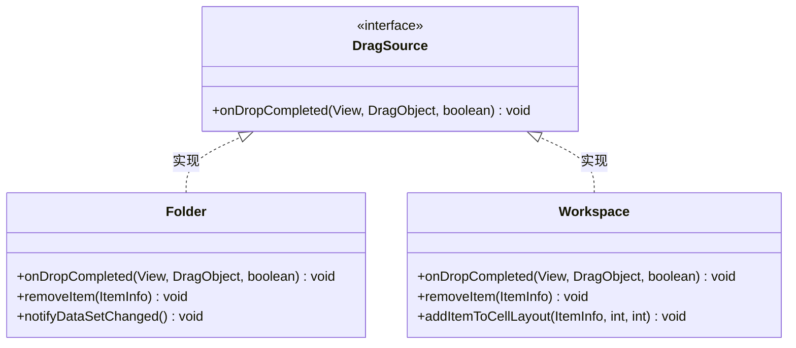
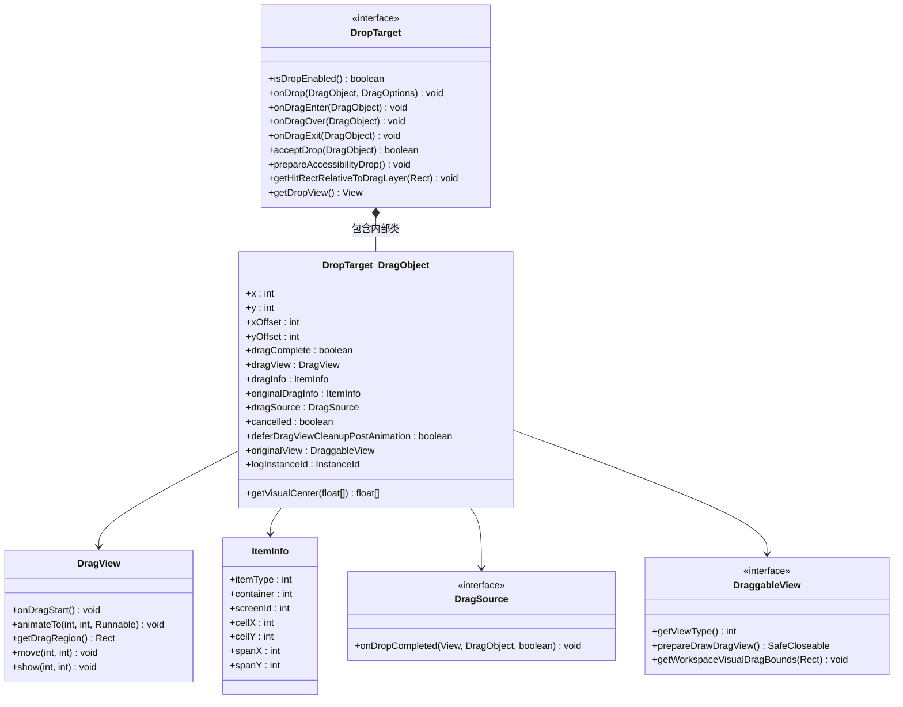
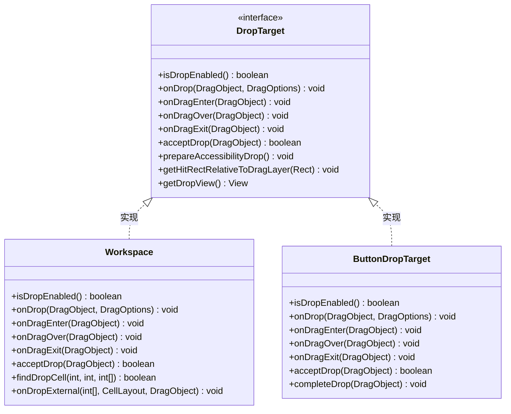
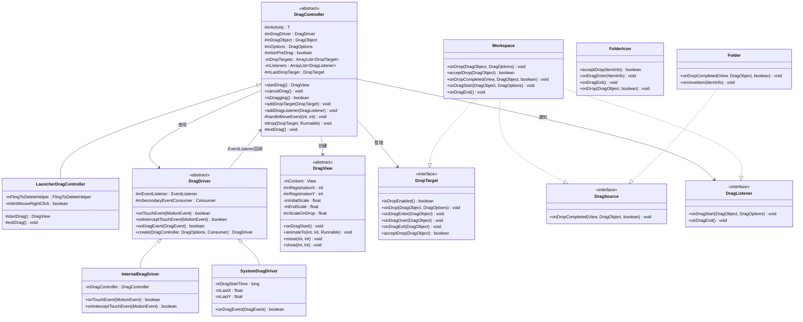
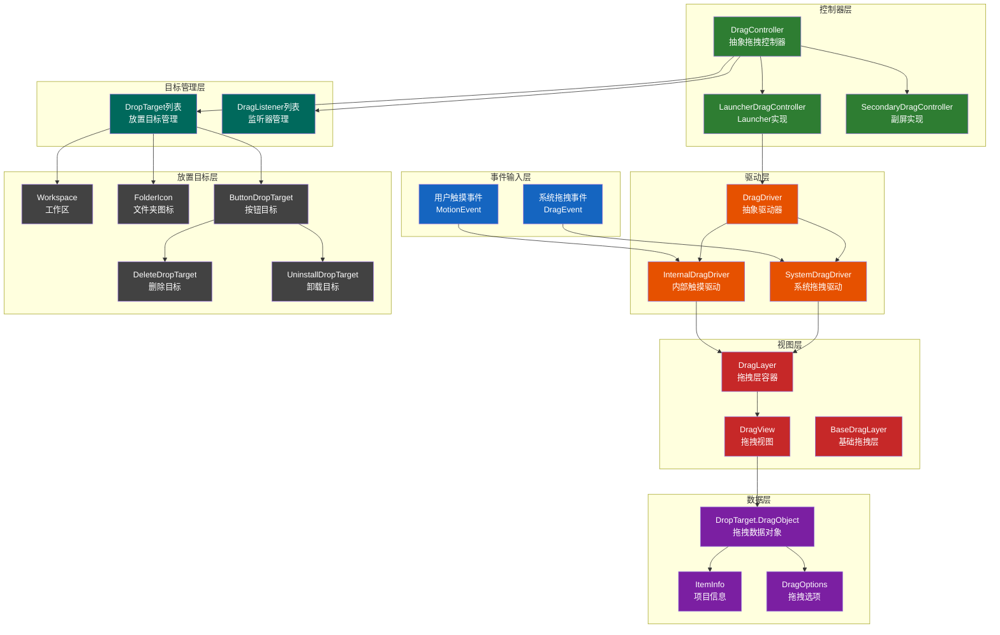
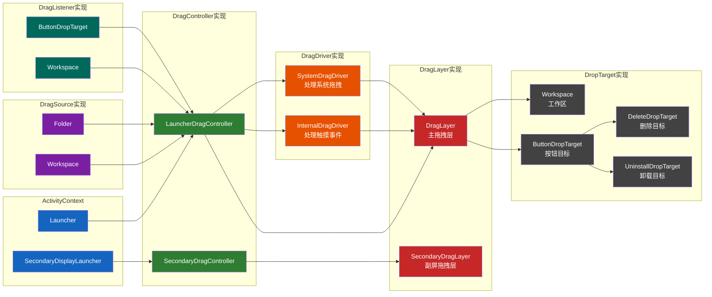
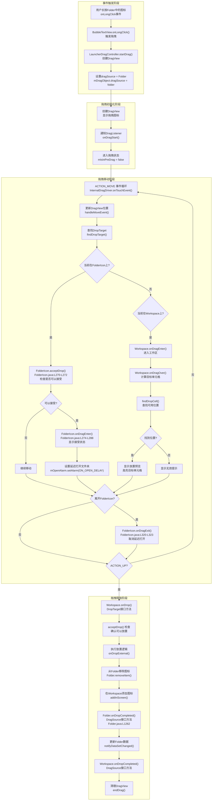
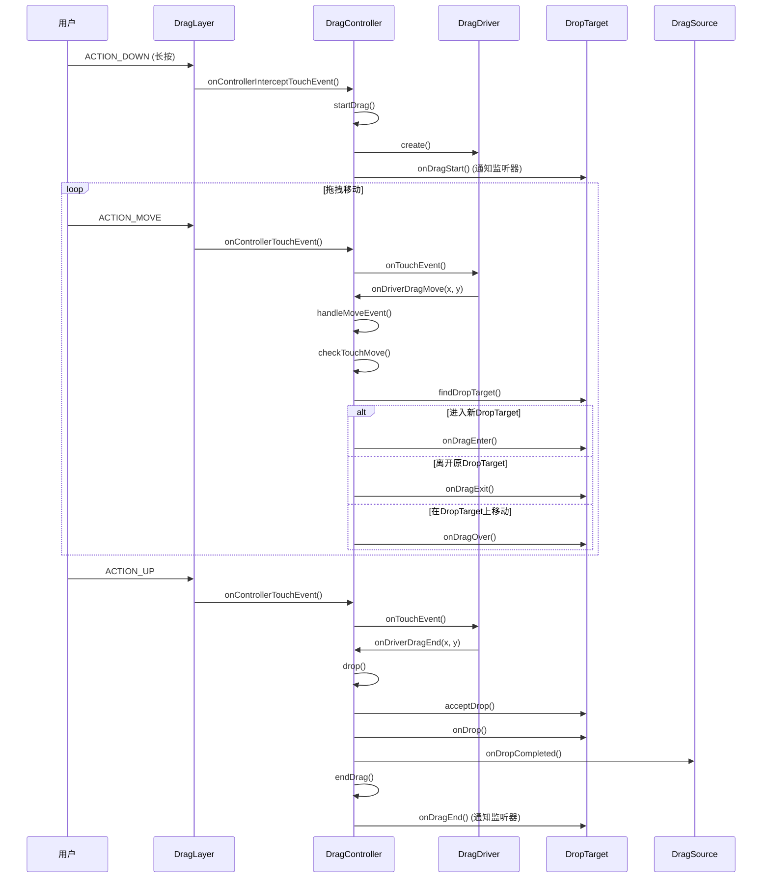

# Launcher3拖拽系统架构分析报告

## 概述

本报告基于对AOSP Launcher3源码的深入分析，全面解析了Launcher3中的拖拽系统架构，包括拖拽控制器、拖拽驱动、拖拽目标等核心组件的设计原理和实现机制。

**核心源码位置**:
| 组件 | 文件路径 |
|------|----------|
| DragController | [DragController.java](src/com/android/launcher3/dragndrop/DragController.java) |
| LauncherDragController | [LauncherDragController.java](src/com/android/launcher3/dragndrop/LauncherDragController.java) |
| DragDriver | [DragDriver.java](src/com/android/launcher3/dragndrop/DragDriver.java) |
| DragView | [DragView.java](src/com/android/launcher3/dragndrop/DragView.java) |
| DropTarget | [DropTarget.java](src/com/android/launcher3/DropTarget.java) |
| DragSource | [DragSource.java](src/com/android/launcher3/DragSource.java) |
| DragOptions | [DragOptions.java](src/com/android/launcher3/dragndrop/DragOptions.java) |
| DraggableView | [DraggableView.java](src/com/android/launcher3/dragndrop/DraggableView.java) |
| DragLayer | [DragLayer.java](src/com/android/launcher3/dragndrop/DragLayer.java) |
| Workspace | [Workspace.java](src/com/android/launcher3/Workspace.java) |
| FolderIcon | [FolderIcon.java](src/com/android/launcher3/folder/FolderIcon.java) |
| Folder | [Folder.java](src/com/android/launcher3/folder/Folder.java) |
| ButtonDropTarget | [ButtonDropTarget.java](src/com/android/launcher3/ButtonDropTarget.java) |

## 拖拽系统架构分析

### 核心组件架构

Launcher3的拖拽系统采用分层设计，包含控制器层、驱动层、视图层和接口层，实现了高度模块化和可扩展的拖拽功能。

#### 1. DragController - 拖拽控制器

DragController是拖拽系统的核心控制器，负责管理整个拖拽生命周期：
- 管理拖拽开始、移动、结束的完整流程
- 维护DropTarget列表和DragListener列表
- 处理拖拽状态转换和事件分发

**源码定义** ([DragController.java:54-69](src/com/android/launcher3/dragndrop/DragController.java#L54-L69)):
```java
public abstract class DragController<T extends ActivityContext>
        implements DragDriver.EventListener, TouchController {

    private static final int DEEP_PRESS_DISTANCE_FACTOR = 3;

    protected final T mActivity;
    protected DragDriver mDragDriver = null;
    public DragOptions mOptions;
    protected final Point mMotionDown = new Point();
    protected final Point mLastTouch = new Point();
    public DropTarget.DragObject mDragObject;
    private final ArrayList<DropTarget> mDropTargets = new ArrayList<>();
    private final ArrayList<DragListener> mListeners = new ArrayList<>();
    protected DropTarget mLastDropTarget;
    protected boolean mIsInPreDrag;
```

**核心方法**:
| 方法 | 位置 | 说明 |
|------|------|------|
| `startDrag()` | L114-L138 | 启动拖拽的核心方法 |
| `cancelDrag()` | L215-L230 | 取消拖拽操作 |
| `endDrag()` | L253-L276 | 结束拖拽操作 |
| `handleMoveEvent()` | L389-L409 | 处理移动事件 |
| `checkTouchMove()` | L418-L438 | 检查触摸移动并更新DropTarget |
| `drop()` | L456-L494 | 执行放置操作 |

#### 2. DragDriver - 拖拽驱动器

DragDriver负责处理具体的触摸和拖拽事件，支持两种实现：
- **InternalDragDriver**: 处理Launcher内部的拖拽事件
- **SystemDragDriver**: 处理系统级的跨应用拖拽事件

**源码定义** ([DragDriver.java:30-46](src/com/android/launcher3/dragndrop/DragDriver.java#L30-L46)):
```java
public abstract class DragDriver {

    protected final EventListener mEventListener;
    protected final Consumer<MotionEvent> mSecondaryEventConsumer;

    public interface EventListener {
        void onDriverDragMove(float x, float y);
        void onDriverDragExitWindow();
        void onDriverDragEnd(float x, float y);
        void onDriverDragCancel();
    }
```

**驱动创建逻辑** ([DragDriver.java:65-74](src/com/android/launcher3/dragndrop/DragDriver.java#L65-L74)):
```java
    public static DragDriver create(DragController dragController, DragOptions options,
            Consumer<MotionEvent> sec) {
        if (options.simulatedDndStartPoint != null) {
            if  (options.isAccessibleDrag) {
                return null;
            }
            return new SystemDragDriver(dragController, sec);
        } else {
            return new InternalDragDriver(dragController, sec);
        }
    }
```

**InternalDragDriver实现** ([DragDriver.java:156-L189](src/com/android/launcher3/dragndrop/DragDriver.java#L156-L189)):
```java
    static class InternalDragDriver extends DragDriver {
        private final DragController mDragController;

        @Override
        public boolean onTouchEvent(MotionEvent ev) {
            mSecondaryEventConsumer.accept(ev);
            final int action = ev.getAction();

            switch (action) {
                case MotionEvent.ACTION_MOVE:
                    mEventListener.onDriverDragMove(mDragController.getX(ev),
                            mDragController.getY(ev));
                    break;
                case MotionEvent.ACTION_UP:
                    mEventListener.onDriverDragMove(mDragController.getX(ev),
                            mDragController.getY(ev));
                    mEventListener.onDriverDragEnd(mDragController.getX(ev),
                            mDragController.getY(ev));
                    break;
                case MotionEvent.ACTION_CANCEL:
                    mEventListener.onDriverDragCancel();
                    break;
            }
            return true;
        }
    }
```

#### 3. DragView - 拖拽视图

DragView是拖拽过程中显示的视图组件，负责：
- 显示拖拽项的视觉反馈
- 实现拖拽动画效果
- 管理拖拽过程中的缩放和位置变化

**源码定义** ([DragView.java:70-L103](src/com/android/launcher3/dragndrop/DragView.java#L70-L103)):
```java
public abstract class DragView<T extends Context & ActivityContext> extends FrameLayout {

    public static final int VIEW_ZOOM_DURATION = 150;

    private final View mContent;
    private final int mWidth;
    private final int mHeight;
    protected final int mRegistrationX;
    protected final int mRegistrationY;
    private final float mInitialScale;
    private final float mEndScale;
    protected final float mScaleOnDrop;
    protected final T mActivity;
    private final BaseDragLayer<T> mDragLayer;
    
    final ValueAnimator mScaleAnim;
    final ValueAnimator mShiftAnim;
```

**核心方法**:
| 方法 | 位置 | 说明 |
|------|------|------|
| `show()` | L376-L396 | 显示DragView并启动拾取动画 |
| `move()` | L418-L428 | 移动DragView位置 |
| `onDragStart()` | L267-L269 | 拖拽开始回调 |
| `animateTo()` | L439-L440 | 动画移动到指定位置（抽象方法） |

### 核心接口设计

#### 1. DropTarget接口 - 拖拽目标

DropTarget定义了拖拽目标对象的行为规范：

**源码定义** ([DropTarget.java:35-L103](src/com/android/launcher3/DropTarget.java#L35-L103)):
```java
public interface DropTarget {

    class DragObject {
        public int x = -1;
        public int y = -1;
        public int xOffset = -1;
        public int yOffset = -1;
        public boolean dragComplete = false;
        public DragView dragView = null;
        public ItemInfo dragInfo = null;
        public ItemInfo originalDragInfo = null;
        public DragSource dragSource = null;
        public boolean cancelled = false;
        public boolean deferDragViewCleanupPostAnimation = true;
        public DragViewStateAnnouncer stateAnnouncer;
        public FolderNameSuggestionLoader folderNameSuggestionLoader;
        public DraggableView originalView = null;
        public final InstanceId logInstanceId = new InstanceIdSequence().newInstanceId();

        public final float[] getVisualCenter(float[] recycle) {
            // 计算视觉中心点
        }
    }

    boolean isDropEnabled();
    void onDrop(DragObject dragObject, DragOptions options);
    void onDragEnter(DragObject dragObject);
    void onDragOver(DragObject dragObject);
    void onDragExit(DragObject dragObject);
    boolean acceptDrop(DragObject dragObject);
    void prepareAccessibilityDrop();
    void getHitRectRelativeToDragLayer(Rect outRect);
    default @Nullable View getDropView() {
        return (View) this;
    }
}
```

#### 2. DragSource接口 - 拖拽源

DragSource定义了拖拽源对象的行为规范：

**源码定义** ([DragSource.java:26-L33](src/com/android/launcher3/DragSource.java#L26-L33)):
```java
public interface DragSource {

    /**
     * A callback made back to the source after an item from this source has been dropped on a
     * DropTarget.
     */
    void onDropCompleted(View target, DragObject d, boolean success);
}
```

#### 3. DragListener接口 - 拖拽监听器

DragListener定义了拖拽开始和结束的监听接口：

**源码定义** ([DragController.java:91-L107](src/com/android/launcher3/dragndrop/DragController.java#L91-L107)):
```java
    public interface DragListener {
        /**
         * A drag has begun
         */
        void onDragStart(DropTarget.DragObject dragObject, DragOptions options);

        /**
         * The drag has ended
         */
        void onDragEnd();
    }
```

#### 4. DraggableView接口 - 可拖拽视图

DraggableView定义了可拖拽视图的行为规范：

**源码定义** ([DraggableView.java:28-L71](src/com/android/launcher3/dragndrop/DraggableView.java#L28-L71)):
```java
public interface DraggableView {
    int DRAGGABLE_ICON = 0;
    int DRAGGABLE_WIDGET = 1;

    static DraggableView ofType(int type) {
        return () -> type;
    }

    int getViewType();

    @NonNull default SafeCloseable prepareDrawDragView() {
        return () -> { };
    }

    default void getWorkspaceVisualDragBounds(Rect bounds) { }

    default void getSourceVisualDragBounds(Rect bounds) {
        getWorkspaceVisualDragBounds(bounds);
    }
}
```

#### 5. DragOptions类 - 拖拽选项

DragOptions包含了控制拖拽行为的各种选项：

**源码定义** ([DragOptions.java:27-L89](src/com/android/launcher3/dragndrop/DragOptions.java#L27-L89)):
```java
public class DragOptions {

    public boolean isAccessibleDrag = false;
    public boolean isKeyboardDrag = false;
    public Point simulatedDndStartPoint = null;
    public PreDragCondition preDragCondition = null;
    public float preDragEndScale;
    public float intrinsicIconScaleFactor = 1f;
    public boolean isFlingToDelete;

    public interface PreDragCondition {
        boolean shouldStartDrag(double distanceDragged);
        void onPreDragStart(DropTarget.DragObject dragObject);
        void onPreDragEnd(DropTarget.DragObject dragObject, boolean dragStarted);
        default Point getDragOffset() {
            return new Point(0,0);
        }
    }
}
```

### DragObject数据结构

DragObject是DropTarget的内部类，包含了拖拽过程中的所有数据：

**字段说明**:
| 字段 | 类型 | 说明 |
|------|------|------|
| `x`, `y` | int | 当前触摸位置 |
| `xOffset`, `yOffset` | int | 触摸点相对于视图左上角的偏移量 |
| `dragComplete` | boolean | 拖拽是否完成 |
| `dragView` | DragView | 拖拽视图 |
| `dragInfo` | ItemInfo | 拖拽项信息（可能已修改） |
| `originalDragInfo` | ItemInfo | 原始拖拽项信息 |
| `dragSource` | DragSource | 拖拽来源 |
| `cancelled` | boolean | 是否取消 |
| `deferDragViewCleanupPostAnimation` | boolean | 是否延迟清理DragView |
| `originalView` | DraggableView | 原始视图 |
| `logInstanceId` | InstanceId | 日志实例ID |

## 类图分析

### 1. 核心接口类图

#### DragSource接口类图


#### DragObject数据结构类图


#### DropTarget接口类图


**注意**: FolderIcon并没有直接实现DropTarget接口，但它提供了`acceptDrop()`、`onDragEnter()`、`onDragExit()`等方法来处理拖拽进入文件夹的场景。这些方法由Workspace在处理拖拽事件时调用。

### 2. 完整系统类图



## 架构图

### 1. 核心架构层次图



### 2. 详细组件关系图



## 拖拽流程图

### 1. 通用拖拽流程图（含源码位置）

```mermaid
flowchart TD
    subgraph "拖拽启动阶段"
        A["ACTION_DOWN 长按开始<br/>MotionEvent.ACTION_DOWN"] --> B["创建DragView<br/>DragController.startDrag()<br/>L114-L138"]
        B --> C["创建DragDriver<br/>DragDriver.create()<br/>DragDriver.java:L65-L74"]
        C --> D["调用DragListener.onDragStart<br/>callOnDragStart()<br/>L149-L165"]
        D --> E{有PreDragCondition?}
        E -->|是| F["进入预拖拽状态<br/>mIsInPreDrag = true"]
        E -->|否| G["直接开始拖拽<br/>mIsInPreDrag = false"]
    end
    
    subgraph "拖拽移动阶段"
        F --> H["ACTION_MOVE 移动检测<br/>InternalDragDriver.onTouchEvent()<br/>DragDriver.java:L156-L175"]
        G --> H
        H --> I["更新DragView位置<br/>handleMoveEvent()<br/>L389-L409"]
        I --> J{检查PreDragCondition<br/>shouldStartDrag()?}
        J -->|满足| K["开始正式拖拽<br/>callOnDragStart()<br/>L149-L165"]
        J -->|不满足| L["继续预拖拽"]
        K --> M["检查DropTarget<br/>checkTouchMove()<br/>L418-L438"]
        L --> H
        M --> N["findDropTarget()<br/>查找当前触摸位置的DropTarget"]
        N --> O{进入新DropTarget?}
        O -->|是| P["onDragEnter()<br/>target.onDragEnter()"]
        O -->|否| Q{离开原DropTarget?}
        Q -->|是| R["onDragExit()<br/>mLastDropTarget.onDragExit()"]
        Q -->|否| S["onDragOver()<br/>target.onDragOver()"]
        P --> S
        R --> S
        S --> T{ACTION_UP?}
    end
    
    subgraph "拖拽结束阶段"
        T -->|是| U["执行放置<br/>drop()<br/>L456-L494"]
        T -->|否| H
        U --> V{acceptDrop()?}
        V -->|接受| W["onDrop()<br/>target.onDrop()"]
        V -->|拒绝| X["取消放置"]
        W --> Y["onDropCompleted()<br/>dragSource.onDropCompleted()"]
        X --> Y
        Y --> Z["结束拖拽<br/>endDrag()<br/>L253-L276"]
        Z --> AA["通知监听器<br/>callOnDragEnd()<br/>L288-L295"]
        AA --> AB["清理DragView<br/>dragView.remove()"]
    end
    
    subgraph "异常处理"
        H --> AC{ACTION_CANCEL?}
        AC -->|是| AD["取消拖拽<br/>cancelDrag()<br/>L215-L230"]
        AD --> AE["设置取消标志<br/>mDragObject.cancelled = true"]
        AE --> Z
    end
```

### 2. 从Folder拖拽图标到Workspace的完整流程图



### 3. DragDriver事件分发流程



## 设计模式分析

### 1. 观察者模式 (Observer Pattern)

**应用场景**: DragListener机制

**源码实现** ([DragController.java:91-L107](src/com/android/launcher3/dragndrop/DragController.java#L91-L107)):
```java
    public interface DragListener {
        void onDragStart(DropTarget.DragObject dragObject, DragOptions options);
        void onDragEnd();
    }
```

**设计优势**:
- 解耦拖拽控制器和具体业务逻辑
- 支持多个监听器同时响应拖拽事件
- 便于扩展新的拖拽行为

### 2. 策略模式 (Strategy Pattern)

**应用场景**: DragDriver实现

**源码实现** ([DragDriver.java:65-L74](src/com/android/launcher3/dragndrop/DragDriver.java#L65-L74)):
```java
    public static DragDriver create(DragController dragController, DragOptions options,
            Consumer<MotionEvent> sec) {
        if (options.simulatedDndStartPoint != null) {
            return new SystemDragDriver(dragController, sec);
        } else {
            return new InternalDragDriver(dragController, sec);
        }
    }
```

**设计优势**:
- 运行时动态选择拖拽驱动策略
- 支持内部拖拽和系统拖拽两种模式
- 便于添加新的拖拽驱动方式

### 3. 模板方法模式 (Template Method Pattern)

**应用场景**: DragController抽象类

**源码实现** ([DragController.java:139-L148](src/com/android/launcher3/dragndrop/DragController.java#L139-L148)):
```java
    protected abstract DragView startDrag(
            @Nullable Drawable drawable,
            @Nullable View view,
            DraggableView originalView,
            int dragLayerX,
            int dragLayerY,
            DragSource source,
            ItemInfo dragInfo,
            Rect dragRegion,
            float initialDragViewScale,
            float dragViewScaleOnDrop,
            DragOptions options);
```

**设计优势**:
- 定义拖拽流程骨架，子类实现具体细节
- 保证拖拽流程的一致性
- 支持不同Launcher上下文的定制

### 4. 装饰器模式 (Decorator Pattern)

**应用场景**: DragView内容包装

**源码实现** ([DragView.java:82-L96](src/com/android/launcher3/dragndrop/DragView.java#L82-L96)):
```java
    public DragView(T activity, View content, int width, int height, ...) {
        super(activity);
        mContent = content;
        // 将content添加到DragView中
        addView(content, new LayoutParams(width, height));
        // 设置初始缩放
        setScaleX(initialScale);
        setScaleY(initialScale);
    }
```

**设计优势**:
- 动态添加拖拽视觉效果
- 不修改原始视图的情况下增强功能
- 支持多种内容类型（Drawable、View）

## 性能优化分析

### 1. 预拖拽机制

**源码实现** ([DragController.java:149-L165](src/com/android/launcher3/dragndrop/DragController.java#L149-L165)):
```java
    protected void callOnDragStart() {
        if (mOptions.preDragCondition != null) {
            mOptions.preDragCondition.onPreDragEnd(mDragObject, true /* dragStarted*/);
        }
        mIsInPreDrag = false;
        // ... 缩放动画
        mDragObject.dragView.onDragStart();
        for (DragListener listener : new ArrayList<>(mListeners)) {
            listener.onDragStart(mDragObject, mOptions);
        }
    }
```

**优化效果**:
- 减少误触发的拖拽操作
- 支持深按手势的延迟响应
- 提升用户体验

### 2. 深按距离因子

**源码实现** ([DragController.java:56-L57](src/com/android/launcher3/dragndrop/DragController.java#L56-L57)):
```java
    private static final int DEEP_PRESS_DISTANCE_FACTOR = 3;
```

**优化效果**:
- 深按时需要更大的移动距离才触发拖拽
- 避免深按手势与拖拽手势冲突

### 3. 延迟清理DragView

**源码实现** ([DropTarget.java:68-L69](src/com/android/launcher3/DropTarget.java#L68-L69)):
```java
        public boolean deferDragViewCleanupPostAnimation = true;
```

**优化效果**:
- 支持放置动画完成后再清理DragView
- 避免动画过程中的视觉闪烁

### 4. 视觉中心计算优化

**源码实现** ([DropTarget.java:87-L102](src/com/android/launcher3/DropTarget.java#L87-L102)):
```java
        public final float[] getVisualCenter(float[] recycle) {
            final float res[] = (recycle == null) ? new float[2] : recycle;
            Rect dragRegion = dragView.getDragRegion();
            int left = x - xOffset - dragRegion.left;
            int top = y - yOffset - dragRegion.top;
            res[0] = left + dragRegion.width() / 2;
            res[1] = top + dragRegion.height() / 2;
            return res;
        }
```

**优化效果**:
- 复用数组减少内存分配
- 精确计算拖拽项的视觉中心
- 提升放置位置的准确性

## 扩展性分析

### 1. 添加新的DropTarget

**实现步骤**:
1. 实现DropTarget接口
2. 在DragController中注册DropTarget
3. 实现放置逻辑

**示例代码**:
```java
public class CustomDropTarget extends View implements DropTarget {
    @Override
    public boolean isDropEnabled() {
        return true;
    }
    
    @Override
    public void onDrop(DragObject dragObject, DragOptions options) {
        // 处理放置逻辑
    }
    
    // ... 其他接口方法
}

// 注册DropTarget
dragController.addDropTarget(new CustomDropTarget(context));
```

### 2. 添加新的DragSource

**实现步骤**:
1. 实现DragSource接口
2. 在拖拽开始时设置dragSource
3. 处理拖拽完成回调

**示例代码**:
```java
public class CustomDragSource implements DragSource {
    @Override
    public void onDropCompleted(View target, DragObject d, boolean success) {
        if (success) {
            // 从源位置移除项
            removeItem(d.dragInfo);
        }
    }
}
```

### 3. 自定义拖拽行为

**实现步骤**:
1. 创建自定义PreDragCondition
2. 设置到DragOptions中

**示例代码**:
```java
DragOptions options = new DragOptions();
options.preDragCondition = new DragOptions.PreDragCondition() {
    @Override
    public boolean shouldStartDrag(double distanceDragged) {
        return distanceDragged > threshold;
    }
    
    @Override
    public void onPreDragStart(DropTarget.DragObject dragObject) {
        // 预拖拽开始
    }
    
    @Override
    public void onPreDragEnd(DropTarget.DragObject dragObject, boolean dragStarted) {
        // 预拖拽结束
    }
};
```

## 总结

Launcher3的拖拽系统采用了分层架构设计，通过DragController、DragDriver、DragView等核心组件实现了高度模块化和可扩展的拖拽功能：

1. **控制器层**: DragController作为核心控制器，管理整个拖拽生命周期
2. **驱动层**: DragDriver支持内部拖拽和系统拖拽两种模式
3. **视图层**: DragView提供拖拽视觉反馈和动画效果
4. **接口层**: DropTarget、DragSource、DragListener定义了清晰的交互规范

**核心设计特点**:
- **观察者模式**: DragListener机制实现拖拽事件的通知
- **策略模式**: DragDriver支持多种拖拽驱动方式
- **模板方法模式**: DragController定义拖拽流程骨架
- **装饰器模式**: DragView包装原始视图增强功能

**性能优化措施**:
- 预拖拽机制减少误触发
- 深按距离因子优化手势冲突
- 延迟清理DragView支持动画
- 视觉中心计算优化放置准确性

这套拖拽系统为Android Launcher提供了强大而灵活的拖拽功能，是Android系统交互体验的重要组成部分。
