# Launcher手势动画分析

## 1. 核心文件分析

### 1.1 主要手势控制器

| 控制器类 | 职责 | 文件路径 |
|---------|------|----------|
| [AbsSwipeUpHandler](quickstep/src/com/android/quickstep/AbsSwipeUpHandler.java) | 处理导航手势的核心类 | `quickstep/src/com/android/quickstep/AbsSwipeUpHandler.java` |
| [PortraitStatesTouchController](quickstep/src/com/android/launcher3/uioverrides/touchcontrollers/PortraitStatesTouchController.java) | 处理竖屏模式下的状态转换手势 | `quickstep/src/com/android/launcher3/uioverrides/touchcontrollers/PortraitStatesTouchController.java` |
| [TwoButtonNavbarTouchController](quickstep/src/com/android/launcher3/uioverrides/touchcontrollers/TwoButtonNavbarTouchController.java) | 处理双按钮导航模式下的边缘滑动 | `quickstep/src/com/android/launcher3/uioverrides/touchcontrollers/TwoButtonNavbarTouchController.java` |
| [EdgeBackGestureHandler](quickstep/src/com/android/quickstep/interaction/EdgeBackGestureHandler.java) | 处理侧滑返回手势 | `quickstep/src/com/android/quickstep/interaction/EdgeBackGestureHandler.java` |
| [AbstractStateChangeTouchController](src/com/android/launcher3/touch/AbstractStateChangeTouchController.java) | 状态变化触摸控制器基类 | `src/com/android/launcher3/touch/AbstractStateChangeTouchController.java` |

### 1.2 动画相关类

| 类名 | 职责 | 文件路径 |
|------|------|----------|
| [AnimatorPlaybackController](src/com/android/launcher3/anim/AnimatorPlaybackController.java) | 控制动画播放 | `src/com/android/launcher3/anim/AnimatorPlaybackController.java` |
| [PendingAnimation](src/com/android/launcher3/anim/PendingAnimation.java) | 待处理动画管理器 | `src/com/android/launcher3/anim/PendingAnimation.java` |
| [SwipeUpAnimationLogic](quickstep/src/com/android/quickstep/SwipeUpAnimationLogic.java) | 处理上滑动画逻辑 | `quickstep/src/com/android/quickstep/SwipeUpAnimationLogic.java` |
| [SingleAxisSwipeDetector](src/com/android/launcher3/touch/SingleAxisSwipeDetector.java) | 单轴滑动检测器 | `src/com/android/launcher3/touch/SingleAxisSwipeDetector.java` |

## 2. 手势处理流程

### 2.1 触摸事件分发流程

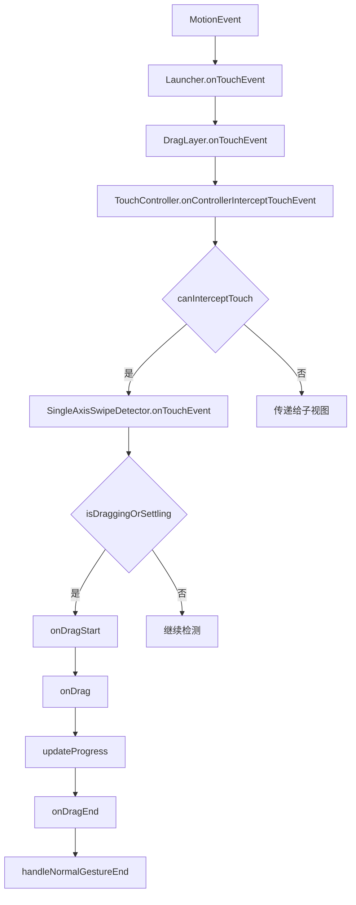
```mermaid
graph TD
    A[MotionEvent] --> B[Launcher.onTouchEvent]
    B --> C[DragLayer.onTouchEvent]
    C --> D[TouchController.onControllerInterceptTouchEvent]
    D --> E{canInterceptTouch}
    E -->|是| F[SingleAxisSwipeDetector.onTouchEvent]
    E -->|否| G[传递给子视图]
    F --> H{isDraggingOrSettling}
    H -->|是| I[onDragStart]
    H -->|否| J[继续检测]
    I --> K[onDrag]
    K --> L[updateProgress]
    L --> M[onDragEnd]
    M --> N[handleNormalGestureEnd]
```

### 2.2 上滑手势调用链

#### 2.2.1 ACTION_DOWN 事件链

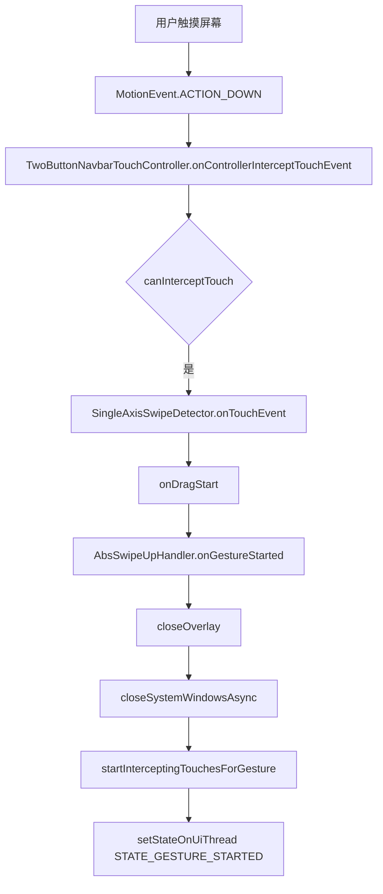
```mermaid
graph TD
    A[用户触摸屏幕] --> B[MotionEvent.ACTION_DOWN]
    B --> C[TwoButtonNavbarTouchController.onControllerInterceptTouchEvent]
    C --> D{canInterceptTouch}
    D -->|是| E[SingleAxisSwipeDetector.onTouchEvent]
    E --> F[onDragStart]
    F --> G[AbsSwipeUpHandler.onGestureStarted]
    G --> H[closeOverlay]
    H --> I[closeSystemWindowsAsync]
    I --> J[startInterceptingTouchesForGesture]
    J --> K[setStateOnUiThread STATE_GESTURE_STARTED]
```

#### 2.2.2 ACTION_MOVE 事件链

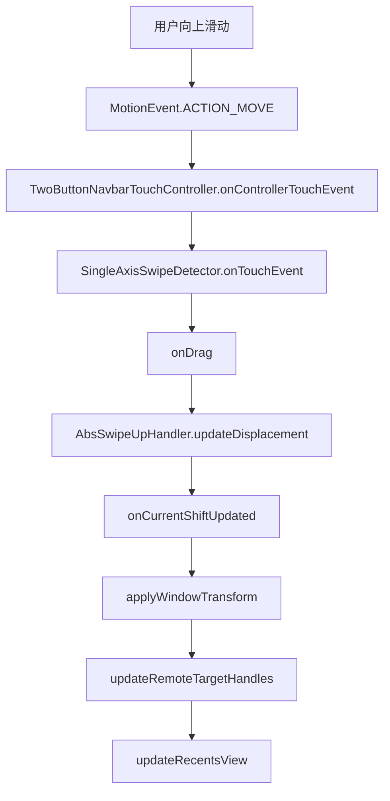
```mermaid
graph TD
    A[用户向上滑动] --> B[MotionEvent.ACTION_MOVE]
    B --> C[TwoButtonNavbarTouchController.onControllerTouchEvent]
    C --> D[SingleAxisSwipeDetector.onTouchEvent]
    D --> E[onDrag]
    E --> F[AbsSwipeUpHandler.updateDisplacement]
    F --> G[onCurrentShiftUpdated]
    G --> H[applyWindowTransform]
    H --> I[updateRemoteTargetHandles]
    I --> J[updateRecentsView]
```

#### 2.2.3 ACTION_UP 事件链

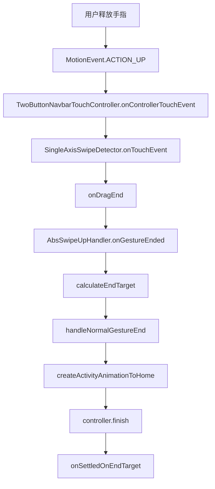
```mermaid
graph TD
    A[用户释放手指] --> B[MotionEvent.ACTION_UP]
    B --> C[TwoButtonNavbarTouchController.onControllerTouchEvent]
    C --> D[SingleAxisSwipeDetector.onTouchEvent]
    D --> E[onDragEnd]
    E --> F[AbsSwipeUpHandler.onGestureEnded]
    F --> G[calculateEndTarget]
    G --> H[handleNormalGestureEnd]
    H --> I[createActivityAnimationToHome]
    I --> J[controller.finish]
    J --> K[onSettledOnEndTarget]
```

### 2.3 下滑手势调用链

#### 2.3.1 ACTION_DOWN 事件链

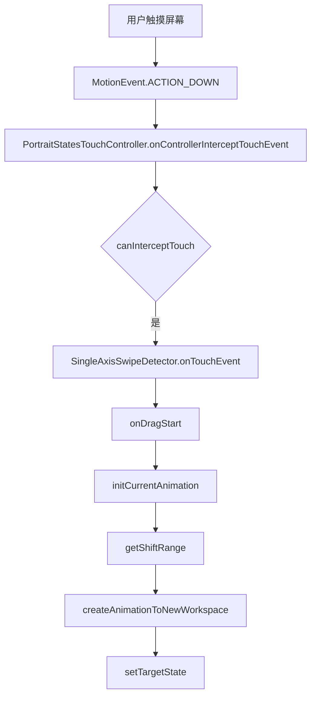
```mermaid
graph TD
    A[用户触摸屏幕] --> B[MotionEvent.ACTION_DOWN]
    B --> C[PortraitStatesTouchController.onControllerInterceptTouchEvent]
    C --> D{canInterceptTouch}
    D -->|是| E[SingleAxisSwipeDetector.onTouchEvent]
    E --> F[onDragStart]
    F --> G[initCurrentAnimation]
    G --> H[getShiftRange]
    H --> I[createAnimationToNewWorkspace]
    I --> J[setTargetState]
```

#### 2.3.2 ACTION_MOVE 事件链

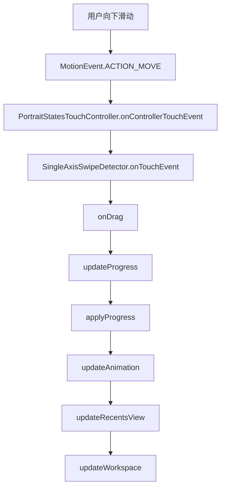
```mermaid
graph TD
    A[用户向下滑动] --> B[MotionEvent.ACTION_MOVE]
    B --> C[PortraitStatesTouchController.onControllerTouchEvent]
    C --> D[SingleAxisSwipeDetector.onTouchEvent]
    D --> E[onDrag]
    E --> F[updateProgress]
    F --> G[applyProgress]
    G --> H[updateAnimation]
    H --> I[updateRecentsView]
    I --> J[updateWorkspace]
```

#### 2.3.3 ACTION_UP 事件链

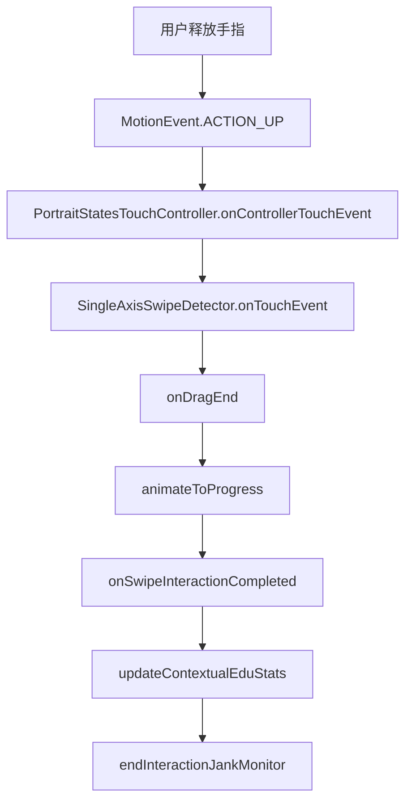
```mermaid
graph TD
    A[用户释放手指] --> B[MotionEvent.ACTION_UP]
    B --> C[PortraitStatesTouchController.onControllerTouchEvent]
    C --> D[SingleAxisSwipeDetector.onTouchEvent]
    D --> E[onDragEnd]
    E --> F[animateToProgress]
    F --> G[onSwipeInteractionCompleted]
    G --> H[updateContextualEduStats]
    H --> I[endInteractionJankMonitor]
```

### 2.4 侧滑返回手势调用链

#### 2.4.1 ACTION_DOWN 事件链

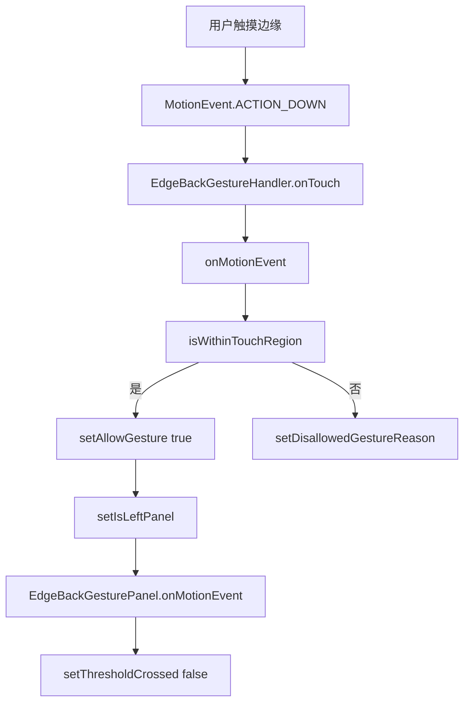
```mermaid
graph TD
    A[用户触摸边缘] --> B[MotionEvent.ACTION_DOWN]
    B --> C[EdgeBackGestureHandler.onTouch]
    C --> D[onMotionEvent]
    D --> E[isWithinTouchRegion]
    E -->|是| F[setAllowGesture true]
    F --> G[setIsLeftPanel]
    G --> H[EdgeBackGesturePanel.onMotionEvent]
    H --> I[setThresholdCrossed false]
    E -->|否| J[setDisallowedGestureReason]
```

#### 2.4.2 ACTION_MOVE 事件链

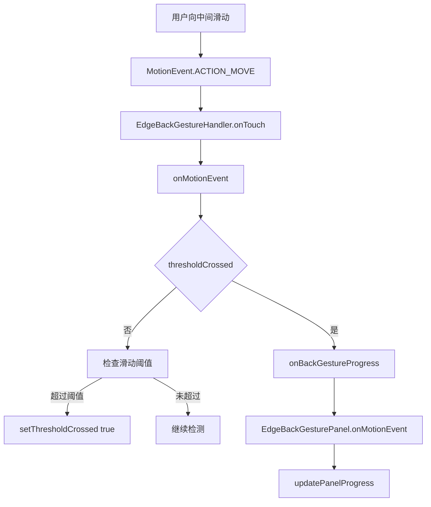
```mermaid
graph TD
    A[用户向中间滑动] --> B[MotionEvent.ACTION_MOVE]
    B --> C[EdgeBackGestureHandler.onTouch]
    C --> D[onMotionEvent]
    D --> E{thresholdCrossed}
    E -->|否| F[检查滑动阈值]
    F -->|超过阈值| G[setThresholdCrossed true]
    F -->|未超过| H[继续检测]
    E -->|是| I[onBackGestureProgress]
    I --> J[EdgeBackGesturePanel.onMotionEvent]
    J --> K[updatePanelProgress]
```

#### 2.4.3 ACTION_UP 事件链

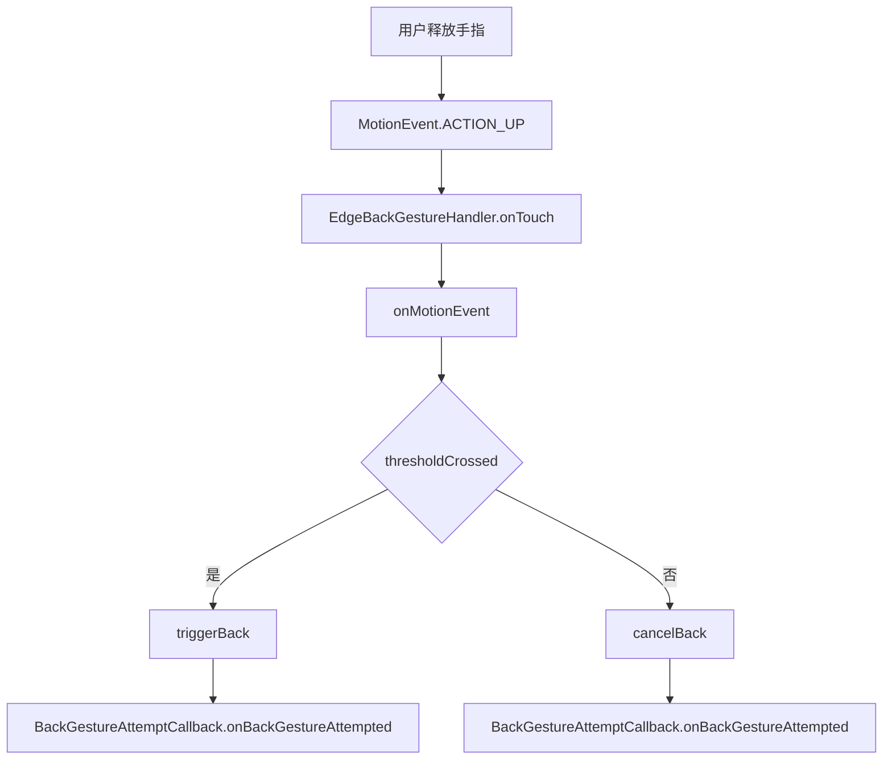
```mermaid
graph TD
    A[用户释放手指] --> B[MotionEvent.ACTION_UP]
    B --> C[EdgeBackGestureHandler.onTouch]
    C --> D[onMotionEvent]
    D --> E{thresholdCrossed}
    E -->|是| F[triggerBack]
    F --> G[BackGestureAttemptCallback.onBackGestureAttempted]
    E -->|否| H[cancelBack]
    H --> I[BackGestureAttemptCallback.onBackGestureAttempted]
```

## 3. 动画执行时序图

### 3.1 上滑手势动画时序

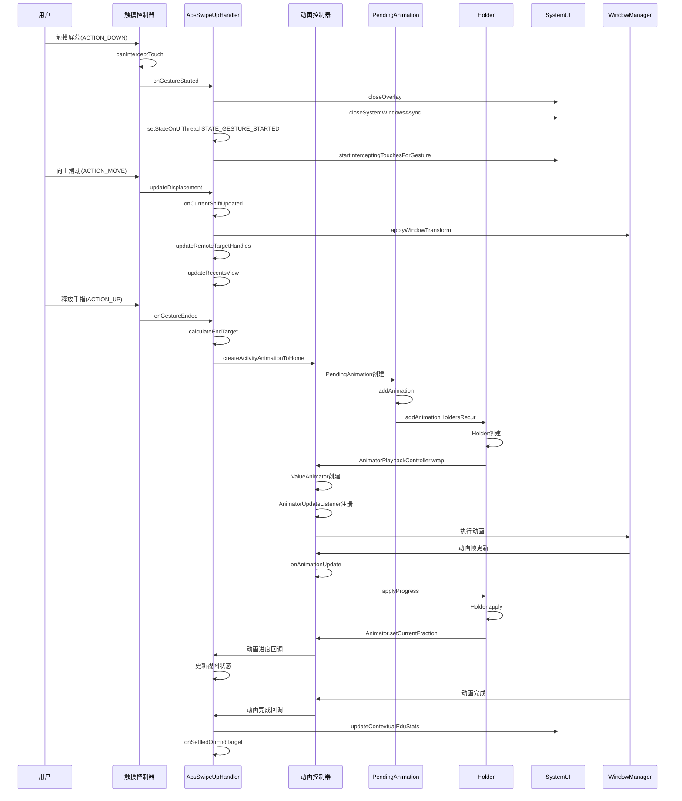
```mermaid
sequenceDiagram
    participant User as 用户
    participant Touch as 触摸控制器
    participant Handler as AbsSwipeUpHandler
    participant Animator as 动画控制器
    participant PendingAnim as PendingAnimation
    participant Holder as Holder
    participant SystemUI as SystemUI
    participant WindowManager as WindowManager

    User->>Touch: 触摸屏幕(ACTION_DOWN)
    Touch->>Touch: canInterceptTouch
    Touch->>Handler: onGestureStarted
    Handler->>SystemUI: closeOverlay
    Handler->>SystemUI: closeSystemWindowsAsync
    Handler->>Handler: setStateOnUiThread STATE_GESTURE_STARTED
    Handler->>SystemUI: startInterceptingTouchesForGesture

    User->>Touch: 向上滑动(ACTION_MOVE)
    Touch->>Handler: updateDisplacement
    Handler->>Handler: onCurrentShiftUpdated
    Handler->>WindowManager: applyWindowTransform
    Handler->>Handler: updateRemoteTargetHandles
    Handler->>Handler: updateRecentsView

    User->>Touch: 释放手指(ACTION_UP)
    Touch->>Handler: onGestureEnded
    Handler->>Handler: calculateEndTarget
    
    Handler->>Animator: createActivityAnimationToHome
    Animator->>PendingAnim: PendingAnimation创建
    PendingAnim->>PendingAnim: addAnimation
    PendingAnim->>Holder: addAnimationHoldersRecur
    Holder->>Holder: Holder创建
    Holder->>Animator: AnimatorPlaybackController.wrap
    Animator->>Animator: ValueAnimator创建
    Animator->>Animator: AnimatorUpdateListener注册
    
    Animator->>WindowManager: 执行动画
    WindowManager->>Animator: 动画帧更新
    Animator->>Animator: onAnimationUpdate
    Animator->>Holder: applyProgress
    Holder->>Holder: Holder.apply
    Holder->>Animator: Animator.setCurrentFraction
    Animator->>Handler: 动画进度回调
    Handler->>Handler: 更新视图状态
    
    WindowManager->>Animator: 动画完成
    Animator->>Handler: 动画完成回调
    Handler->>SystemUI: updateContextualEduStats
    Handler->>Handler: onSettledOnEndTarget
```

### 3.2 下滑返回应用时序

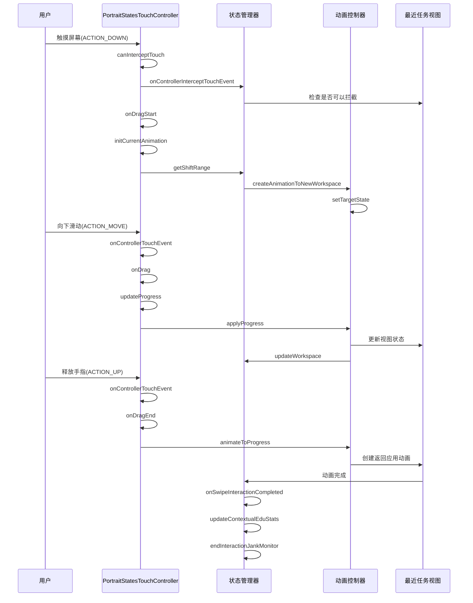
```mermaid
sequenceDiagram
    participant User as 用户
    participant Touch as PortraitStatesTouchController
    participant Handler as 状态管理器
    participant Animator as 动画控制器
    participant RecentsView as 最近任务视图

    User->>Touch: 触摸屏幕(ACTION_DOWN)
    Touch->>Touch: canInterceptTouch
    Touch->>Handler: onControllerInterceptTouchEvent
    Handler->>RecentsView: 检查是否可以拦截
    Touch->>Touch: onDragStart
    Touch->>Touch: initCurrentAnimation
    Touch->>Handler: getShiftRange
    Handler->>Animator: createAnimationToNewWorkspace
    Animator->>Animator: setTargetState

    User->>Touch: 向下滑动(ACTION_MOVE)
    Touch->>Touch: onControllerTouchEvent
    Touch->>Touch: onDrag
    Touch->>Touch: updateProgress
    Touch->>Animator: applyProgress
    Animator->>RecentsView: 更新视图状态
    Animator->>Handler: updateWorkspace

    User->>Touch: 释放手指(ACTION_UP)
    Touch->>Touch: onControllerTouchEvent
    Touch->>Touch: onDragEnd
    Touch->>Animator: animateToProgress
    Animator->>RecentsView: 创建返回应用动画
    RecentsView->>Handler: 动画完成
    Handler->>Handler: onSwipeInteractionCompleted
    Handler->>Handler: updateContextualEduStats
    Handler->>Handler: endInteractionJankMonitor
```

## 4. 核心方法分析

### 4.1 `AbsSwipeUpHandler.onGestureStarted`

**源码位置**：[AbsSwipeUpHandler.java:1060-1089](quickstep/src/com/android/quickstep/AbsSwipeUpHandler.java#L1060-L1089)

**功能**：处理手势开始时的逻辑

**关键代码**：
```java
// quickstep/src/com/android/quickstep/AbsSwipeUpHandler.java#L1060-L1089
@UiThread
public void onGestureStarted(boolean isLikelyToStartNewTask) {
    mContainerInterface.closeOverlay();
    TaskUtils.closeSystemWindowsAsync(CLOSE_SYSTEM_WINDOWS_REASON_RECENTS);

    if (mRecentsView != null) {
        final View rv = mRecentsView;
        mRecentsView.getViewTreeObserver().addOnDrawListener(new OnDrawListener() {
            boolean mHandled = false;

            @Override
            public void onDraw() {
                if (mHandled) {
                    return;
                }
                mHandled = true;

                InteractionJankMonitorWrapper.begin(
                        rv, Cuj.CUJ_LAUNCHER_QUICK_SWITCH, /* timeoutMs= */ 2000);
                InteractionJankMonitorWrapper.begin(rv, Cuj.CUJ_LAUNCHER_APP_CLOSE_TO_HOME);
                InteractionJankMonitorWrapper.begin(rv, Cuj.CUJ_LAUNCHER_APP_SWIPE_TO_RECENTS);

                rv.post(() -> rv.getViewTreeObserver().removeOnDrawListener(this));
            }
        });
    }
    notifyGestureStarted();
    setIsLikelyToStartNewTask(isLikelyToStartNewTask, false /* animate */);

    if (mIsTransientTaskbar && !mTaskbarAlreadyOpen && !isLikelyToStartNewTask) {
        setClampScrollOffset(true);
    }
    mStateCallback.setStateOnUiThread(STATE_GESTURE_STARTED);
    mGestureStarted = true;
}
```

### 4.2 `AbstractStateChangeTouchController.onControllerInterceptTouchEvent`

**源码位置**：[AbstractStateChangeTouchController.java:56-92](src/com/android/launcher3/touch/AbstractStateChangeTouchController.java#L56-L92)

**功能**：拦截触摸事件的核心方法

**关键代码**：
```java
// src/com/android/launcher3/touch/AbstractStateChangeTouchController.java#L56-L92
@Override
public boolean onControllerInterceptTouchEvent(MotionEvent ev) {
    if (ev.getAction() == MotionEvent.ACTION_DOWN) {
        mNoIntercept = !canInterceptTouch(ev);
        if (mNoIntercept) {
            return false;
        }

        mIsTrackpadReverseScroll = !mLauncher.isNaturalScrollingEnabled()
                && isTrackpadScroll(ev);

        final int directionsToDetectScroll;
        boolean ignoreSlopWhenSettling = false;

        if (mCurrentAnimation != null) {
            directionsToDetectScroll = SingleAxisSwipeDetector.DIRECTION_BOTH;
            ignoreSlopWhenSettling = true;
        } else {
            directionsToDetectScroll = getSwipeDirection();
            boolean ignoreWhenShownBehindDesktop = !mLauncher.isTopResumedActivity()
                    && mLauncher.shouldShowHomeBehindDesktop();
            boolean ignoreMouseScroll = ev.getSource() == InputDevice.SOURCE_MOUSE
                    && shouldEnableMouseInteractionChanges(
                    mLauncher.getWorkspace().getContext());
            if (directionsToDetectScroll == 0 || ignoreMouseScroll
                    || ignoreWhenShownBehindDesktop) {
                mNoIntercept = true;
                return false;
            }
        }
        mDetector.setDetectableScrollConditions(
                directionsToDetectScroll, ignoreSlopWhenSettling);
    }

    if (mNoIntercept) {
        return false;
    }

    onControllerTouchEvent(ev);
    return mDetector.isDraggingOrSettling();
}
```

### 4.3 `EdgeBackGestureHandler.onMotionEvent`

**源码位置**：[EdgeBackGestureHandler.java:179-252](quickstep/src/com/android/quickstep/interaction/EdgeBackGestureHandler.java#L179-L252)

**功能**：处理侧滑返回手势的触摸事件

**关键代码**：
```java
// quickstep/src/com/android/quickstep/interaction/EdgeBackGestureHandler.java#L179-L252
private void onMotionEvent(MotionEvent ev) {
    int action = ev.getActionMasked();
    if (action == MotionEvent.ACTION_DOWN) {
        boolean isOnLeftEdge = ev.getX() <= mEdgeWidth + mLeftInset;
        mDisallowedGestureReason = BackGestureResult.UNKNOWN;
        mAllowGesture = isWithinTouchRegion((int) ev.getX(), (int) ev.getY());
        mDownPoint.set(ev.getX(), ev.getY());
        if (mAllowGesture) {
            mEdgeBackPanel.setIsLeftPanel(isOnLeftEdge);
            mEdgeBackPanel.onMotionEvent(ev);
            mThresholdCrossed = false;
        }
    } else if (mAllowGesture) {
        if (!mThresholdCrossed) {
            if (action == MotionEvent.ACTION_POINTER_DOWN) {
                cancelGesture(ev);
                return;
            } else if (action == MotionEvent.ACTION_MOVE) {
                if ((ev.getEventTime() - ev.getDownTime()) > mLongPressTimeout) {
                    cancelGesture(ev);
                    return;
                }
                float dx = Math.abs(ev.getX() - mDownPoint.x);
                float dy = Math.abs(ev.getY() - mDownPoint.y);
                if (dy > dx && dy > mTouchSlop) {
                    cancelGesture(ev);
                    return;
                } else if (dx > dy && dx > mTouchSlop) {
                    mThresholdCrossed = true;
                }
            }
        }

        mGestureCallback.onBackGestureProgress(ev.getX() - mDownPoint.x,
                ev.getY() - mDownPoint.y, mEdgeBackPanel.getIsLeftPanel());

        mEdgeBackPanel.onMotionEvent(ev);
    }

    if (action == MotionEvent.ACTION_UP || action == MotionEvent.ACTION_CANCEL) {
        float dx = Math.abs(ev.getX() - mDownPoint.x);
        float dy = Math.abs(ev.getY() - mDownPoint.y);
        if (dx > dy && dx > mTouchSlop && !mAllowGesture && mGestureCallback != null) {
            mGestureCallback.onBackGestureAttempted(mDisallowedGestureReason);
        }
    }
}
```

### 4.4 `AbstractStateChangeTouchController.onDragStart`

**源码位置**：[AbstractStateChangeTouchController.java:195-213](src/com/android/launcher3/touch/AbstractStateChangeTouchController.java#L195-L213)

**功能**：处理拖拽开始事件

**关键代码**：
```java
// src/com/android/launcher3/touch/AbstractStateChangeTouchController.java#L195-L213
@Override
public void onDragStart(boolean start, float startDisplacement) {
    mStartState = mLauncher.getStateManager().getState();
    mIsLogContainerSet = false;

    if (mCurrentAnimation == null) {
        mFromState = mStartState;
        mToState = null;
        cancelAnimationControllers();
        reinitCurrentAnimation(false, mDetector.wasInitialTouchPositive());
        mDisplacementShift = 0;
    } else {
        mCurrentAnimation.pause();
        mStartProgress = mCurrentAnimation.getProgressFraction();
    }
    mCanBlockFling = mFromState == NORMAL;
    mFlingBlockCheck.unblockFling();
}
```

### 4.5 `AbstractStateChangeTouchController.onDrag`

**源码位置**：[AbstractStateChangeTouchController.java:214-272](src/com/android/launcher3/touch/AbstractStateChangeTouchController.java#L214-L272)

**功能**：处理拖拽过程中的事件

**关键代码**：
```java
// src/com/android/launcher3/touch/AbstractStateChangeTouchController.java#L214-L272
@Override
public boolean onDrag(float displacement) {
    float deltaProgress = mProgressMultiplier * (displacement - mDisplacementShift);
    float progress = deltaProgress + mStartProgress;
    updateProgress(progress);
    boolean isDragTowardPositive = mSwipeDirection.isPositive(
            displacement - mDisplacementShift);
    if (progress <= 0) {
        if (reinitCurrentAnimation(false, isDragTowardPositive)) {
            mDisplacementShift = displacement;
            if (mCanBlockFling) {
                mFlingBlockCheck.blockFling();
            }
        }
        if (mFromState == LauncherState.ALL_APPS) {
            mAllAppsOvershootStarted = true;
            mLauncher.getAppsView().onPull(-progress , -progress);
        }
    } else if (progress >= 1) {
        if (reinitCurrentAnimation(true, isDragTowardPositive)) {
            mDisplacementShift = displacement;
            if (mCanBlockFling) {
                mFlingBlockCheck.blockFling();
            }
        }
        if (mToState == LauncherState.ALL_APPS) {
            mAllAppsOvershootStarted = true;
            mLauncher.getAppsView().onPull(progress - 1f, progress - 1f);
        }
    } else {
        mFlingBlockCheck.onEvent();
    }

    return true;
}
```

## 5. 动画实现机制

### 5.1 动画控制器创建流程

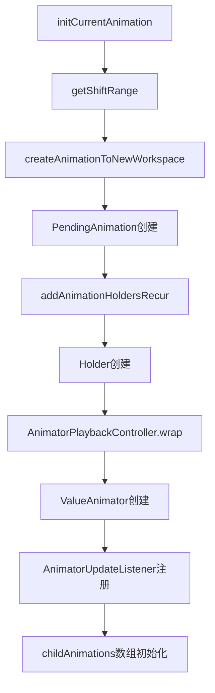
```mermaid
graph TD
    A[initCurrentAnimation] --> B[getShiftRange]
    B --> C[createAnimationToNewWorkspace]
    C --> D[PendingAnimation创建]
    D --> E[addAnimationHoldersRecur]
    E --> F[Holder创建]
    F --> G[AnimatorPlaybackController.wrap]
    G --> H[ValueAnimator创建]
    H --> I[AnimatorUpdateListener注册]
    I --> J[childAnimations数组初始化]
```

### 5.2 PendingAnimation动画注入流程

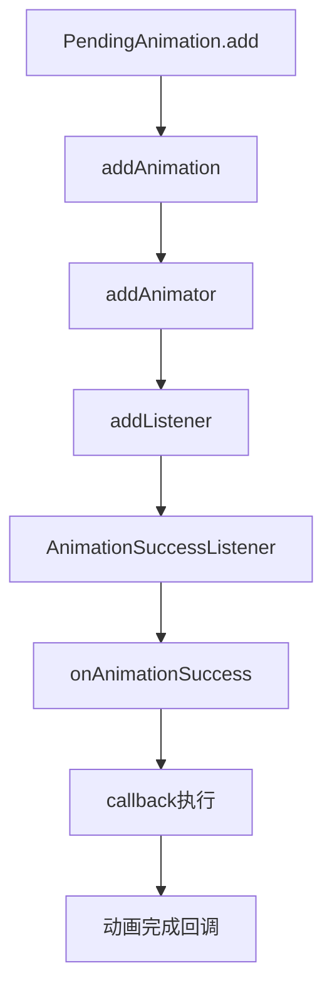
```mermaid
graph TD
    A[PendingAnimation.add] --> B[addAnimation]
    B --> C[addAnimator]
    C --> D[addListener]
    D --> E[AnimationSuccessListener]
    E --> F[onAnimationSuccess]
    F --> G[callback执行]
    G --> H[动画完成回调]
```

### 5.3 动画回调流程

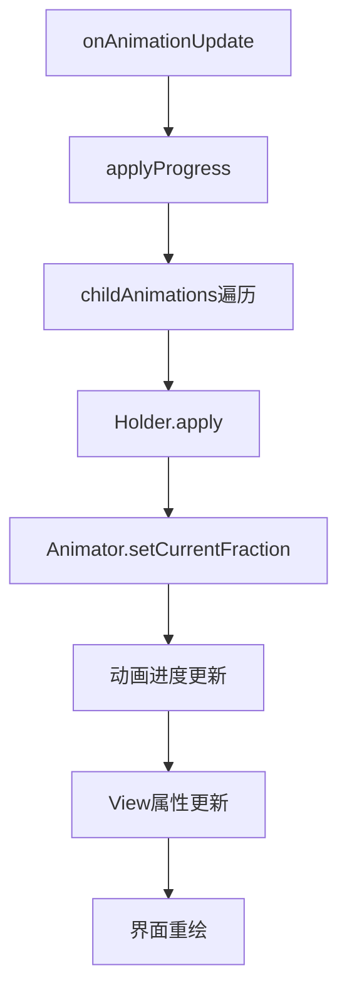
```mermaid
graph TD
    A[onAnimationUpdate] --> B[applyProgress]
    B --> C[childAnimations遍历]
    C --> D[Holder.apply]
    D --> E[Animator.setCurrentFraction]
    E --> F[动画进度更新]
    F --> G[View属性更新]
    G --> H[界面重绘]
```

### 5.4 完整动画控制器结构

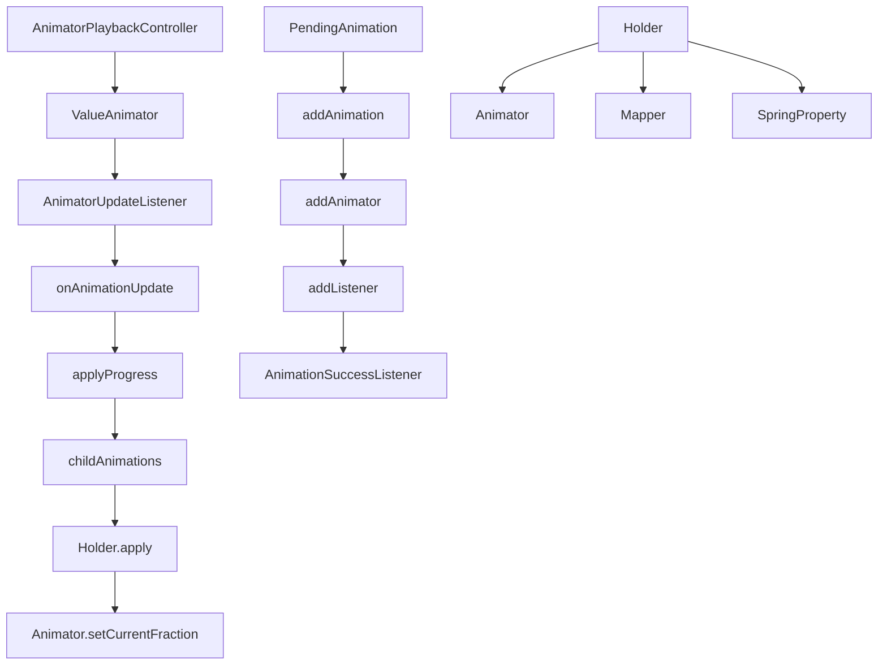
```mermaid
graph TD
    A[AnimatorPlaybackController] --> B[ValueAnimator]
    B --> C[AnimatorUpdateListener]
    C --> D[onAnimationUpdate]
    D --> E[applyProgress]
    E --> F[childAnimations]
    F --> G[Holder.apply]
    G --> H[Animator.setCurrentFraction]
    
    I[PendingAnimation] --> J[addAnimation]
    J --> K[addAnimator]
    K --> L[addListener]
    L --> M[AnimationSuccessListener]
    
    N[Holder] --> O[Animator]
    N --> P[Mapper]
    N --> Q[SpringProperty]
```

### 5.5 手势动画参数

**源码位置**：[AbsSwipeUpHandler.java:289-296](quickstep/src/com/android/quickstep/AbsSwipeUpHandler.java#L289-L296)

| 参数 | 描述 | 默认值 | 源码位置 |
|------|------|--------|----------|
| `MAX_SWIPE_DURATION` | 最大滑动动画持续时间 | 350ms | [AbsSwipeUpHandler.java:289](quickstep/src/com/android/quickstep/AbsSwipeUpHandler.java#L289) |
| `MIN_PROGRESS_FOR_OVERVIEW` | 进入概览模式的最小进度 | 0.7f | [AbsSwipeUpHandler.java:291](quickstep/src/com/android/quickstep/AbsSwipeUpHandler.java#L291) |
| `SWIPE_DURATION_MULTIPLIER` | 滑动持续时间乘数 | 1.428f | [AbsSwipeUpHandler.java:292](quickstep/src/com/android/quickstep/AbsSwipeUpHandler.java#L292) |
| `RECENTS_ATTACH_DURATION` | 最近任务附加动画持续时间 | 300ms | [AbsSwipeUpHandler.java:296](quickstep/src/com/android/quickstep/AbsSwipeUpHandler.java#L296) |

```java
// quickstep/src/com/android/quickstep/AbsSwipeUpHandler.java#L289-L296
public static final long MAX_SWIPE_DURATION = 350;

public static final float MIN_PROGRESS_FOR_OVERVIEW = 0.7f;
private static final float SWIPE_DURATION_MULTIPLIER =
        Math.min(1 / MIN_PROGRESS_FOR_OVERVIEW, 1 / (1 - MIN_PROGRESS_FOR_OVERVIEW));

public static final long RECENTS_ATTACH_DURATION = 300;
```

### 5.6 滑动过程中的动画控制器创建流程

#### 5.6.1 AnimatorPlaybackController创建

**源码位置**：[AnimatorPlaybackController.java:46-52](src/com/android/launcher3/anim/AnimatorPlaybackController.java#L46-L52)

1. **触发时机**：在`initCurrentAnimation`方法中
2. **创建流程**：
   - 调用`getShiftRange()`获取滑动范围
   - 创建`PendingAnimation`对象
   - 通过`addAnimationHoldersRecur()`添加动画持有者
   - 调用`AnimatorPlaybackController.wrap()`包装动画
   - 创建`ValueAnimator`并注册`AnimatorUpdateListener`

```java
// src/com/android/launcher3/anim/AnimatorPlaybackController.java#L46-L52
public static AnimatorPlaybackController wrap(AnimatorSet anim, long duration) {
    ArrayList<Holder> childAnims = new ArrayList<>();
    addAnimationHoldersRecur(anim, duration, SpringProperty.DEFAULT, childAnims);

    return new AnimatorPlaybackController(anim, duration, childAnims);
}
```

#### 5.6.2 Holder创建过程

**源码位置**：[AnimatorPlaybackController.java:365-395](src/com/android/launcher3/anim/AnimatorPlaybackController.java#L365-L395)

1. **创建时机**：在`addAnimationHoldersRecur`方法中
2. **核心功能**：
   - 持有具体的`Animator`对象
   - 管理动画的进度映射
   - 支持弹簧动画属性
   - 处理动画的应用逻辑

```java
// src/com/android/launcher3/anim/AnimatorPlaybackController.java#L365-L395
static class Holder {

    public final ValueAnimator anim;

    public final SpringProperty springProperty;

    public final TimeInterpolator interpolator;

    public final float globalEndProgress;

    public ProgressMapper mapper;

    Holder(Animator anim, float globalDuration, SpringProperty springProperty) {
        this.anim = (ValueAnimator) anim;
        this.springProperty = springProperty;
        this.interpolator = this.anim.getInterpolator();
        this.globalEndProgress = anim.getDuration() / globalDuration;
        this.mapper = ProgressMapper.DEFAULT;
    }

    public void setProgress(float progress) {
        anim.setCurrentFraction(mapper.getProgress(progress, globalEndProgress));
    }

    public void reset() {
        anim.setInterpolator(interpolator);
        mapper = ProgressMapper.DEFAULT;
    }
}
```

#### 5.6.3 PendingAnimation类继承结构

PendingAnimation的完整继承关系如下：

```
PropertySetter (抽象基类)
    ↓
AnimatedPropertySetter (动画属性设置器)
    ↓
PendingAnimation (待处理动画管理器)
```

**源码位置**：[PendingAnimation.java:33-130](src/com/android/launcher3/anim/PendingAnimation.java#L33-L130)

#### 5.6.4 add方法注入动画的详细流程

##### 5.6.4.1 核心add方法实现

**源码位置**：[PendingAnimation.java:68-71](src/com/android/launcher3/anim/PendingAnimation.java#L68-L71)

```java
// src/com/android/launcher3/anim/PendingAnimation.java#L68-L71
public void add(Animator a, SpringProperty springProperty) {
    mAnim.play(a.setDuration(mDuration));
    addAnimationHoldersRecur(a, mDuration, springProperty, mAnimHolders);
}
```

##### 5.6.4.2 addAnimationHoldersRecur递归方法

**源码位置**：[AnimatorPlaybackController.java:397-415](src/com/android/launcher3/anim/AnimatorPlaybackController.java#L397-L415)

```java
// src/com/android/launcher3/anim/AnimatorPlaybackController.java#L397-L415
static void addAnimationHoldersRecur(Animator anim, long globalDuration,
        SpringProperty springProperty, ArrayList<Holder> out) {
    long forceDuration = anim.getDuration();
    TimeInterpolator forceInterpolator = anim.getInterpolator();
    if (anim instanceof ValueAnimator) {
        out.add(new Holder(anim, globalDuration, springProperty));
    } else if (anim instanceof AnimatorSet) {
        for (Animator child : ((AnimatorSet) anim).getChildAnimations()) {
            if (forceDuration > 0) {
                child.setDuration(forceDuration);
            }
            if (forceInterpolator != null) {
                child.setInterpolator(forceInterpolator);
            }
            addAnimationHoldersRecur(child, globalDuration, springProperty, out);
        }
    } else {
        throw new RuntimeException("Unknown animation type " + anim);
    }
}
```

##### 5.6.4.3 动画注入的完整调用链

**源码位置**：[PendingAnimation.java:55-71](src/com/android/launcher3/anim/PendingAnimation.java#L55-L71)

PendingAnimation提供了多种动画注入方法：

```java
// src/com/android/launcher3/anim/PendingAnimation.java#L55-L71
@Override
public void add(Animator anim) {
    add(anim, SpringProperty.DEFAULT);
}

public void add(Animator a, SpringProperty springProperty) {
    mAnim.play(a.setDuration(mDuration));
    addAnimationHoldersRecur(a, mDuration, springProperty, mAnimHolders);
}

public void add(Animator anim, TimeInterpolator interpolator) {
    add(anim, interpolator, SpringProperty.DEFAULT);
}

public void add(Animator anim, TimeInterpolator interpolator, SpringProperty springProperty) {
    anim.setInterpolator(interpolator);
    add(anim, springProperty);
}
```

##### 5.6.4.4 便捷动画创建方法

**源码位置**：[PendingAnimation.java:83-100](src/com/android/launcher3/anim/PendingAnimation.java#L83-L100)

```java
// src/com/android/launcher3/anim/PendingAnimation.java#L83-L100
public <T> void addFloat(T target, FloatProperty<T> property, float from, float to,
        TimeInterpolator interpolator) {
    Animator anim = ObjectAnimator.ofFloat(target, property, from, to);
    anim.setInterpolator(interpolator);
    add(anim);
}

public void addAnimatedFloat(AnimatedFloat target, float from, float to,
        TimeInterpolator interpolator) {
    Animator anim = target.animateToValue(from, to);
    anim.setInterpolator(interpolator);
    add(anim);
}
```

#### 5.6.5 动画控制器创建流程

**源码位置**：[PendingAnimation.java:117-119](src/com/android/launcher3/anim/PendingAnimation.java#L117-L119)

```java
// src/com/android/launcher3/anim/PendingAnimation.java#L117-L119
public AnimatorPlaybackController createPlaybackController() {
    return new AnimatorPlaybackController(buildAnim(), mDuration, mAnimHolders);
}
```

其中`buildAnim()`方法确保至少有一个占位动画：

**源码位置**：[PendingAnimation.java:107-115](src/com/android/launcher3/anim/PendingAnimation.java#L107-L115)

```java
// src/com/android/launcher3/anim/PendingAnimation.java#L107-L115
@Override
public AnimatorSet buildAnim() {
    if (mAnimHolders.isEmpty()) {
        add(ValueAnimator.ofFloat(0, 1).setDuration(mDuration));
    }
    return super.buildAnim();
}
```

#### 5.6.6 动画进度控制

**源码位置**：[AnimatorPlaybackController.java:161-176](src/com/android/launcher3/anim/AnimatorPlaybackController.java#L161-L176)

```java
// src/com/android/launcher3/anim/AnimatorPlaybackController.java#L161-L176
public void setPlayFraction(float fraction) {
    mCurrentFraction = fraction;
    if (mTargetCancelled) {
        return;
    }
    float progress = boundToRange(fraction, 0, 1);
    for (Holder holder : mChildAnimations) {
        holder.setProgress(progress);
    }
}

public float getProgressFraction() {
    return mCurrentFraction;
}

public float getInterpolatedProgress() {
    return getInterpolator().getInterpolation(mCurrentFraction);
}
```

#### 5.6.7 动画注入调用链图

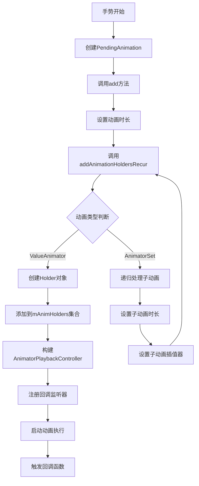
```mermaid
graph TD
    A[手势开始] --> B[创建PendingAnimation]
    B --> C[调用add方法]
    C --> D[设置动画时长]
    D --> E[调用addAnimationHoldersRecur]
    E --> F{动画类型判断}
    F -->|ValueAnimator| G[创建Holder对象]
    F -->|AnimatorSet| H[递归处理子动画]
    H --> I[设置子动画时长]
    I --> J[设置子动画插值器]
    J --> E
    G --> K[添加到mAnimHolders集合]
    K --> L[构建AnimatorPlaybackController]
    L --> M[注册回调监听器]
    M --> N[启动动画执行]
    N --> O[触发回调函数]
```

#### 5.6.8 动画注入时序图

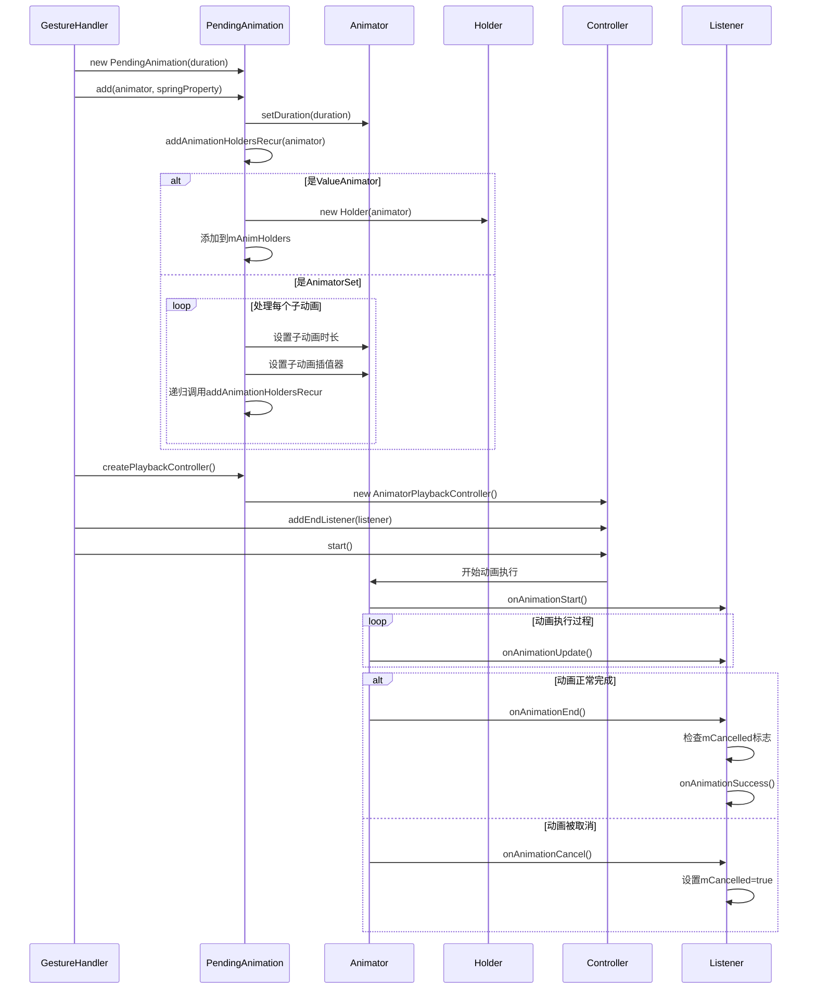
```mermaid
sequenceDiagram
    participant G as GestureHandler
    participant P as PendingAnimation
    participant A as Animator
    participant H as Holder
    participant C as Controller
    participant L as Listener
    
    G->>P: new PendingAnimation(duration)
    G->>P: add(animator, springProperty)
    P->>A: setDuration(duration)
    P->>P: addAnimationHoldersRecur(animator)
    
    alt 是ValueAnimator
        P->>H: new Holder(animator)
        P->>P: 添加到mAnimHolders
    else 是AnimatorSet
        loop 处理每个子动画
            P->>A: 设置子动画时长
            P->>A: 设置子动画插值器
            P->>P: 递归调用addAnimationHoldersRecur
        end
    end
    
    G->>P: createPlaybackController()
    P->>C: new AnimatorPlaybackController()
    G->>C: addEndListener(listener)
    G->>C: start()
    
    C->>A: 开始动画执行
    A->>L: onAnimationStart()
    loop 动画执行过程
        A->>L: onAnimationUpdate()
    end
    
    alt 动画正常完成
        A->>L: onAnimationEnd()
        L->>L: 检查mCancelled标志
        L->>L: onAnimationSuccess()
    else 动画被取消
        A->>L: onAnimationCancel()
        L->>L: 设置mCancelled=true
    end
```

## 6. 手势类型分析

### 6.1 上滑手势

- **触发条件**：从导航栏向上滑动
- **目标状态**：
  - 快速上滑：进入概览模式
  - 慢速上滑到底：返回主页
  - 上滑后左右滑动：快速切换应用

### 6.2 下滑手势

- **触发条件**：从屏幕顶部向下滑动
- **目标状态**：
  - 概览模式下滑：返回上一个应用
  - 所有应用模式下滑：返回主页

### 6.3 侧滑手势

- **触发条件**：从屏幕左侧或右侧边缘向中间滑动
- **目标状态**：
  - 侧滑返回：执行返回操作
  - 侧滑切换：在应用间切换

## 7. 性能优化

### 7.1 关键优化点

1. **手势识别优化**：使用阈值检测和触摸斜率判断，减少误触发
2. **动画性能**：使用`AnimatorPlaybackController`控制动画播放，支持自定义插值器
3. **状态管理**：使用位标志管理多个状态，减少状态检查开销
4. **触摸事件处理**：使用`SingleAxisSwipeDetector`专注于单轴滑动检测

### 7.2 代码优化建议

1. **减少对象创建**：在触摸事件处理中减少临时对象的创建
2. **优化动画插值**：根据不同手势类型选择合适的插值器
3. **状态预计算**：预先计算可能的目标状态，减少运行时计算
4. **触摸区域优化**：精确计算触摸区域，减少不必要的事件处理

## 8. 设计思想和理念

### 8.1 统一性与一致性设计理念

#### 8.1.1 统一的动画管理架构
```java
// 统一的继承结构
PropertySetter → AnimatedPropertySetter → PendingAnimation
```

**设计思想**：通过统一的基类和接口，确保所有动画遵循相同的设计模式，提供一致的API和行为。

#### 8.1.2 一致的时长管理

**源码位置**：[PendingAnimation.java:68-71](src/com/android/launcher3/anim/PendingAnimation.java#L68-L71)

```java
public void add(Animator a, SpringProperty springProperty) {
    mAnim.play(a.setDuration(mDuration));  // 统一时长设置
}
```

**设计理念**：所有动画使用统一的时长设置，确保动画同步和协调，避免不同动画之间的时间不一致问题。

### 8.2 递归与组合设计模式

#### 8.2.1 递归处理机制

**源码位置**：[AnimatorPlaybackController.java:397-415](src/com/android/launcher3/anim/AnimatorPlaybackController.java#L397-L415)

```java
static void addAnimationHoldersRecur(Animator anim, long globalDuration,
        SpringProperty springProperty, ArrayList<Holder> out) {
    // 递归处理动画树
}
```

**设计思想**：采用递归算法处理复杂的动画组合，支持任意深度的动画嵌套，体现了"分而治之"的设计原则。

#### 8.2.2 组合模式应用

```java
if (anim instanceof AnimatorSet) {
    for (Animator child : ((AnimatorSet) anim).getChildAnimations()) {
        addAnimationHoldersRecur(child, globalDuration, springProperty, out);
    }
}
```

**设计理念**：将复杂动画分解为简单动画的组合，通过组合模式实现动画的灵活构建和复用。

### 8.3 容器化与生命周期管理

#### 8.3.1 Holder容器设计

**源码位置**：[AnimatorPlaybackController.java:365-395](src/com/android/launcher3/anim/AnimatorPlaybackController.java#L365-L395)

```java
static class Holder {
    public final ValueAnimator anim;
    public final SpringProperty springProperty;
    // 统一管理动画属性和状态
}
```

**设计思想**：通过容器模式统一管理动画实例，实现动画资源的集中管理和生命周期控制。

#### 8.3.2 精确的状态管理

```java
public void setProgress(float progress) {
    anim.setCurrentFraction(mapper.getProgress(progress, globalEndProgress));
}
```

**设计理念**：提供精确的进度控制机制，确保动画状态的可预测性和可控性。

### 8.4 回调与事件驱动架构

#### 8.4.1 分层回调机制

```java
public abstract class AnimationSuccessListener extends AnimatorListenerAdapter {
    protected boolean mCancelled = false;  // 状态标志管理
}
```

**设计思想**：采用分层的事件驱动架构，支持不同粒度的回调处理，从帧级更新到动画完成事件。

#### 8.4.2 状态安全保证

```java
@Override
public void onAnimationEnd(Animator animation) {
    if (!mCancelled) {
        onAnimationSuccess(animation);  // 状态安全检查
    }
}
```

**设计理念**：通过状态标志确保回调的安全性，防止因动画取消导致的意外行为。

### 8.5 性能与效率优化理念

#### 8.5.1 对象复用机制

**源码位置**：[PendingAnimation.java:35](src/com/android/launcher3/anim/PendingAnimation.java#L35)

```java
private final ArrayList<Holder> mAnimHolders = new ArrayList<>();  // 复用容器
```

**设计思想**：通过对象池和复用机制减少内存分配，提高动画执行的效率。

#### 8.5.2 延迟计算策略

```java
private ValueAnimator getProgressAnimator() {
    if (mProgressAnimator == null) {
        mProgressAnimator = ValueAnimator.ofFloat(0, 1);  // 延迟创建
    }
    return mProgressAnimator;
}
```

**设计理念**：采用延迟计算策略，只在需要时创建资源，优化内存使用和启动性能。

### 8.6 可扩展性与灵活性设计

#### 8.6.1 插件化架构

**源码位置**：[PendingAnimation.java:83-88](src/com/android/launcher3/anim/PendingAnimation.java#L83-L88)

```java
public <T> void addFloat(T target, FloatProperty<T> property, float from, float to,
        TimeInterpolator interpolator) {
    // 支持任意类型的属性动画
}
```

**设计思想**：通过泛型和接口设计，支持任意类型的动画属性，实现高度的可扩展性。

#### 8.6.2 弹簧动画支持

```java
public void add(Animator a, SpringProperty springProperty) {
    // 支持弹簧动画属性
}
```

**设计理念**：内置对物理动画（弹簧效果）的支持，提供更自然的交互体验。

### 8.7 错误处理与健壮性设计

#### 8.7.1 异常处理机制

**源码位置**：[AnimatorPlaybackController.java:413](src/com/android/launcher3/anim/AnimatorPlaybackController.java#L413)

```java
} else {
    throw new RuntimeException("Unknown animation type " + anim);
}
```

**设计思想**：明确的异常处理机制，确保在遇到未知动画类型时能够及时发现问题。

#### 8.7.2 空动画保护

**源码位置**：[PendingAnimation.java:108-114](src/com/android/launcher3/anim/PendingAnimation.java#L108-L114)

```java
if (mAnimHolders.isEmpty()) {
    add(ValueAnimator.ofFloat(0, 1).setDuration(mDuration));  // 占位动画
}
```

**设计理念**：通过占位动画机制确保即使没有实际动画也能保持正确的时长和行为。

### 8.8 用户体验导向的设计哲学

#### 8.8.1 流畅性优先
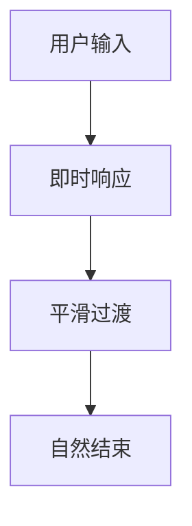
```mermaid
graph TD
    A[用户输入] --> B[即时响应]
    B --> C[平滑过渡]
    C --> D[自然结束]
```

**设计思想**：所有动画设计都以用户体验为中心，确保操作的即时响应和视觉的流畅过渡。

#### 8.8.2 物理真实性

```java
public SpringProperty setDampingRatio(float dampingRatio) {
    mDampingRatio = dampingRatio;  // 物理阻尼系数
    return this;
}
```

**设计理念**：模拟真实物理效果，通过弹簧动画提供符合用户心理预期的交互反馈。

### 8.9 总结：核心设计哲学

#### 8.9.1 统一管理原则
通过统一的架构和接口，确保所有动画遵循相同的设计模式和行为规范。

#### 8.9.2 递归组合思想
采用递归算法和组合模式处理复杂动画，实现动画的灵活构建和复用。

#### 8.9.3 生命周期控制
通过容器化设计和精确的状态管理，实现动画资源的有效管理和控制。

#### 8.9.4 事件驱动架构
基于回调机制的事件驱动设计，支持灵活的动画生命周期管理。

#### 8.9.5 性能优化导向
从对象复用、延迟计算到线程安全，全面考虑性能优化。

#### 8.9.6 用户体验中心
所有设计决策都以提供流畅、自然的用户体验为最终目标。

这种设计思想和理念不仅体现在代码实现层面，更反映了Android系统对高质量动画交互的深刻理解和持续追求。

## 9. 类继承关系图

### 9.1 触摸控制器继承关系

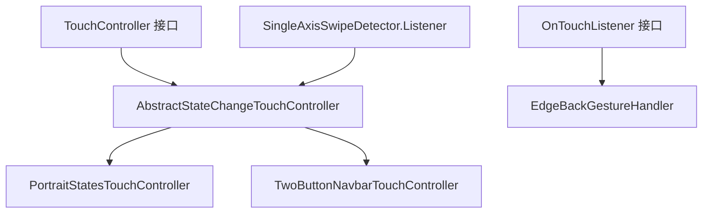
```mermaid
graph TD
    A[TouchController 接口] --> B[AbstractStateChangeTouchController]
    B --> C[PortraitStatesTouchController]
    B --> D[TwoButtonNavbarTouchController]
    
    E[SingleAxisSwipeDetector.Listener] --> B
    
    F[OnTouchListener 接口] --> G[EdgeBackGestureHandler]
```

### 9.2 动画类继承关系

```mermaid
graph TD
    A[PropertySetter 抽象基类] --> B[AnimatedPropertySetter]
    B --> C[PendingAnimation]
    
    D[AnimatorPlaybackController] --> E[ValueAnimator.AnimatorUpdateListener]
    
    F[AnimatorPlaybackController.Holder] --> G[持有 ValueAnimator]
    F --> H[持有 SpringProperty]
    F --> I[持有 ProgressMapper]
```

## 10. 总结

Launcher手势动画系统是一个复杂而精巧的设计，通过多层次的控制器和动画系统，实现了流畅的手势交互体验。核心组件包括：

1. **触摸事件分发**：从`MotionEvent`到具体控制器的分发流程
2. **手势识别**：通过`SingleAxisSwipeDetector`识别不同类型的手势
3. **状态管理**：通过`LauncherState`和状态标志管理不同的界面状态
4. **动画控制**：通过`AnimatorPlaybackController`控制动画的播放和进度
5. **系统交互**：与SystemUI和WindowManager的交互，实现窗口变换和状态切换

这种设计不仅提供了流畅的用户体验，也为不同设备和导航模式提供了灵活的适配能力。

## 11. 参考资料

- [Android Developer Documentation](https://developer.android.com/)
- [Launcher3 Source Code](https://android.googlesource.com/platform/packages/apps/Launcher3/)
- [SystemUI Gesture Handling](https://android.googlesource.com/platform/frameworks/base/packages/SystemUI/)
