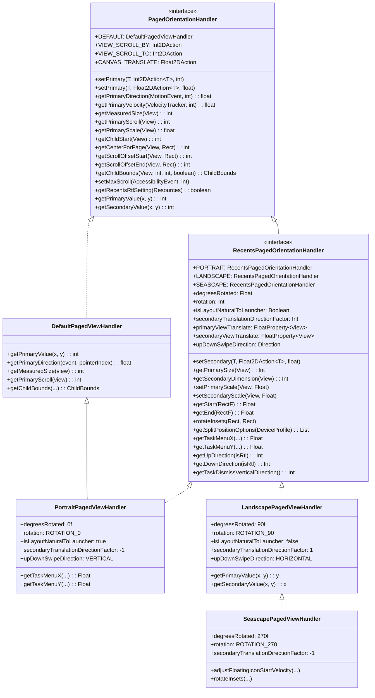
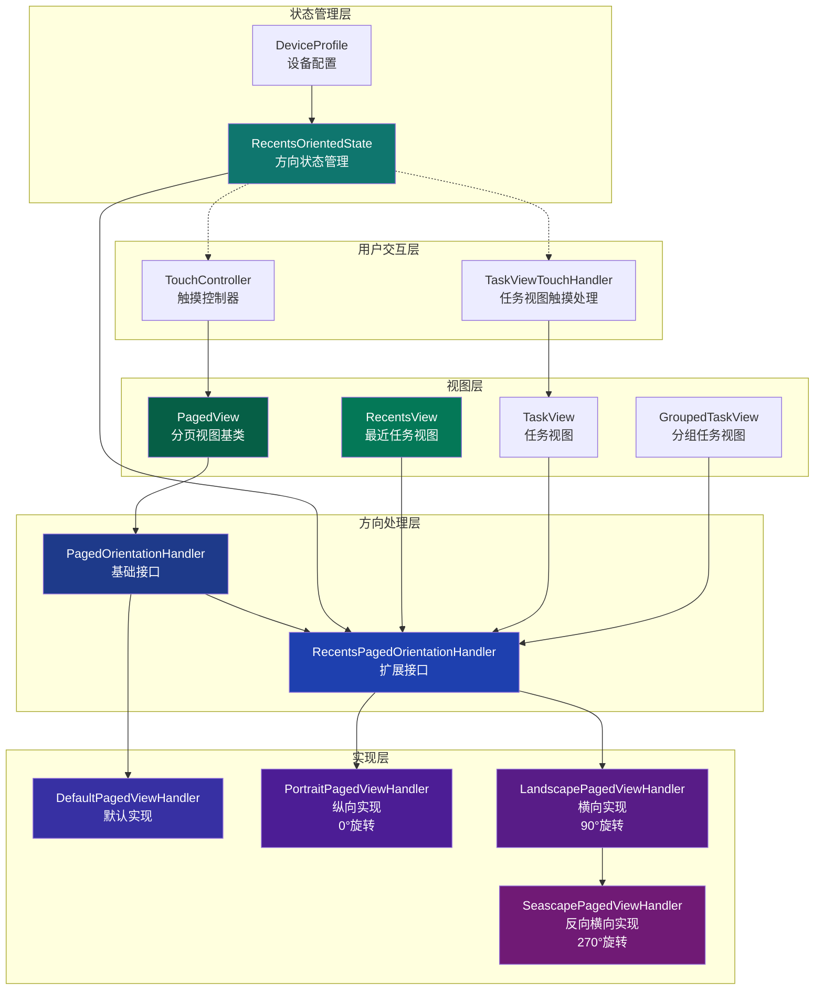
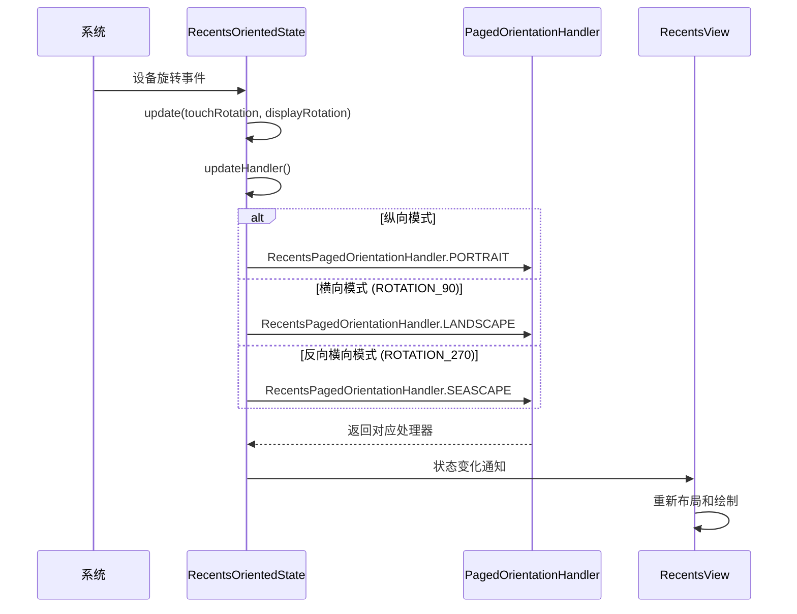
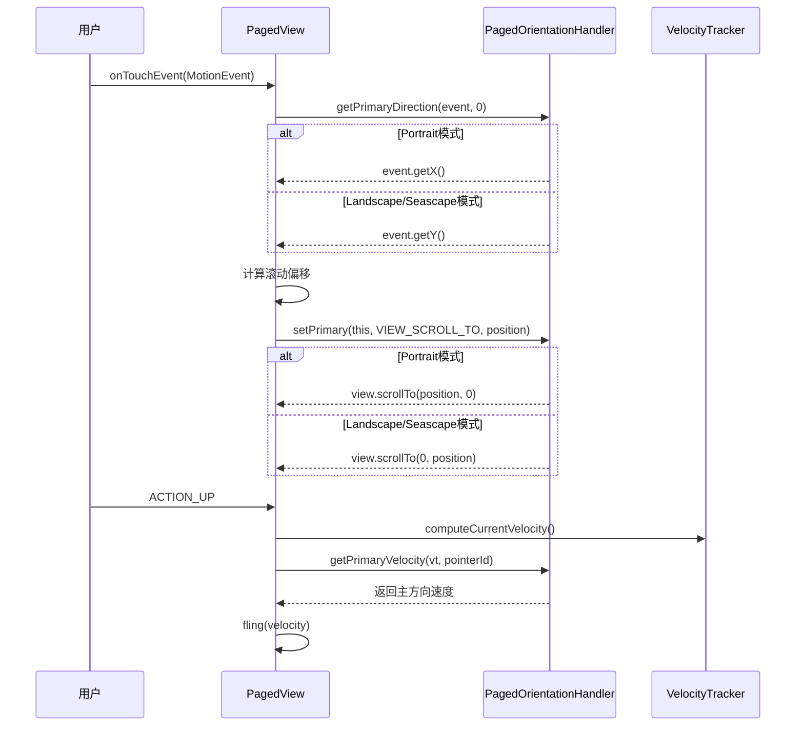
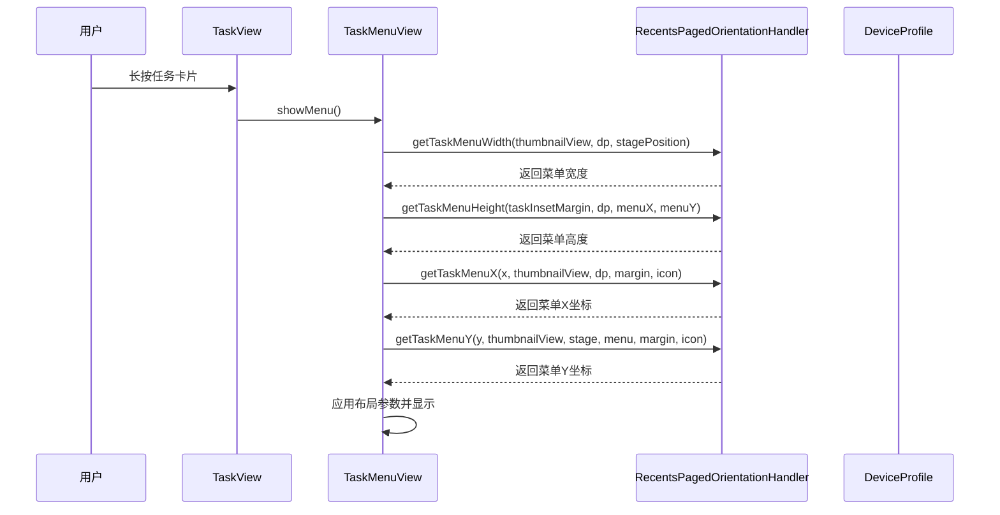

# PagedOrientationHandler接口分析报告

## 概述

PagedOrientationHandler是Android Launcher3中一个高度抽象的方向处理接口，主要用于分离横向和纵向布局的具体实现，为分页视图和最近任务视图提供统一的方向处理逻辑。

**源码位置**: 
- 接口定义: [PagedOrientationHandler.java](src/com/android/launcher3/touch/PagedOrientationHandler.java)
- 默认实现: [DefaultPagedViewHandler.java](src/com/android/launcher3/touch/DefaultPagedViewHandler.java)
- 纵向实现: [PortraitPagedViewHandler.kt](quickstep/src/com/android/quickstep/orientation/PortraitPagedViewHandler.kt)
- 横向实现: [LandscapePagedViewHandler.kt](quickstep/src/com/android/quickstep/orientation/LandscapePagedViewHandler.kt)
- 反向横向实现: [SeascapePagedViewHandler.kt](quickstep/src/com/android/quickstep/orientation/SeascapePagedViewHandler.kt)
- 扩展接口: [RecentsPagedOrientationHandler.kt](quickstep/src/com/android/quickstep/orientation/RecentsPagedOrientationHandler.kt)
- 状态管理: [RecentsOrientedState.java](quickstep/src/com/android/quickstep/util/RecentsOrientedState.java)

## 接口设计理念

### 核心目标
1. **统一处理方向逻辑**：将X/Y轴操作抽象为"主方向"和"次方向"
2. **简化方向切换**：通过接口实现轻松切换横向/纵向布局
3. **减少代码重复**：避免在多个地方重复编写方向判断逻辑

### 设计优势
- **解耦设计**：方向逻辑与视图逻辑分离
- **扩展性强**：新增方向模式只需实现接口
- **性能优化**：避免运行时频繁方向判断
- **一致性保证**：统一接口确保行为一致性

## 接口层次结构

### 基础接口：PagedOrientationHandler

```java
public interface PagedOrientationHandler {
    PagedOrientationHandler DEFAULT = new DefaultPagedViewHandler();
    
    // 功能型接口
    interface Int2DAction<T> { void call(T target, int x, int y); }
    interface Float2DAction<T> { void call(T target, float x, float y); }
    
    // 预定义动作
    Int2DAction<View> VIEW_SCROLL_BY = View::scrollBy;
    Int2DAction<View> VIEW_SCROLL_TO = View::scrollTo;
    Float2DAction<Canvas> CANVAS_TRANSLATE = Canvas::translate;
    Float2DAction<Matrix> MATRIX_POST_TRANSLATE = Matrix::postTranslate;
    
    // 核心方法
    <T> void setPrimary(T target, Int2DAction<T> action, int param);
    <T> void setPrimary(T target, Float2DAction<T> action, float param);
    float getPrimaryDirection(MotionEvent event, int pointerIndex);
    float getPrimaryVelocity(VelocityTracker velocityTracker, int pointerId);
    int getMeasuredSize(View view);
    int getPrimaryScroll(View view);
    float getPrimaryScale(View view);
    int getChildStart(View view);
    int getCenterForPage(View view, Rect insets);
    int getScrollOffsetStart(View view, Rect insets);
    int getScrollOffsetEnd(View view, Rect insets);
    ChildBounds getChildBounds(View child, int childStart, int pageCenter, boolean layoutChild);
    void setMaxScroll(AccessibilityEvent event, int maxScroll);
    boolean getRecentsRtlSetting(Resources resources);
    
    // 方向值获取
    int getPrimaryValue(int x, int y);
    int getSecondaryValue(int x, int y);
    float getPrimaryValue(float x, float y);
    float getSecondaryValue(float x, float y);
}
```

### 扩展接口：RecentsPagedOrientationHandler

```kotlin
interface RecentsPagedOrientationHandler : PagedOrientationHandler {
    // 扩展方法
    fun <T> setSecondary(target: T, action: Float2DAction<T>, param: Float)
    operator fun <T> set(target: T, action: Int2DAction<T>, primaryParam: Int, secondaryParam: Int)
    
    // 尺寸获取
    fun getPrimarySize(view: View): Int
    fun getPrimarySize(rect: RectF): Float
    fun getSecondarySize(rect: RectF): Float
    fun getSecondaryDimension(view: View): Int
    
    // 旋转相关属性
    val degreesRotated: Float
    val rotation: Int
    val isLayoutNaturalToLauncher: Boolean
    val secondaryTranslationDirectionFactor: Int
    
    // 视图属性
    val primaryViewTranslate: FloatProperty<View>
    val secondaryViewTranslate: FloatProperty<View>
    
    // 缩放设置
    fun setPrimaryScale(view: View, scale: Float)
    fun setSecondaryScale(view: View, scale: Float)
    
    // 矩形操作
    fun getStart(rect: RectF): Float
    fun getEnd(rect: RectF): Float
    fun rotateInsets(insets: Rect, outInsets: Rect)
    
    // 分屏相关
    fun getSplitPositionOptions(dp: DeviceProfile): List<SplitPositionOption>
    fun getInitialSplitPlaceholderBounds(placeholderHeight: Int, placeholderInset: Int, dp: DeviceProfile, stagePosition: Int, out: Rect)
    fun getFinalSplitPlaceholderBounds(splitDividerSize: Int, dp: DeviceProfile, stagePosition: Int, out1: Rect, out2: Rect)
    fun setSplitTaskSwipeRect(dp: DeviceProfile, outRect: Rect, splitInfo: SplitBounds, desiredStagePosition: Int)
    
    // 任务菜单相关
    fun getTaskMenuX(x: Float, thumbnailView: View, deviceProfile: DeviceProfile, taskInsetMargin: Float, taskViewIcon: View): Float
    fun getTaskMenuY(y: Float, thumbnailView: View, stagePosition: Int, taskMenuView: View, taskInsetMargin: Float, taskViewIcon: View): Float
    fun getTaskMenuWidth(thumbnailView: View, deviceProfile: DeviceProfile, stagePosition: Int): Int
    fun getTaskMenuHeight(taskInsetMargin: Float, deviceProfile: DeviceProfile, taskMenuX: Float, taskMenuY: Float): Int
    
    // 滑动方向
    val upDownSwipeDirection: SingleAxisSwipeDetector.Direction
    fun getUpDirection(isRtl: Boolean): Int
    fun getDownDirection(isRtl: Boolean): Int
    fun isGoingUp(displacement: Float, isRtl: Boolean): Boolean
    fun getTaskDragDisplacementFactor(isRtl: Boolean): Int
    fun getTaskDismissVerticalDirection(): Int
    
    // 伴生对象提供静态实例
    companion object {
        @JvmField val PORTRAIT: RecentsPagedOrientationHandler = PortraitPagedViewHandler()
        @JvmField val LANDSCAPE: RecentsPagedOrientationHandler = LandscapePagedViewHandler()
        @JvmField val SEASCAPE: RecentsPagedOrientationHandler = SeascapePagedViewHandler()
    }
}
```

## 实现类分析

### 1. DefaultPagedViewHandler（默认实现）

**特点**：
- 提供基础的横向布局实现
- 将X轴作为主方向
- 作为其他实现的基类

**关键方法实现**：
```java
@Override
public int getPrimaryValue(int x, int y) {
    return x;  // X轴为主方向
}

@Override
public int getSecondaryValue(int x, int y) {
    return y;  // Y轴为次方向
}

@Override
public float getPrimaryDirection(MotionEvent event, int pointerIndex) {
    return event.getX(pointerIndex);
}

@Override
public float getPrimaryVelocity(VelocityTracker velocityTracker, int pointerId) {
    return velocityTracker.getXVelocity(pointerId);
}

@Override
public int getMeasuredSize(View view) {
    return view.getMeasuredWidth();
}

@Override
public int getPrimaryScroll(View view) {
    return view.getScrollX();
}

@Override
public ChildBounds getChildBounds(View child, int childStart, int pageCenter, boolean layoutChild) {
    final int childWidth = child.getMeasuredWidth();
    final int childRight = childStart + childWidth;
    final int childHeight = child.getMeasuredHeight();
    final int childTop = pageCenter - childHeight / 2;
    if (layoutChild) {
        child.layout(childStart, childTop, childRight, childTop + childHeight);
    }
    return new ChildBounds(childWidth, childHeight, childRight, childTop);
}
```

### 2. PortraitPagedViewHandler（纵向布局）

**特点**：
- 继承DefaultPagedViewHandler
- 实现RecentsPagedOrientationHandler
- `degreesRotated = 0f`（无旋转）
- `rotation = Surface.ROTATION_0`
- `isLayoutNaturalToLauncher = true`
- `upDownSwipeDirection = VERTICAL`

**关键方法实现**：
```kotlin
class PortraitPagedViewHandler : DefaultPagedViewHandler(), RecentsPagedOrientationHandler {
    override fun <T> getPrimaryValue(x: T, y: T): T = x
    override fun <T> getSecondaryValue(x: T, y: T): T = y
    
    override val isLayoutNaturalToLauncher: Boolean = true
    override val degreesRotated: Float = 0f
    override val rotation: Int = Surface.ROTATION_0
    override val secondaryTranslationDirectionFactor: Int = -1
    
    override val primaryViewTranslate: FloatProperty<View> = LauncherAnimUtils.VIEW_TRANSLATE_X
    override val secondaryViewTranslate: FloatProperty<View> = LauncherAnimUtils.VIEW_TRANSLATE_Y
    
    override val upDownSwipeDirection: SingleAxisSwipeDetector.Direction = 
        SingleAxisSwipeDetector.VERTICAL
    
    override fun getUpDirection(isRtl: Boolean): Int = SingleAxisSwipeDetector.DIRECTION_POSITIVE
    override fun getDownDirection(isRtl: Boolean): Int = SingleAxisSwipeDetector.DIRECTION_NEGATIVE
    override fun getTaskDismissVerticalDirection(): Int = -1
}
```

**适用场景**：纵向设备、自然布局

### 3. LandscapePagedViewHandler（横向布局）

**特点**：
- 直接实现RecentsPagedOrientationHandler
- 将Y轴作为主方向，X轴作为次方向
- `degreesRotated = 90f`（旋转90度）
- `rotation = Surface.ROTATION_90`
- `isLayoutNaturalToLauncher = false`
- `upDownSwipeDirection = HORIZONTAL`

**关键方法实现**：
```kotlin
open class LandscapePagedViewHandler : RecentsPagedOrientationHandler {
    override fun <T> getPrimaryValue(x: T, y: T): T = y  // Y轴为主方向
    override fun <T> getSecondaryValue(x: T, y: T): T = x  // X轴为次方向
    
    override fun getPrimaryValue(x: Int, y: Int): Int = y
    override fun getSecondaryValue(x: Int, y: Int): Int = x
    override fun getPrimaryValue(x: Float, y: Float): Float = y
    override fun getSecondaryValue(x: Float, y: Float): Float = x
    
    override val isLayoutNaturalToLauncher: Boolean = false
    override val degreesRotated: Float = 90f
    override val rotation: Int = Surface.ROTATION_90
    override val secondaryTranslationDirectionFactor: Int = 1
    
    override val primaryViewTranslate: FloatProperty<View> = LauncherAnimUtils.VIEW_TRANSLATE_Y
    override val secondaryViewTranslate: FloatProperty<View> = LauncherAnimUtils.VIEW_TRANSLATE_X
    
    override fun getPrimaryDirection(event: MotionEvent, pointerIndex: Int): Float = 
        event.getY(pointerIndex)
    
    override fun getPrimaryVelocity(velocityTracker: VelocityTracker, pointerId: Int): Float = 
        velocityTracker.getYVelocity(pointerId)
    
    override fun getMeasuredSize(view: View): Int = view.measuredHeight
    override fun getPrimaryScroll(view: View): Int = view.scrollY
    override fun getPrimaryScale(view: View): Float = view.scaleY
    
    override val upDownSwipeDirection: SingleAxisSwipeDetector.Direction = 
        SingleAxisSwipeDetector.HORIZONTAL
    
    override fun getUpDirection(isRtl: Boolean): Int = 
        if (isRtl) SingleAxisSwipeDetector.DIRECTION_NEGATIVE 
        else SingleAxisSwipeDetector.DIRECTION_POSITIVE
    
    override fun getTaskDismissVerticalDirection(): Int = 1
}
```

**适用场景**：横向设备（旋转90度）

### 4. SeascapePagedViewHandler（反向横向布局）

**特点**：
- 继承LandscapePagedViewHandler
- 将Y轴作为主方向，X轴作为次方向
- `degreesRotated = 270f`（旋转270度，即逆时针90度）
- `rotation = Surface.ROTATION_270`
- `isLayoutNaturalToLauncher = false`
- RTL设置与Landscape相反

**关键方法实现**：
```kotlin
class SeascapePagedViewHandler : LandscapePagedViewHandler() {
    override val degreesRotated: Float = 270f
    override val rotation: Int = Surface.ROTATION_270
    override val secondaryTranslationDirectionFactor: Int = -1
    
    override fun getRecentsRtlSetting(resources: Resources): Boolean = Utilities.isRtl(resources)
    
    override fun adjustFloatingIconStartVelocity(velocity: PointF) = 
        velocity.set(velocity.y, -velocity.x)
    
    override fun rotateInsets(insets: Rect, outInsets: Rect) {
        outInsets.set(insets.top, insets.right, insets.bottom, insets.left)
    }
    
    override fun getDistanceToBottomOfRect(dp: DeviceProfile, rect: Rect): Int = 
        dp.deviceProperties.widthPx - rect.right
}
```

**适用场景**：反向横向设备（旋转270度），主要用于某些设备的特殊方向

## 实现类对比表

| 实现类 | 主方向 | 旋转角度 | Surface旋转 | 布局自然性 | 滑动方向 | 适用场景 |
|--------|--------|----------|-------------|------------|----------|----------|
| **DefaultPagedViewHandler** | X轴 | 0° | ROTATION_0 | 自然 | - | 基础横向布局 |
| **PortraitPagedViewHandler** | X轴 | 0° | ROTATION_0 | 自然 | VERTICAL | 纵向设备 |
| **LandscapePagedViewHandler** | Y轴 | 90° | ROTATION_90 | 非自然 | HORIZONTAL | 横向设备 |
| **SeascapePagedViewHandler** | Y轴 | 270° | ROTATION_270 | 非自然 | HORIZONTAL | 反向横向设备 |

## 架构设计

### 类图



### 系统架构图



## 使用方法与调用关系

### 1. 初始化与配置

在[RecentsOrientedState.java](quickstep/src/com/android/quickstep/util/RecentsOrientedState.java)中动态选择实现：

```java
private RecentsPagedOrientationHandler mOrientationHandler = 
    RecentsPagedOrientationHandler.PORTRAIT; // 默认纵向

private boolean updateHandler() {
    mRecentsActivityRotation = inferRecentsActivityRotation(mDisplayRotation);
    if (mRecentsActivityRotation == mTouchRotation || shouldUseRealOrientation()) {
        mOrientationHandler = RecentsPagedOrientationHandler.PORTRAIT;
    } else if (mTouchRotation == ROTATION_90) {
        mOrientationHandler = RecentsPagedOrientationHandler.LANDSCAPE;
    } else if (mTouchRotation == ROTATION_270) {
        mOrientationHandler = RecentsPagedOrientationHandler.SEASCAPE;
    } else {
        mOrientationHandler = RecentsPagedOrientationHandler.PORTRAIT;
    }
    return mStateId != oldStateId;
}
```

### 2. 在PagedView中的使用

**关键调用示例**（来自[PagedView.java](src/com/android/launcher3/PagedView.java)）：

```java
private PagedOrientationHandler mOrientationHandler = PagedOrientationHandler.DEFAULT;

// 触摸事件处理
private float mDownMotionPrimary;

private void handleTouchEvent(MotionEvent ev) {
    // 获取主方向坐标
    mDownMotionPrimary = mOrientationHandler.getPrimaryDirection(ev, 0);
    
    // 滚动操作
    mOrientationHandler.setPrimary(this, VIEW_SCROLL_TO, newPosition);
    
    // 获取滚动位置
    int oldPos = mOrientationHandler.getPrimaryScroll(this);
}

// 子视图布局
protected void layoutChild(View child, int childStart, int pageCenter) {
    ChildBounds bounds = mOrientationHandler.getChildBounds(
        child, childStart, pageCenter, true);
}

// 计算最大滚动范围
protected int getMaxScroll() {
    return mOrientationHandler.getMeasuredSize(this) - getViewportWidth();
}
```

### 3. 在RecentsView中的使用

**扩展使用场景**（来自[RecentsView.java](quickstep/src/com/android/quickstep/views/RecentsView.java)）：

```java
// 获取方向处理器
public RecentsPagedOrientationHandler getPagedOrientationHandler() {
    return mOrientationState.getOrientationHandler();
}

// 画布变换
@Override
protected void dispatchDraw(Canvas canvas) {
    getRecentsView().getPagedOrientationHandler()
        .setPrimary(canvas, CANVAS_TRANSLATE, scroll);
}

// 任务视图可见性判断
private boolean isTaskVisible(TaskView taskView) {
    int screenStart = getPagedOrientationHandler().getPrimaryScroll(this);
    int screenEnd = screenStart + getPagedOrientationHandler().getMeasuredSize(this);
    int taskStart = getPagedOrientationHandler().getChildStart(taskView);
    return taskStart < screenEnd && taskStart + taskView.getWidth() > screenStart;
}

// 任务菜单位置计算
private void updateTaskMenuPosition(TaskMenuView taskMenu, TaskView taskView) {
    float menuX = getPagedOrientationHandler().getTaskMenuX(
        x, thumbnailView, deviceProfile, taskInsetMargin, taskViewIcon);
    float menuY = getPagedOrientationHandler().getTaskMenuY(
        y, thumbnailView, stagePosition, taskMenu, taskInsetMargin, taskViewIcon);
}
```

## 时序图分析

### 方向变化处理流程



### 用户滑动操作流程



### 任务菜单显示流程



## 关键技术特性

### 1. 方向抽象机制

```java
// 将X/Y坐标抽象为主/次方向
int primary = handler.getPrimaryValue(x, y);
int secondary = handler.getSecondaryValue(x, y);

// Portrait模式：primary=x, secondary=y  
// Landscape/Seascape模式：primary=y, secondary=x
```

### 2. 统一操作接口

```java
// 滚动操作统一处理
handler.setPrimary(view, VIEW_SCROLL_TO, position);

// 尺寸获取统一处理  
int size = handler.getMeasuredSize(view);

// 边界计算统一处理
ChildBounds bounds = handler.getChildBounds(child, start, center, layout);
```

### 3. 动态适配机制

通过`RecentsOrientedState`实现：
- 实时监测设备方向变化
- 动态切换方向处理器（Portrait/Landscape/Seascape）
- 保持UI状态一致性
- 支持多窗口模式下的方向处理

### 4. RTL支持

```java
// Portrait模式：RTL设置取反
@Override
public boolean getRecentsRtlSetting(Resources resources) {
    return !Utilities.isRtl(resources);
}

// Seascape模式：RTL设置直接使用
@Override
public boolean getRecentsRtlSetting(Resources resources) {
    return Utilities.isRtl(resources);
}
```

## 实际应用场景

### 1. 分页滚动
在[PagedView.java](src/com/android/launcher3/PagedView.java)中：
- 触摸事件的方向处理
- 滚动位置的计算和设置
- 子视图的布局计算
- 滚动边界检测

### 2. 最近任务管理
在[RecentsView.java](quickstep/src/com/android/quickstep/views/RecentsView.java)中：
- 任务视图的可见性判断
- 任务菜单的位置计算
- 动画变换的方向处理
- 清除所有按钮的布局

### 3. 多任务分屏
在分屏场景中：
- 不同方向的分屏布局计算
- 任务边界的位置调整
- 分屏占位符的边界计算
- 分屏图标的位置设置

### 4. 任务视图触摸处理
在TaskViewTouchHandler中：
- 上滑/下滑方向判断
- 任务消除方向计算
- 拖动位移因子获取

### 5. 分组任务视图
在[GroupedTaskView.kt](quickstep/src/com/android/quickstep/views/GroupedTaskView.kt)中：
- 分组任务缩略图尺寸计算
- 分屏图标位置设置
- Digital Wellbeing横幅布局

## 核心方法详解

### 方向抽象方法

| 方法名 | 参数 | 返回值 | 说明 |
|--------|------|--------|------|
| `getPrimaryValue(x, y)` | int/int 或 float/float | 主方向值 | 获取主方向坐标值 |
| `getSecondaryValue(x, y)` | int/int 或 float/float | 次方向值 | 获取次方向坐标值 |
| `setPrimary(target, action, param)` | 目标对象, 动作接口, 参数 | void | 设置主方向参数 |
| `setSecondary(target, action, param)` | 目标对象, 动作接口, 参数 | void | 设置次方向参数 |

### 滚动相关方法

| 方法名 | 参数 | 返回值 | 说明 |
|--------|------|--------|------|
| `getPrimaryScroll(view)` | View | int | 获取主方向滚动位置 |
| `getMeasuredSize(view)` | View | int | 获取主方向尺寸 |
| `getPrimaryScale(view)` | View | float | 获取主方向缩放值 |
| `setMaxScroll(event, maxScroll)` | AccessibilityEvent, int | void | 设置最大滚动范围 |

### 布局相关方法

| 方法名 | 参数 | 返回值 | 说明 |
|--------|------|--------|------|
| `getChildBounds(child, start, center, layout)` | View, int, int, boolean | ChildBounds | 计算子视图边界 |
| `getChildStart(view)` | View | int | 获取子视图起始位置 |
| `getCenterForPage(view, insets)` | View, Rect | int | 获取页面中心位置 |
| `getScrollOffsetStart(view, insets)` | View, Rect | int | 获取滚动起始偏移 |
| `getScrollOffsetEnd(view, insets)` | View, Rect | int | 获取滚动结束偏移 |

### 任务菜单方法

| 方法名 | 参数 | 返回值 | 说明 |
|--------|------|--------|------|
| `getTaskMenuX(...)` | x, thumbnailView, dp, margin, icon | Float | 计算任务菜单X坐标 |
| `getTaskMenuY(...)` | y, thumbnailView, stage, menu, margin, icon | Float | 计算任务菜单Y坐标 |
| `getTaskMenuWidth(...)` | thumbnailView, dp, stagePosition | Int | 计算任务菜单宽度 |
| `getTaskMenuHeight(...)` | margin, dp, menuX, menuY | Int | 计算任务菜单高度 |

### 滑动方向方法

| 方法名 | 参数 | 返回值 | 说明 |
|--------|------|--------|------|
| `getUpDirection(isRtl)` | Boolean | Int | 获取"向上"滑动方向 |
| `getDownDirection(isRtl)` | Boolean | Int | 获取"向下"滑动方向 |
| `isGoingUp(displacement, isRtl)` | Float, Boolean | Boolean | 判断是否向上滑动 |
| `getTaskDragDisplacementFactor(isRtl)` | Boolean | Int | 获取任务拖动位移因子 |
| `getTaskDismissVerticalDirection()` | - | Int | 获取任务消除方向 |

## ChildBounds数据类

```java
public class ChildBounds {
    public final int primaryDimension;    // 主方向尺寸
    public final int secondaryDimension;  // 次方向尺寸
    public final int childPrimaryEnd;     // 子视图主方向结束位置
    public final int childSecondaryEnd;   // 子视图次方向结束位置
    
    public ChildBounds(int primaryDimension, int secondaryDimension, 
                       int childPrimaryEnd, int childSecondaryEnd) {
        this.primaryDimension = primaryDimension;
        this.secondaryDimension = secondaryDimension;
        this.childPrimaryEnd = childPrimaryEnd;
        this.childSecondaryEnd = childSecondaryEnd;
    }
}
```

## 总结

PagedOrientationHandler是Android Launcher中一个**高度抽象且设计精良的方向处理框架**。通过将方向逻辑抽象为统一的接口，它成功解决了多方向适配的复杂性，为Launcher的流畅用户体验提供了坚实的技术基础。

### 主要贡献
1. **架构清晰**：明确的层次结构和职责分离
2. **扩展性强**：易于添加新的方向模式（支持Portrait/Landscape/Seascape三种模式）
3. **性能优秀**：避免了重复的方向判断逻辑
4. **维护性好**：统一的接口降低了代码复杂度
5. **RTL支持**：完善支持从右到左的布局方向

### 设计模式应用
- **策略模式**：不同方向处理器作为不同的策略实现
- **模板方法模式**：DefaultPagedViewHandler提供基础实现
- **单例模式**：通过companion object提供全局唯一实例

### 适用场景
这种设计模式在需要处理多种方向场景的UI框架中具有很高的参考价值，特别是：
- 多方向适配的应用程序
- 复杂的布局管理系统
- 需要动态切换UI方向的场景
- 支持分屏和多窗口的应用

---

**文档版本**: 2.0  
**分析时间**: 2026-02-13  
**源码版本**: Android16 QPR2 Release
