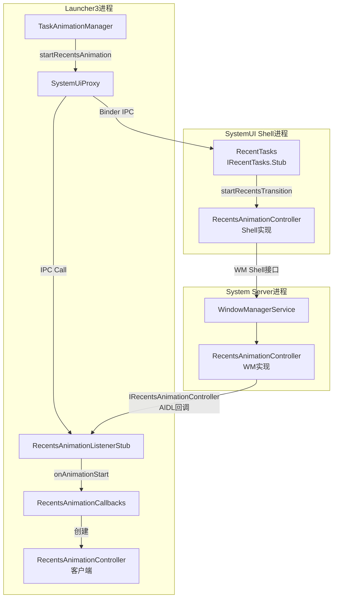
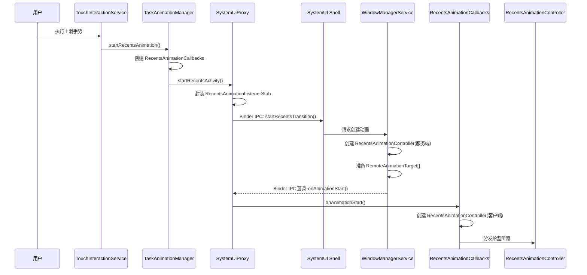
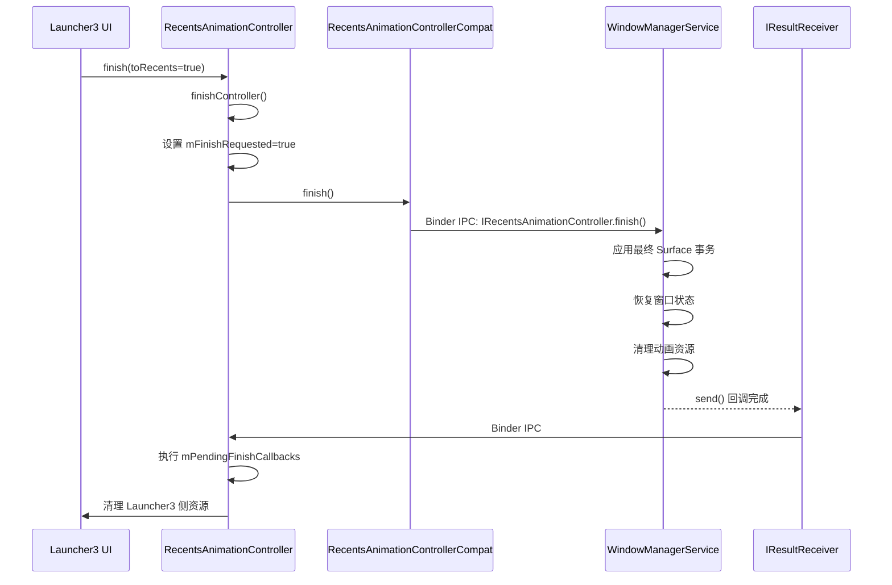
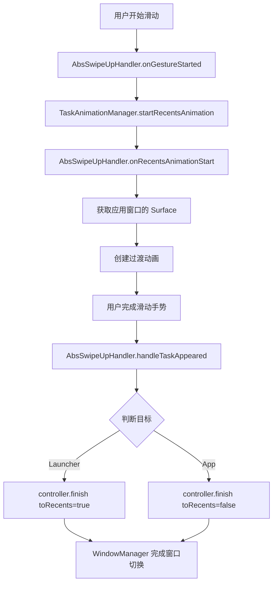
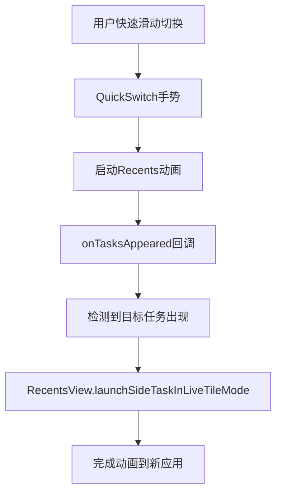
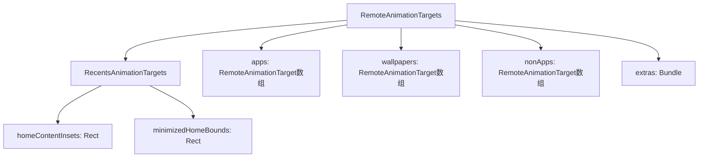
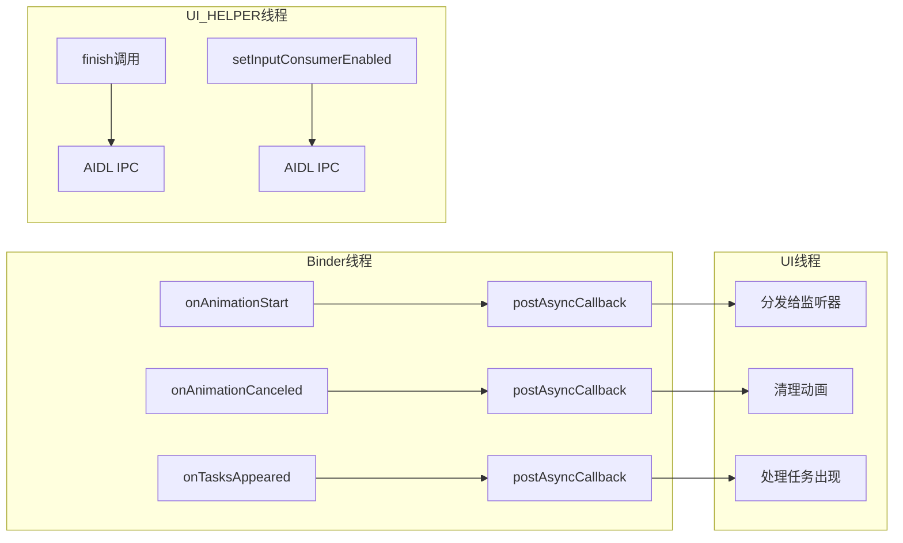
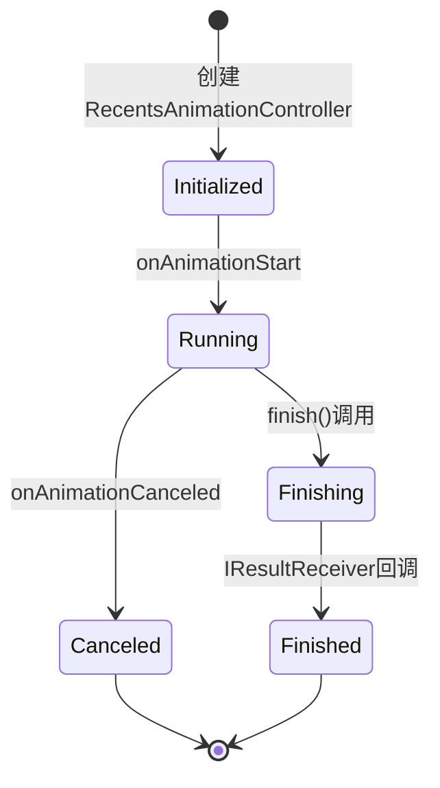

# RecentsAnimationController 架构分析

## 概述

在 Android 系统中，存在两个同名的 `RecentsAnimationController` 类，它们分别位于不同的包中，扮演着客户端和服务端的角色：

1. **客户端（Launcher3）**: `com.android.quickstep.RecentsAnimationController`
2. **服务端（WindowManager）**: `com.android.server.wm.RecentsAnimationController`

这两个类通过 AIDL（Android Interface Definition Language）接口进行通信，共同实现了 Android 的 Recent Apps（最近任务）动画功能。

---

## 1. 客户端：`com.android.quickstep.RecentsAnimationController`

### 1.1 位置与职责

**文件路径**: [RecentsAnimationController.java](quickstep/src/com/android/quickstep/RecentsAnimationController.java)

**主要职责**:
- 作为 Launcher3 中 recents 动画的控制器包装类
- 提供 UI 线程安全的接口
- 管理动画的生命周期（启动、完成、取消）
- 协调与 SystemUI 的交互

### 1.2 核心组件

```java
// quickstep/src/com/android/quickstep/RecentsAnimationController.java#L47-L56
public class RecentsAnimationController {
    private static final String TAG = "RecentsAnimationController";
    private final RecentsAnimationControllerCompat mController;
    private final Consumer<RecentsAnimationController> mOnFinishedListener;

    private boolean mUseLauncherSysBarFlags = false;
    private boolean mFinishRequested = false;
    // Only valid when mFinishRequested == true.
    private boolean mFinishTargetIsLauncher;
    private RunnableList mPendingFinishCallbacks = new RunnableList();
}
```

**关键成员说明**:

1. **`RecentsAnimationControllerCompat`**: 这是一个兼容层包装类，实际上是对 `IRecentsAnimationController` AIDL 接口的封装，用于与服务端通信。

2. **`mOnFinishedListener`**: 动画完成时的回调监听器。

3. **状态标志**:
   - `mFinishRequested`: 标记是否已请求完成动画
   - `mFinishTargetIsLauncher`: 动画结束时目标是否为 Launcher（而非应用）
   - `mUseLauncherSysBarFlags`: 是否使用 Launcher 的系统栏标志

### 1.3 主要功能方法

#### a. 完成动画

```java
// quickstep/src/com/android/quickstep/RecentsAnimationController.java#L95-L98
@UiThread
public void finish(boolean toRecents, Runnable onFinishComplete, boolean sendUserLeaveHint) {
    Preconditions.assertUIThread();
    finishController(toRecents, onFinishComplete, sendUserLeaveHint);
}

// quickstep/src/com/android/quickstep/RecentsAnimationController.java#L105-L130
@UiThread
public void finishController(boolean toRecents, Runnable callback, boolean sendUserLeaveHint,
        boolean forceFinish) {
    mPendingFinishCallbacks.add(callback);
    if (!forceFinish && mFinishRequested) {
        return;
    }
    ActiveGestureProtoLogProxy.logFinishRecentsAnimation(toRecents);
    mFinishRequested = true;
    mFinishTargetIsLauncher = toRecents;
    mOnFinishedListener.accept(this);
    Runnable finishCb = () -> {
        mController.finish(toRecents, sendUserLeaveHint, new IResultReceiver.Stub() {
            @Override
            public void send(int i, Bundle bundle) throws RemoteException {
                ActiveGestureProtoLogProxy.logFinishRecentsAnimationCallback();
                MAIN_EXECUTOR.execute(() -> {
                    mPendingFinishCallbacks.executeAllAndDestroy();
                });
            }
        });
        InteractionJankMonitorWrapper.end(Cuj.CUJ_LAUNCHER_QUICK_SWITCH);
        InteractionJankMonitorWrapper.end(Cuj.CUJ_LAUNCHER_APP_CLOSE_TO_HOME);
        InteractionJankMonitorWrapper.end(Cuj.CUJ_LAUNCHER_APP_SWIPE_TO_RECENTS);
    };
    if (forceFinish) {
        finishCb.run();
    } else {
        UI_HELPER_EXECUTOR.execute(finishCb);
    }
}
```

**参数说明**:
- `toRecents`: `true` 表示返回到 Launcher/Recents，`false` 表示返回到应用
- `sendUserLeaveHint`: 是否发送用户离开提示（用于 PiP 模式）
- `forceFinish`: 是否强制同步完成

#### b. 系统栏标志管理

```java
// quickstep/src/com/android/quickstep/RecentsAnimationController.java#L63-L75
public void setUseLauncherSystemBarFlags(boolean useLauncherSysBarFlags) {
    if (mUseLauncherSysBarFlags != useLauncherSysBarFlags) {
        mUseLauncherSysBarFlags = useLauncherSysBarFlags;
        UI_HELPER_EXECUTOR.execute(() -> {
            try {
                WindowManagerGlobal.getWindowManagerService().setRecentsAppBehindSystemBars(
                        useLauncherSysBarFlags);
            } catch (RemoteException e) {
                Log.e(TAG, "Unable to reach window manager", e);
            }
        });
    }
}
```

这个方法在手势跨越窗口边界阈值时被调用，通知系统更新系统栏标志。

#### c. 截图功能

```java
// quickstep/src/com/android/quickstep/RecentsAnimationController.java#L56-L59
public ThumbnailData screenshotTask(int taskId) {
    return ActivityManagerWrapper.getInstance().takeTaskThumbnail(taskId);
}
```

同步获取正在动画的任务的缩略图。

#### d. 输入消费者控制

```java
// quickstep/src/com/android/quickstep/RecentsAnimationController.java#L168-L172
public void enableInputConsumer() {
    UI_HELPER_EXECUTOR.submit(() -> {
        mController.setInputConsumerEnabled(true);
    });
}
```

启用输入消费者以开始拦截应用窗口中的触摸事件。

#### e. 动画交接

```java
// quickstep/src/com/android/quickstep/RecentsAnimationController.java#L77-L83
@UiThread
public void handOffAnimation(RemoteAnimationTarget[] targets, WindowAnimationState[] states) {
    if (TransitionAnimator.Companion.longLivedReturnAnimationsEnabled()) {
        UI_HELPER_EXECUTOR.execute(() -> mController.handOffAnimation(targets, states));
    } else {
        Log.e(TAG, "Tried to hand off the animation, but the feature is disabled",
                new Exception());
    }
}
```

将正在进行的动画交接给其他处理器，用于长时间存活的返回动画。

---

## 2. 服务端：`com.android.server.wm.RecentsAnimationController`

### 2.1 位置与职责

**所在包**: `frameworks/base/services/core/java/com/android/server/wm/`

**主要职责**:
- 在 WindowManagerService 中真正执行动画控制
- 管理 Surface 事务和窗口层级
- 控制任务和活动的可见性
- 处理系统级的动画状态

### 2.2 核心功能

虽然我们无法直接查看服务端代码（它不在 Launcher3 仓库中），但根据 AIDL 接口定义，服务端控制器主要负责：

1. **窗口动画管理**:
   - 创建和管理动画目标（RemoteAnimationTarget）
   - 控制任务的 Surface 层级
   - 管理壁纸和非应用窗口的动画

2. **生命周期管理**:
   - 初始化 recents 动画
   - 提供动画目标给客户端
   - 处理动画完成和取消

3. **Surface 控制**:
   - 管理任务 Surface 的 leash（租约）
   - 应用最终的 Surface 事务
   - 处理 PiP（画中画）模式的 Surface 转换

4. **输入处理**:
   - 控制输入消费者的启用/禁用
   - 管理手势导航期间的触摸事件

---

## 3. AIDL 接口：通信桥梁

### 3.1 `IRecentsAnimationController`

这是定义在 `com.android.wm.shell.recents` 包中的 AIDL 接口，用于客户端与服务端通信。

**文件路径**: [IRecentsAnimationController.aidl](wmshell/src/com/android/wm/shell/recents/IRecentsAnimationController.aidl)

**主要方法**:

```java
// wmshell/src/com/android/wm/shell/recents/IRecentsAnimationController.aidl
interface IRecentsAnimationController {
    // 设置 PiP 模式的 Surface 事务
    void setFinishTaskTransaction(int taskId,
            in PictureInPictureSurfaceTransaction finishTransaction, in SurfaceControl overlay);

    // 完成动画
    void finish(boolean moveHomeToTop, boolean sendUserLeaveHint, in IResultReceiver finishCb);

    // 控制输入消费者
    void setInputConsumerEnabled(boolean enabled);

    // 设置是否将要返回主屏幕
    void setWillFinishToHome(boolean willFinishToHome);

    // 分离导航栏
    void detachNavigationBarFromApp(boolean moveHomeToTop);

    // 交接动画控制权
    oneway void handOffAnimation(in RemoteAnimationTarget[] targets,
                    in WindowAnimationState[] states);
}
```

### 3.2 `IRecentsAnimationRunner`

客户端实现的 AIDL 接口，用于接收服务端的回调。

**文件路径**: [IRecentsAnimationRunner.aidl](wmshell/src/com/android/wm/shell/recents/IRecentsAnimationRunner.aidl)

```java
// wmshell/src/com/android/wm/shell/recents/IRecentsAnimationRunner.aidl
oneway interface IRecentsAnimationRunner {
    // 动画取消回调
    void onAnimationCanceled(in @nullable int[] taskIds,
            in @nullable TaskSnapshot[] taskSnapshots) = 1;

    // 动画开始回调
    void onAnimationStart(in IRecentsAnimationController controller,
            in RemoteAnimationTarget[] apps, in RemoteAnimationTarget[] wallpapers,
            in Rect homeContentInsets, in Rect minimizedHomeBounds, in Bundle extras,
            in @nullable TransitionInfo info) = 2;

    // 任务出现回调
    void onTasksAppeared(in RemoteAnimationTarget[] app,
            in @nullable TransitionInfo transitionInfo) = 3;
}
```

**在 Launcher3 中的实现**（[SystemUiProxy.kt:1296](quickstep/src/com/android/quickstep/SystemUiProxy.kt#L1296)）:

```kotlin
// quickstep/src/com/android/quickstep/SystemUiProxy.kt#L1296-L1330
private class RecentsAnimationListenerStub(val listener: RecentsAnimationListener) :
    IRecentsAnimationRunner.Stub() {
    override fun onAnimationStart(
        controller: IRecentsAnimationController,
        apps: Array<RemoteAnimationTarget>?,
        wallpapers: Array<RemoteAnimationTarget>?,
        homeContentInsets: Rect?,
        minimizedHomeBounds: Rect?,
        extras: Bundle?,
        transitionInfo: TransitionInfo?,
    ) =
        listener.onAnimationStart(
            RecentsAnimationControllerCompat(controller),
            apps,
            wallpapers,
            homeContentInsets,
            minimizedHomeBounds,
            extras?.apply {
                classLoader = SplitBounds::class.java.classLoader
            },
            transitionInfo,
        )

    override fun onAnimationCanceled(taskIds: IntArray?, taskSnapshots: Array<TaskSnapshot?>?) {
        listener.onAnimationCanceled(wrap(taskIds, taskSnapshots))
    }

    override fun onTasksAppeared(
        apps: Array<RemoteAnimationTarget>?,
        transitionInfo: TransitionInfo?,
    ) = listener.onTasksAppeared(apps, transitionInfo)
}
```

---

## 4. 连接机制：Launcher3 如何关联两个类

### 4.1 整体架构流程图



### 4.2 详细连接步骤

#### 步骤 1: 启动 Recents 动画

**触发点**: 用户执行手势（如向上滑动）

```java
// quickstep/src/com/android/quickstep/TaskAnimationManager.java#L114-L200
@UiThread
public RecentsAnimationCallbacks startRecentsAnimation(@NonNull GestureState gestureState,
        Intent intent, RecentsAnimationCallbacks.RecentsAnimationListener listener) {
    ActiveGestureProtoLogProxy.logStartRecentsAnimation();
    
    // 1. 创建回调对象
    RecentsAnimationCallbacks newCallbacks = new RecentsAnimationCallbacks(
            containerInterface.getCreatedContainer());
    mCallbacks = newCallbacks;
    
    // 2. 添加监听器
    mCallbacks.addListener(gestureState);
    mCallbacks.addListener(listener);

    // 3. 准备 ActivityOptions
    final ActivityOptions options = ActivityOptions.makeBasic();
    options.setPendingIntentBackgroundActivityStartMode(
            ActivityOptions.MODE_BACKGROUND_ACTIVITY_START_ALLOW_ALWAYS);
    options.setTransientLaunch();
    options.setSourceInfo(ActivityOptions.SourceInfo.TYPE_RECENTS_ANIMATION, eventTime);
    options.setLaunchDisplayId(mDisplayId);

    // 4. 通过 SystemUiProxy 启动
    getSystemUiProxy().startRecentsActivity(intent, options, mCallbacks, 
            false, null, mDisplayId);

    return newCallbacks;
}
```

#### 步骤 2: SystemUiProxy 桥接

**文件路径**: [SystemUiProxy.kt:1265](quickstep/src/com/android/quickstep/SystemUiProxy.kt#L1265)

```kotlin
// quickstep/src/com/android/quickstep/SystemUiProxy.kt#L1265-L1294
fun startRecentsActivity(
    intent: Intent?,
    options: ActivityOptions,
    listener: RecentsAnimationListener,
    useSyntheticRecentsTransition: Boolean,
    wct: WindowContainerTransaction? = null,
    displayId: Int,
): Boolean {
    executeWithErrorLog({ "Error starting recents via shell" }) {
        recentTasks?.startRecentsTransition(
            getRecentsPendingIntent(displayId),
            intent,
            options.toBundle().apply {
                if (useSyntheticRecentsTransition) {
                    putBoolean("is_synthetic_recents_transition", true)
                }
            },
            wct,
            context.iApplicationThread,
            RecentsAnimationListenerStub(listener),  // ← AIDL Stub 实现
        )
        return true
    }
    return false
}
```

**关键组件**:

1. **`recentTasks: IRecentTasks`**: 这是与 SystemUI Shell 通信的 AIDL 接口引用

2. **`RecentsAnimationListenerStub`**: 将 Launcher3 的监听器包装成 AIDL Stub，用于接收服务端回调

#### 步骤 3: 服务端创建动画控制器

服务端（WindowManagerService）收到请求后：

1. 创建 `com.android.server.wm.RecentsAnimationController` 实例
2. 准备动画目标（RemoteAnimationTarget）
3. 通过 `IRecentsAnimationRunner.onAnimationStart()` 回调客户端

#### 步骤 4: 客户端接收回调

**文件路径**: [RecentsAnimationCallbacks.java:80](quickstep/src/com/android/quickstep/RecentsAnimationCallbacks.java#L80)

```java
// quickstep/src/com/android/quickstep/RecentsAnimationCallbacks.java#L80-L134
@BinderThread
public final void onAnimationStart(RecentsAnimationControllerCompat animationController,
        RemoteAnimationTarget[] appTargets,
        RemoteAnimationTarget[] wallpaperTargets,
        Rect homeContentInsets, Rect minimizedHomeBounds, Bundle extras,
        @Nullable TransitionInfo transitionInfo) {
    long appCount = Arrays.stream(appTargets)
            .filter(app -> app.mode == MODE_CLOSING)
            .count();

    boolean isOpeningHome = Arrays.stream(appTargets)
            .filter(app -> app.mode == MODE_OPENING
                    && app.windowConfiguration.getActivityType() == ACTIVITY_TYPE_HOME)
            .count() > 0;
    if (appCount == 0 && (!(mContainer instanceof RecentsWindowManager)
            || isOpeningHome)) {
        // 边缘情况：没有关闭的应用目标，取消动画
        notifyAnimationCanceled();
        animationController.finish(false, false, null);
        return;
    }

    // 1. 创建 Launcher3 的 RecentsAnimationController
    mController = new RecentsAnimationController(animationController, this::onAnimationFinished);

    // 2. 创建动画目标包装
    final RecentsAnimationTargets targets = new RecentsAnimationTargets(appTargets,
            wallpaperTargets, nonAppTargets, homeContentInsets, minimizedHomeBounds, extras);

    // 3. 分发给所有监听器
    Utilities.postAsyncCallback(MAIN_EXECUTOR.getHandler(), () -> {
        for (RecentsAnimationListener listener : getListeners()) {
            listener.onRecentsAnimationStart(mController, targets, transitionInfo);
        }
    });
}
```

**关键点**:
- `RecentsAnimationControllerCompat` 是对 `IRecentsAnimationController` AIDL 接口的包装
- 客户端的 `RecentsAnimationController` 包装了这个 Compat 对象
- 所有操作通过 AIDL 转发到服务端

### 4.3 关键包装类

#### `RecentsAnimationControllerCompat`

这是 SystemUI Shared 库中的类，位于：
`com.android.systemui.shared.system.RecentsAnimationControllerCompat`

**文件路径**: [RecentsAnimationControllerCompat.java](systemUI/shared/src/com/android/systemui/shared/system/RecentsAnimationControllerCompat.java)

**作用**:
```java
// systemUI/shared/src/com/android/systemui/shared/system/RecentsAnimationControllerCompat.java#L30-L50
public class RecentsAnimationControllerCompat {
    private static final String TAG = RecentsAnimationControllerCompat.class.getSimpleName();
    private IRecentsAnimationController mAnimationController;

    public RecentsAnimationControllerCompat(IRecentsAnimationController animationController) {
        mAnimationController = animationController;
    }

    public void setInputConsumerEnabled(boolean enabled) {
        try {
            mAnimationController.setInputConsumerEnabled(enabled);
        } catch (RemoteException e) {
            Log.e(TAG, "Failed to set input consumer enabled state", e);
        }
    }

    public void finish(boolean toHome, boolean sendUserLeaveHint, IResultReceiver finishCb) {
        try {
            mAnimationController.finish(toHome, sendUserLeaveHint, finishCb);
        } catch (RemoteException e) {
            Log.e(TAG, "Failed to finish recents animation", e);
            try {
                finishCb.send(0, null);
            } catch (Exception ex) {
                // Local call, can ignore
            }
        }
    }
    // 其他方法类似，都是对 AIDL 接口的简单包装
}
```

---

## 5. 数据流向

### 5.1 启动流程数据流



### 5.2 完成流程数据流



---

## 6. 关键交互场景

### 6.1 场景 1: 从应用滑动到 Launcher



### 6.2 场景 2: PiP（画中画）模式

```java
// 1. Launcher 通知即将进入 PiP
RecentsAnimationController.setFinishTaskTransaction(
    taskId,
    pipTransaction,  // PiP 的 Surface 事务
    overlay          // 覆盖层
)
    │
    ▼
// 2. 执行 PiP 动画
// ... 动画过程 ...
    │
    ▼
// 3. 完成并应用 PiP 事务
controller.finish(toRecents=true, sendUserLeaveHint=true)
    │
    ▼
// WindowManager 应用 PiP Surface 事务
```

### 6.3 场景 3: 快速切换应用



---

## 7. RecentsAnimationTargets 数据结构

### 7.1 类定义

**文件路径**: [RecentsAnimationTargets.java](quickstep/src/com/android/quickstep/RecentsAnimationTargets.java)

```java
// quickstep/src/com/android/quickstep/RecentsAnimationTargets.java#L29-L38
public class RecentsAnimationTargets extends RemoteAnimationTargets {

    public final Rect homeContentInsets;
    public final Rect minimizedHomeBounds;

    public RecentsAnimationTargets(RemoteAnimationTarget[] apps,
            RemoteAnimationTarget[] wallpapers, RemoteAnimationTarget[] nonApps,
            Rect homeContentInsets, Rect minimizedHomeBounds, Bundle extras) {
        super(apps, wallpapers, nonApps, MODE_CLOSING, extras);
        this.homeContentInsets = homeContentInsets;
        this.minimizedHomeBounds = minimizedHomeBounds;
    }
}
```

### 7.2 继承关系



---

## 8. 线程模型

### 8.1 线程使用规范



### 8.2 线程安全机制

1. **UI线程注解**: 使用 `@UiThread` 标注必须在主线程调用的方法
2. **Binder线程注解**: 使用 `@BinderThread` 标注来自 Binder 回调的方法
3. **线程切换**: 使用 `MAIN_EXECUTOR` 和 `UI_HELPER_EXECUTOR` 进行线程切换
4. **异步回调**: 使用 `Utilities.postAsyncCallback()` 确保回调在正确的线程执行

---

## 9. 状态管理

### 9.1 动画状态标志

```java
// quickstep/src/com/android/quickstep/RecentsAnimationController.java
private boolean mUseLauncherSysBarFlags = false;  // 系统栏标志状态
private boolean mFinishRequested = false;          // 是否已请求完成
private boolean mFinishTargetIsLauncher;           // 完成目标是否为Launcher
```

### 9.2 状态转换图



---

## 10. 设计思想和理念

### 10.1 架构设计原则

1. **职责分离**:
   - 客户端负责 UI 层面的动画控制和状态管理
   - 服务端负责窗口层面的 Surface 和层级管理
   - 通过 AIDL 接口清晰划分职责边界

2. **进程隔离**:
   - Launcher3 进程与 SystemUI/WindowManager 进程完全隔离
   - 通过 Binder IPC 实现跨进程通信
   - 保证系统稳定性和安全性

3. **异步非阻塞**:
   - 所有跨进程调用都是异步的
   - 使用回调机制处理结果
   - 避免阻塞 UI 线程

4. **线程安全**:
   - 明确的线程模型和注解
   - 使用 Executor 进行线程切换
   - 避免并发问题

### 10.2 性能优化设计

1. **Surface 控制**:
   - 直接操作 Surface 而非 View 层级
   - 减少布局计算和重绘
   - 实现流畅的 60fps 动画

2. **输入消费者**:
   - 提前注册输入消费者
   - 动画过程中动态启用
   - 避免事件丢失和卡顿

3. **资源管理**:
   - 及时清理动画资源
   - 使用 RunnableList 管理回调
   - 避免内存泄漏

这种设计实现了职责分离、进程隔离和高性能的动画系统，是 Android 现代手势导航的核心基础设施。

---

## 11. 源码文件索引

| 文件 | 路径 | 说明 |
|------|------|------|
| RecentsAnimationController.java | quickstep/src/com/android/quickstep/ | 客户端控制器 |
| RecentsAnimationControllerCompat.java | systemUI/shared/src/com/android/systemui/shared/system/ | 兼容层包装 |
| IRecentsAnimationController.aidl | wmshell/src/com/android/wm/shell/recents/ | AIDL 控制器接口 |
| IRecentsAnimationRunner.aidl | wmshell/src/com/android/wm/shell/recents/ | AIDL 回调接口 |
| TaskAnimationManager.java | quickstep/src/com/android/quickstep/ | 动画管理器 |
| RecentsAnimationCallbacks.java | quickstep/src/com/android/quickstep/ | 回调分发器 |
| RecentsAnimationTargets.java | quickstep/src/com/android/quickstep/ | 动画目标数据 |
| SystemUiProxy.kt | quickstep/src/com/android/quickstep/ | SystemUI 代理 |

---

**最后更新**: 2026年2月13日  
**适用AOSP版本**: Android 14+  
**核心分析范围**: Launcher3 / SystemUI / WindowManager  
**输出格式**: Markdown文档 + Mermaid图表 + 源码证据链
