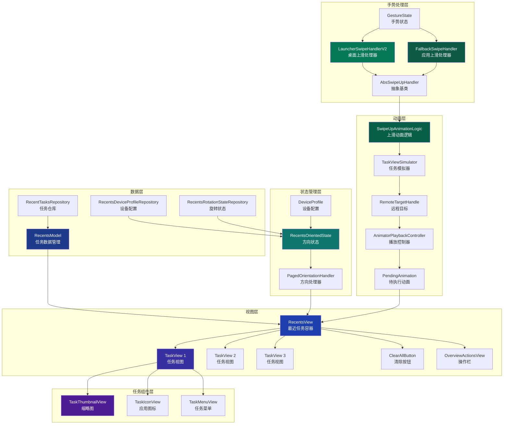
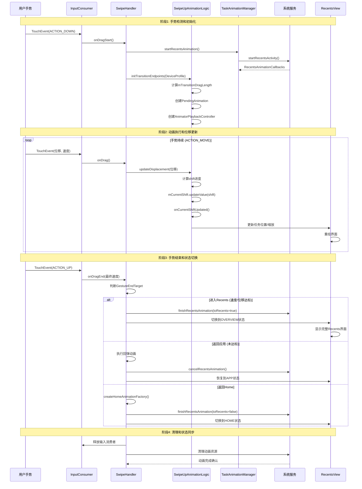
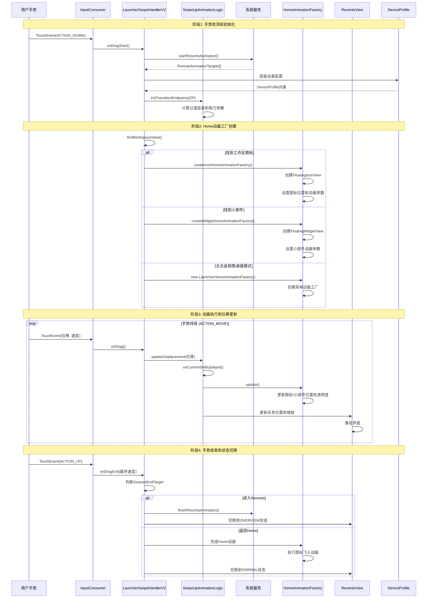
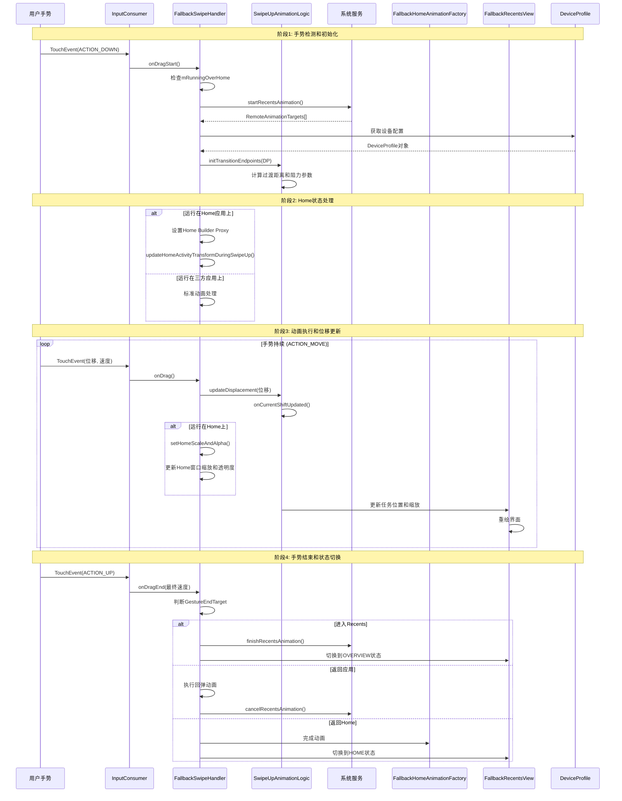

# Recents布局及上滑流程分析报告

## 概述

本报告基于对AOSP Launcher3源码的深入分析，全面解析了Recents（最近任务）界面的布局架构以及从桌面和三方应用上滑进入Recents的完整流程。

**源码位置**: 
- RecentsView: [quickstep/src/com/android/quickstep/views/RecentsView.java](quickstep/src/com/android/quickstep/views/RecentsView.java)
- SwipeUpAnimationLogic: [quickstep/src/com/android/quickstep/SwipeUpAnimationLogic.java](quickstep/src/com/android/quickstep/SwipeUpAnimationLogic.java)
- AbsSwipeUpHandler: [quickstep/src/com/android/quickstep/AbsSwipeUpHandler.java](quickstep/src/com/android/quickstep/AbsSwipeUpHandler.java)
- LauncherSwipeHandlerV2: [quickstep/src/com/android/quickstep/LauncherSwipeHandlerV2.java](quickstep/src/com/android/quickstep/LauncherSwipeHandlerV2.java)
- FallbackSwipeHandler: [quickstep/src/com/android/quickstep/FallbackSwipeHandler.java](quickstep/src/com/android/quickstep/FallbackSwipeHandler.java)

---

## Recents布局架构分析

### 核心组件架构

Recents（最近任务）界面是Android多任务系统的核心，其架构设计高度模块化，主要包含以下核心组件：

#### 1. RecentsView - 最近任务视图容器

RecentsView是继承自PagedView的抽象类，负责：
- 管理所有TaskView的布局和显示
- 处理分页滚动逻辑
- 实现任务切换动画
- 支持横向/纵向布局适配

```java
// quickstep/src/com/android/quickstep/views/RecentsView.java#L277-L281
public abstract class RecentsView<
        CONTAINER_TYPE extends Context & RecentsViewContainer & StatefulContainer<STATE_TYPE>,
        STATE_TYPE extends BaseState<STATE_TYPE>> extends PagedView implements Insettable,
        HighResLoadingState.HighResLoadingStateChangedCallback,
        TaskVisualsChangeListener {
```

**关键特性**:
- **泛型设计**: 支持不同类型的容器（Launcher、FallbackActivity等）
- **状态管理**: 通过STATE_TYPE参数支持多种状态类型
- **接口实现**: 实现Insettable、HighResLoadingState回调、TaskVisualsChangeListener

#### 2. SwipeUpAnimationLogic - 上滑动画逻辑基类

负责上滑手势动画的核心计算逻辑：

```java
// quickstep/src/com/android/quickstep/SwipeUpAnimationLogic.java#L52-L86
public abstract class SwipeUpAnimationLogic implements
        RecentsAnimationCallbacks.RecentsAnimationListener {

    protected final RemoteTargetGluer mTargetGluer;
    protected DeviceProfile mDp;
    protected final Context mContext;
    protected final GestureState mGestureState;
    protected RemoteTargetHandle[] mRemoteTargetHandles;

    // Shift in the range of [0, 1].
    // 0 => preview snapShot is completely visible
    // 1 => preview snapShot is completely aligned with the recents view
    protected final AnimatedFloat mCurrentShift = new AnimatedFloat(this::onCurrentShiftUpdated);
    protected float mCurrentDisplacement;

    // The distance needed to drag to reach the task size in recents.
    protected int mTransitionDragLength;
    // How much further we can drag past recents, as a factor of mTransitionDragLength.
    protected float mDragLengthFactor = 1;
}
```

**核心机制**:
- **mCurrentShift**: 动画进度值，范围[0, 1]，通过AnimatedFloat实现自动回调
- **mTransitionDragLength**: 到达Recents任务大小所需的拖动距离
- **mDragLengthFactor**: 可以超过Recents的额外拖动距离因子

#### 3. AbsSwipeUpHandler - 上滑手势处理器抽象基类

继承自SwipeUpAnimationLogic，处理上滑手势的完整生命周期：

```java
// quickstep/src/com/android/quickstep/AbsSwipeUpHandler.java
public abstract class AbsSwipeUpHandler<...> extends SwipeUpAnimationLogic {
    // 状态回调
    protected final MultiStateCallback mStateCallback;
    
    // 手势结束目标
    protected GestureEndTarget mGestureEndTarget;
    
    // 动画控制器
    protected AnimatorControllerWithResistance mAnimatorController;
}
```

#### 4. LauncherSwipeHandlerV2 - 桌面上滑处理器

专门处理从Launcher桌面上滑的场景：

```java
// quickstep/src/com/android/quickstep/LauncherSwipeHandlerV2.java#L50-L53
public class LauncherSwipeHandlerV2 extends AbsSwipeUpHandler<
        QuickstepLauncher, RecentsView<QuickstepLauncher, LauncherState>, LauncherState> {
```

#### 5. FallbackSwipeHandler - 三方应用上滑处理器

处理从三方应用上滑的场景：

```java
// quickstep/src/com/android/quickstep/FallbackSwipeHandler.java#L69-L71
public class FallbackSwipeHandler extends
        AbsSwipeUpHandler<RecentsActivity, FallbackRecentsView<RecentsActivity>, RecentsState> {
```

### 布局层次结构

```
RecentsView (PagedView)
├── TaskView 1
│   ├── TaskThumbnailView (缩略图)
│   ├── IconView (应用图标)
│   └── TaskMenuView (任务菜单)
├── TaskView 2
├── ClearAllButton (清除所有按钮)
└── OverviewActionsView (概览操作栏)
```

### 关键布局特性

#### 1. 分页布局机制
RecentsView继承自PagedView，支持：
- 水平/垂直分页滚动
- 惯性滚动效果
- 边缘回弹效果
- 无障碍访问支持

#### 2. 方向自适应
通过PagedOrientationHandler实现：
- 纵向模式：水平分页，X轴为主方向
- 横向模式：垂直分页，Y轴为主方向
- 动态方向切换支持

#### 3. 任务布局策略
- **网格布局**：多任务并排显示
- **全屏布局**：单个任务占据全屏
- **分屏布局**：支持Split Screen模式

---

## 上滑动画核心机制

### 1. 动画进度管理

**文件路径**: [SwipeUpAnimationLogic.java:110-132](quickstep/src/com/android/quickstep/SwipeUpAnimationLogic.java#L110-L132)

```java
protected void initTransitionEndpoints(DeviceProfile dp) {
    mDp = dp;
    // 计算过渡距离
    mTransitionDragLength = mGestureState.getContainerInterface()
            .getSwipeUpDestinationAndLength(dp, mContext, TEMP_RECT,
                    mRemoteTargetHandles[0].getTaskViewSimulator().getOrientationState()
                            .getOrientationHandler());
    mDragLengthFactor = (float) dp.getDeviceProperties().getHeightPx() / mTransitionDragLength;

    // 为每个远程目标创建动画控制器
    for (RemoteTargetHandle remoteHandle : mRemoteTargetHandles) {
        PendingAnimation pendingAnimation = new PendingAnimation(mTransitionDragLength * 2);
        TaskViewSimulator taskViewSimulator = remoteHandle.getTaskViewSimulator();
        taskViewSimulator.setDp(dp);
        taskViewSimulator.addAppToCarouselAnim(pendingAnimation, LINEAR,
                mGestureState.isHandlingAtomicEvent());
        AnimatorPlaybackController playbackController =
                pendingAnimation.createPlaybackController();

        remoteHandle.setPlaybackController(AnimatorControllerWithResistance.createForRecents(
                playbackController, mContext, taskViewSimulator.getOrientationState(),
                mDp, taskViewSimulator.recentsViewScale, AnimatedFloat.VALUE,
                taskViewSimulator.recentsViewSecondaryTranslation, AnimatedFloat.VALUE
        ));
    }
}
```

### 2. 位移更新机制

**文件路径**: [SwipeUpAnimationLogic.java:143-155](quickstep/src/com/android/quickstep/SwipeUpAnimationLogic.java#L143-L155)

```java
@UiThread
public void updateDisplacement(float displacement) {
    // 负方向移动
    displacement = overrideDisplacementForTransientTaskbar(-displacement);
    mCurrentDisplacement = displacement;

    float shift;
    if (displacement > mTransitionDragLength * mDragLengthFactor && mTransitionDragLength > 0) {
        shift = mDragLengthFactor;
    } else {
        float translation = Math.max(displacement, 0);
        shift = mTransitionDragLength == 0 ? 0 : translation / mTransitionDragLength;
    }

    mCurrentShift.updateValue(shift); // 触发onCurrentShiftUpdated回调
}
```

### 3. 动画进度回调

**文件路径**: [SwipeUpAnimationLogic.java:163-167](quickstep/src/com/android/quickstep/SwipeUpAnimationLogic.java#L163-L167)

```java
/**
 * Called when the value of {@link #mCurrentShift} changes
 */
@UiThread
public abstract void onCurrentShiftUpdated();
```

这是一个抽象方法，由子类实现具体的动画更新逻辑。

---

## 桌面上滑流程分析

### 核心处理类

#### LauncherSwipeHandlerV2

桌面上滑的主要处理类，继承自AbsSwipeUpHandler：

```java
// quickstep/src/com/android/quickstep/LauncherSwipeHandlerV2.java#L50-L53
public class LauncherSwipeHandlerV2 extends AbsSwipeUpHandler<
        QuickstepLauncher, RecentsView<QuickstepLauncher, LauncherState>, LauncherState> {
```

### 上滑流程详细分析

#### 阶段1：手势检测和初始化

**触发条件**：用户在桌面从底部向上滑动

**初始化步骤**：
1. 创建GestureState对象，记录手势状态
2. 初始化RemoteTargetGluer，准备远程动画目标
3. 设置输入消费者，拦截后续触摸事件

#### 阶段2：动画准备和远程动画启动

**关键方法**: `onRecentsAnimationStart()`

**文件路径**: [AbsSwipeUpHandler.java:973-975](quickstep/src/com/android/quickstep/AbsSwipeUpHandler.java#L973-L975)

```java
@Override
public void onRecentsAnimationStart(RecentsAnimationController controller,
        RecentsAnimationTargets targets, @Nullable TransitionInfo transitionInfo) {
    super.onRecentsAnimationStart(controller, targets, transitionInfo);
    // 处理桌面模式等特殊情况
    // ...
}
```

**动画准备过程**：
1. **启动Recents动画**：通过SystemUiProxy启动远程动画
2. **获取运行任务**：从ActivityManager获取当前运行的任务信息
3. **创建任务模拟器**：TaskViewSimulator用于动画计算
4. **设置动画端点**：计算过渡距离和阻力参数

#### 阶段3：动画执行和状态同步

通过`updateDisplacement()`方法实时更新动画进度。

#### 阶段4：Home动画工厂创建

**文件路径**: [LauncherSwipeHandlerV2.java:59-99](quickstep/src/com/android/quickstep/LauncherSwipeHandlerV2.java#L59-L99)

桌面上滑特有的Home动画效果：

```java
@Override
protected HomeAnimationFactory createHomeAnimationFactory(
        List<IBinder> launchCookies,
        long duration,
        boolean isTargetTranslucent,
        boolean appCanEnterPip,
        RemoteAnimationTarget runningTaskTarget,
        @Nullable TaskView targetTaskView) {
    
    // 查找工作区视图（图标或小部件）
    final View workspaceView = findWorkspaceView(
            targetTaskView == null ? launchCookies : Collections.emptyList(),
            sourceTaskView);
    
    boolean canUseWorkspaceView = workspaceView != null
            && workspaceView.isAttachedToWindow()
            && workspaceView.getHeight() > 0
            && !DesktopVisibilityController.INSTANCE.get(mContainer)
                    .isInDesktopModeAndNotInOverview(mContainer.getDisplayId());

    // 根据视图类型创建不同的动画工厂
    if (workspaceView instanceof LauncherAppWidgetHostView) {
        return createWidgetHomeAnimationFactory((LauncherAppWidgetHostView) workspaceView,
                isTargetTranslucent, runningTaskTarget);
    }
    return createIconHomeAnimationFactory(workspaceView, targetTaskView);
}
```

**Home动画类型**：
1. **图标动画**：应用图标飞入热座或工作区（FloatingIconView）
2. **小部件动画**：小部件缩放和位置调整（FloatingWidgetView）
3. **简单动画**：LauncherHomeAnimationFactory默认实现

---

## 三方应用界面上滑流程分析

三方应用界面的上滑流程与桌面类似，但处理方式有所不同。

### 核心处理类：FallbackSwipeHandler

**文件路径**: [FallbackSwipeHandler.java:69-71](quickstep/src/com/android/quickstep/FallbackSwipeHandler.java#L69-L71)

```java
public class FallbackSwipeHandler extends
        AbsSwipeUpHandler<RecentsActivity, FallbackRecentsView<RecentsActivity>, RecentsState> {
```

### 主要差异点

#### 1. Home状态检查

**文件路径**: [FallbackSwipeHandler.java:88-98](quickstep/src/com/android/quickstep/FallbackSwipeHandler.java#L88-L98)

```java
private final boolean mRunningOverHome;

public FallbackSwipeHandler(...) {
    super(...);
    
    // 检查是否运行在Home应用上
    mRunningOverHome = mGestureState.getRunningTask() != null
            && mGestureState.getRunningTask().isHomeTask();
    if (mRunningOverHome) {
        runActionOnRemoteHandles(remoteTargetHandle ->
                remoteTargetHandle.getTransformParams().setHomeBuilderProxy(
                FallbackSwipeHandler.this::updateHomeActivityTransformDuringSwipeUp));
    }
}
```

#### 2. Home动画缩放处理

**文件路径**: [FallbackSwipeHandler.java:111-124](quickstep/src/com/android/quickstep/FallbackSwipeHandler.java#L111-L124)

```java
private void updateHomeActivityTransformDuringSwipeUp(SurfaceProperties builder,
        RemoteAnimationTarget app, TransformParams params) {
    setHomeScaleAndAlpha(builder, app, mCurrentShift.value,
            Utilities.boundToRange(1 - mCurrentShift.value, 0, 1));
}

private void setHomeScaleAndAlpha(SurfaceProperties builder,
        RemoteAnimationTarget app, float verticalShift, float alpha) {
    float scale = Utilities.mapRange(verticalShift, 1, mMaxLauncherScale);
    mTmpMatrix.setScale(scale, scale,
            app.localBounds.exactCenterX(), app.localBounds.exactCenterY());
    builder.setMatrix(mTmpMatrix).setAlpha(alpha);
    builder.setShow();
}
```

#### 3. 动画起始状态
- **桌面**：从工作区图标开始动画
- **三方应用**：从当前应用窗口开始动画

#### 4. Home动画处理
三方应用上滑时：
- 没有工作区图标动画
- 直接切换到Recents界面
- 动画效果更简单直接

### 上滑流程对比

| 特性 | 桌面上滑 | 三方应用上滑 |
|------|----------|-------------|
| **处理类** | LauncherSwipeHandlerV2 | FallbackSwipeHandler |
| **起始状态** | Launcher工作区 | 当前应用窗口 |
| **Home动画** | 图标飞入动画 | 简单切换动画 |
| **状态管理** | LauncherState | RecentsState |
| **容器接口** | QuickstepLauncher | RecentsActivity |
| **视图类型** | RecentsView<QuickstepLauncher> | FallbackRecentsView<RecentsActivity> |
| **Home检查** | 无 | mRunningOverHome检查 |

---

## Recents布局架构图



---

## 上滑流程时序图



---

## 桌面上滑 vs 三方应用上滑详细对比

### 桌面上滑详细流程（LauncherSwipeHandlerV2）



### 三方应用上滑详细流程（FallbackSwipeHandler）



### 关键差异对比分析

| 处理阶段 | LauncherSwipeHandlerV2 (桌面) | FallbackSwipeHandler (三方应用) |
|---------|-----------------------------|-------------------------------|
| **动画工厂创建** | createIconHomeAnimationFactory()<br/>createWidgetHomeAnimationFactory() | new FallbackHomeAnimationFactory()<br/>new FallbackPipToHomeAnimationFactory() |
| **Home动画类型** | FloatingIconView图标飞入<br/>FloatingWidgetView小部件动画 | 简单窗口缩放动画<br/>PIP进入动画 |
| **工作区视图查找** | findWorkspaceView()查找图标/小部件 | 无工作区视图查找逻辑 |
| **Home状态处理** | 无特殊Home状态处理 | mRunningOverHome检查<br/>updateHomeActivityTransformDuringSwipeUp() |
| **动画复杂度** | 复杂的图标morphing效果 | 简单的窗口缩放效果 |
| **状态切换** | LauncherState.NORMAL ↔ OVERVIEW | RecentsState.APP ↔ OVERVIEW |
| **容器类型** | QuickstepLauncher | RecentsActivity |
| **视图类型** | RecentsView<QuickstepLauncher> | FallbackRecentsView<RecentsActivity> |

---

## 核心发现总结

### 1. Recents布局架构特点

**模块化分层设计**：
- **数据层**：RecentsModel负责任务数据管理
- **视图层**：RecentsView作为容器，TaskView作为任务单元
- **状态层**：RecentsOrientedState管理方向状态
- **动画层**：SwipeUpAnimationLogic处理动画逻辑
- **手势层**：不同的SwipeHandler处理不同场景

**关键技术特性**：
- **方向自适应**：通过PagedOrientationHandler实现横竖屏适配
- **分页布局**：继承PagedView支持平滑滚动
- **远程动画**：与系统服务协作实现无缝过渡
- **状态管理**：完善的状态机管理界面切换

### 2. 上滑动画核心机制

**AnimatedFloat进度管理**：
- 通过`mCurrentShift`实现动画进度自动回调
- 范围[0, 1]，0表示应用窗口完全可见，1表示完全对齐Recents

**PendingAnimation动画容器**：
- 每个RemoteTargetHandle创建独立的PendingAnimation
- 通过AnimatorPlaybackController控制动画播放

**阻力效果**：
- `mDragLengthFactor`控制可超过Recents的额外拖动距离
- 提供物理模拟的滚动体验

### 3. 桌面上滑流程核心机制

**四阶段处理流程**：
1. **手势检测**：InputConsumer拦截触摸事件
2. **动画准备**：启动远程动画，获取任务数据
3. **动画执行**：实时更新位移，同步界面状态
4. **状态切换**：根据手势结果决定最终状态

**特色功能**：
- **Home动画**：图标飞入效果，提升用户体验
- **阻力效果**：物理模拟的滚动阻力
- **无缝过渡**：与系统动画服务深度集成

### 4. 三方应用上滑差异

**主要区别**：
- **处理类不同**：FallbackSwipeHandler vs LauncherSwipeHandlerV2
- **动画简化**：没有复杂的Home动画效果
- **状态管理**：使用RecentsState而非LauncherState
- **Home检查**：需要判断是否运行在Home应用上

---

## 架构设计优势

1. **高度解耦**：各层职责清晰，便于维护和扩展
2. **性能优化**：异步数据加载，避免主线程阻塞
3. **可扩展性**：支持新的布局模式和动画效果
4. **一致性**：统一的接口设计保证行为一致

---

## 实际应用价值

这种架构设计为Android多任务系统提供了：
- **流畅的用户体验**：无缝的任务切换动画
- **灵活的方向适配**：自动适应设备方向变化
- **强大的扩展能力**：支持分屏、画中画等高级功能
- **稳定的性能表现**：优化的内存管理和动画性能

该分析为理解Android多任务系统的内部机制提供了深入的技术视角，对于系统定制、性能优化和功能扩展具有重要参考价值。

---

## 源码文件索引

| 文件 | 路径 | 说明 |
|------|------|------|
| RecentsView.java | quickstep/src/com/android/quickstep/views/ | 最近任务视图容器 |
| SwipeUpAnimationLogic.java | quickstep/src/com/android/quickstep/ | 上滑动画逻辑基类 |
| AbsSwipeUpHandler.java | quickstep/src/com/android/quickstep/ | 上滑手势处理器抽象基类 |
| LauncherSwipeHandlerV2.java | quickstep/src/com/android/quickstep/ | 桌面上滑处理器 |
| FallbackSwipeHandler.java | quickstep/src/com/android/quickstep/ | 三方应用上滑处理器 |
| RecentsModel.java | quickstep/src/com/android/quickstep/ | 任务数据模型 |
| RecentsOrientedState.java | quickstep/src/com/android/quickstep/util/ | 方向状态管理 |
| GestureState.java | quickstep/src/com/android/quickstep/ | 手势状态 |
| TaskAnimationManager.java | quickstep/src/com/android/quickstep/ | 动画管理器 |

---

**文档版本**: 2.0  
**分析时间**: 2026-02-13  
**源码版本**: Android 16 QPR2 Release  
**输出格式**: Markdown文档 + Mermaid图表 + 源码证据链
